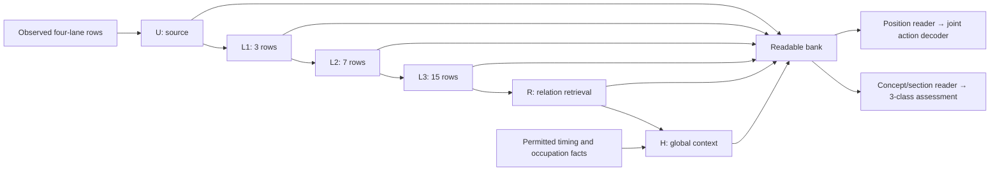

# Agent Note: Build a source-action encoder with readable composition levels

Note ID: 2026-09-14-source-action-stage2-access-comparison
Status: proposed
Kind: implementation
Created: 2026-09-14
Updated: 2026-09-14
Product revision: 7884fbfadf0b623d1ba8860f9f5bbe81e79dd577
Scope: Source/local/relation/contextual encoder architecture, action and concept readers, and the focused comparison needed to assess their value.
Related: 2026-09-14-source-action-stage1-foundation

## Question or Decision

Build a representation that learns **local action patterns, relationships among
those patterns, and their larger organization**, while letting a query read the
level it needs. Train it with the implemented action-block objective; use scoped
style assessment to test whether the learned structure transfers.

The concrete recommendation is a 64-dimensional shared-hand encoder with this
order:

**source rows → three ordered local compositions → relation retrieval → global
context**, retaining all six levels for prediction and concept queries.

This is the next implementation of
`docs/research/source_action_representation_directions.md`. It tests a coherent
architecture rather than searching over operator graphs. Its central bet is
that comparing already composed local patterns along source relations is useful,
and that later queries benefit from reading those patterns directly.

## What Already Exists

The clean product revision above contains the Stage 1 implementation from
`da0a0b7404af9d2025bb217e7cbe8af0f825f670`. Subsequent changes are its guide and
verification report. The current implementation is a useful foundation, not
just a proposal.

Paths below are relative to `src/pulsefield_model/research/`.

| Owner | Reusable implementation | Next architectural work |
| --- | --- | --- |
| `source_action_modeling/observation.py`, `tensors.py` | Separate visible facts and hidden target rows; source-exact taps, heads, closes and coincidences; permitted timing, occupation and relations. | Separate observation visibility from target selection so complete inputs and near/coarse views can use the same encoder. |
| `source_action_modeling/model.py` | `ReferenceEncoder`: lane projection → shared-hand BiGRU → relation attention, returning `[batch,row,hand,64]`. | Add a representation bank and composition before contextual mixing. |
| `source_action_modeling/model.py::JointDecoder` | A coupled 1,296-class action-row distribution with recurrent prefix state; block-normalized NLL; 23,465 parameters. | Give it query-specific reads of the bank while keeping its scoring and recurrent computation common across arms. |
| `source_action_modeling/sampling.py` | Uniform group/context/feasible-size/start sampling for 4-, 16- and 64-event blocks, with recorded draws and durations. | Pair target/view draws across models and evaluate structure by scale. |
| `source_action_modeling/diagnostics.py`, `checkpoint.py` | Actual-update likelihood linearization; snapshots with model, optimizer, scheduler, RNG and sampler state. | Add the new architecture/policy identity and a fixed fitted semantic response. |
| `scoped_style_modeling/probe_model.py`, `probes.py` | Frozen readout experiments; local convolutions over **already contextualized** states. | Reuse the experiment lessons, not that ordering: it does not expose source or pre-contextual local states. |
| `scoped_style_modeling/probe_data.py`, `metrics.py`, `probe_metrics.py` | Human eligibility/confidence, exact input matching, group-macro NLL, ranking, strength and Jack/Stream reports. | Connect these calculations to frozen source-action representations with an explicit human-only training selection. |

The reference encoder has 58,516 parameters; the current whole predictor has
81,981. Its decoder receives only the encoded state at each target position.
An unused collection of intermediate tensors would therefore change neither
prediction access nor semantic reuse: the new readers are part of the model.

The existing Stage 1 note, read at note commit
`e926454add81470ca0ef4bf58660150988f20275`, records the earlier foundation plan
at product revision `83784046300373565d8e3a8409956367172af4ba`. This note continues
that work without replacing its rationale or changing its proposed status.

## Architecture to Implement

### 1. Source states represent complete rows

Let `U` have shape `[batch,row,hand,64]`. For each hand, a shared projection reads
the two own-hand lanes, the other hand's two lanes, action availability, and the
existing row-time/phase features. Preserve outer/inner order. Exchanging hands
exchanges the two outputs; do not average the hands at this stage.

This gives every row representation the complete simultaneous four-lane action,
including releases and close-plus-head/tap combinations. It avoids asking a
later global mixer to discover all within-row coordination from isolated lanes.
Unknown action rows keep their explicit availability flag. Keep exact source
identity/alignment in the data owner, without learning source-hash embeddings.

Use intrinsic action/availability facts for this early path. The existing
12-channel lane features also contain next/previous attacks and propagated
occupation; feeding all of them to `U` would make its apparent locality false.
Retain those permitted features as `F` for the contextual stage below. Both
model families still receive the same total source facts and time encoding.

### 2. Compose order at three local scales

Use three stride-one residual temporal blocks with kernel width 3 and dilations
1, 2 and 4. Each block reads the previous block's result:

$$
L_1=U+\mathcal O_1(U),\qquad
L_2=L_1+\mathcal O_2(L_1),\qquad
L_3=L_2+\mathcal O_4(L_2).
$$

A compact block is per-node LayerNorm, a shared-hand temporal convolution to
128 channels, a gated 64-channel activation, and a 64-channel output projection.
Use the same parameters for both hands. The source projection already exposes
both hands; each temporal block therefore composes full-row organization while
preserving a hand-equivariant output. Zero padded positions between blocks.

These successive states have 3-, 7- and 15-timeline-row receptive fields. They
can distinguish alternating, repeated, interrupted and sustained arrangements
that have the same action counts. Retain every state rather than mixing the
scales into one vector before a query can choose among them.

Keep the existing source/boundary timeline. Release-only rows participate in
composition; synthetic markers are not extra attacks. Describe each support
with its actual duration and realized action-group span as well as timeline
width. The supplied skeleton and any explicit boundary conditions remain named
dependencies. Global pace statistics or distant attack intervals do not belong
inside a claimed local operator.

Realized attack-group spans are reporting fields only; hidden attack membership
never becomes reader metadata.

### 3. Retrieve relationships between composed patterns

Apply the existing relation-attention computation to `L3` to produce `R`.
Use the partial-observation relation graph: simultaneous hands, event adjacency,
observed attack succession, lane recurrence and visible LN identity.

The order matters. A recurrence edge now retrieves a representation of the
local arrangement around its endpoint, rather than only an isolated lane event
or an already globally mixed state. This lets the model compare what repeats,
how its surrounding actions differ, and how holds connect those arrangements.
Retain `R` as a separately readable result.

`R` is relational, not strictly local: its support is the union of the local
supports at the endpoints it reads. Relation names describe source structure,
not Jack/Trill/style assignments.

### 4. Compose global context after retrieval

Feed `R` together with the existing permitted Stage 1 lane/row facts `F` into
a shared-hand bidirectional GRU, with 32 units per direction, to obtain `H`.
The resulting width stays 64. This contextual pass can interpret the recurrence
results as continuation, repetition, interruption and larger section structure.

Keep the full bank:

$$
\mathcal Z=\{U,L_1,L_2,L_3,R,H\}.
$$

There is one state per level, row and hand. Do not add persistent residual slots,
style-named streams or orthogonality penalties. The six levels have distinct
computational roles without assuming that they encode independent information.



### 5. Make access query-dependent

**Action reader.** For a target position, form a query from its contextual state
and supplied time/position information. Use one small shared-hand cross-attention
block over retained row/level states, with shared key/value projections and
explicit relative-time/level metadata. Return `[batch,target,hand,64]`.

The reader must reach visible source/local states around a hidden target; reading
only `U` at that target would mostly return the unknown marker. Allow all six
levels, including contextual states, and let attention choose useful content.
Use fixed level descriptors rather than a trainable module per level, making a
final-state-only read a clean internal comparison with the same reader weights.

Teacher-forced actions stay in the existing decoder. The reader never consumes
that prefix, the current target value, or future target values. Move target-index
gathering out of `JointDecoder.forward` if needed, while preserving `score`,
`advance`, the joint alphabet, legality and loss. Both encoder families use the
same reader/decoder interface and explicit shared-component initialization.

**Concept reader.** Query the bank with the concept and section. Combine a small
concept-attended summary with a mean over section source-event anchors and
section duration, then use a small shared three-class MLP. The mean gives the
readout evidence about extent; attention can select concentrated organization.
Use a symmetric hand combination at assessment, while retaining ordered hand
states throughout the encoder. Keep independent absent/supporting/prominent
outputs so multiple concepts can be prominent together.

Keep this head deliberately modest: the encoder should do the composition.
Complete chart assessment calls the encoder and concept reader directly, without
running reconstruction. A matched frozen untrained encoder receives the same
readout and bank access, including source states, to measure what pretraining
actually contributed.

## One Focused Comparison

Implement three narrow configurations, all trained with the same source-action
objective, blocks, views, update exposure and decoder dimensions:

| Configuration | Purpose |
| --- | --- |
| Current contextual encoder family, exposed as an `H`-only bank | Establish what the broader action objective gives the existing family. Train it too; old style checkpoints are not the comparison. |
| New composed encoder, readers restricted to `H` | Control for the new computation and parameter capacity without direct early-level reads. `U`, local blocks and relation retrieval still participate through `H`. |
| Same new encoder, readers accessing all six levels | Test the added value of direct representation access. Shared readers and the entire encoder retain the same trainable parameter count as the preceding configuration. |

The second and third configurations isolate access within one backbone; the
first distinguishes that result from the total architecture change. Use shared
reader projections in every configuration, not separate level-specific branches
whose unused weights inflate the control. Record parameter counts and compute;
the reference family need not be artificially padded with dead capacity.

If the contextual reference learns the same useful structure, prefer its
simplicity. Equal gains for both new configurations support the changed backbone
as a package, including its added capacity; direct access adds no demonstrated
benefit. If full access improves beyond the
same backbone with `H`-only reads, the central access hypothesis gains evidence.
If no model uses informative context or transfers to a frozen human probe,
investigate the objective and decoder dependence before growing the backbone.

### Make structural progress observable

Extend observations to express complete inputs and extra unavailable context;
currently `PartialObservation` requires unknown rows to equal its nonempty target
block. Keep prediction queries separate from visibility. Add near, detailed and
coarse views of the **same target block and time skeleton**.

Near reveals a fixed surrounding neighborhood. Detailed additionally reveals
farther source arrangement. Coarse retains farther timing and declared
count/known-occupation summaries while removing its ordered lane content and
derived relations. Supply the same summaries in detailed and coarse inputs.
Build summaries from permitted non-target facts, and expose all evaluated views
during training. No style label is assigned to a masked or altered input.

Keep paired decoder conditions equal. In particular, the current collation
derives target-entry occupation from each observation; use the near view's
permitted prefix to set the common query occupation for all views. This prevents
a change in the legal output set from masquerading as a context-reading gain.

Report per-block row NLL and paired near-minus-detailed and coarse-minus-detailed
NLL, by 4/16/64-event scale and actual duration. Include first-row and later-row
responses to distinguish encoder information from teacher-forced prefix use.
Average within source groups and retain paired group uncertainty. Show raw NLL
alongside gains so worse coarse prediction cannot look like better structure.

For semantic reuse, fit the small head on eligible human training judgments
with the encoder frozen, and repeat with the matched untrained encoder. Use
complete, original review scopes/contexts at the recorded playback rate. Reuse
the postmortem's group-macro three-class NLL and 0.5 presence operating point;
inspect Trill separation/false positives, selective Jack/Stream pairs, LN
presence and conditional strength, and High-confidence Tech support. Filter
human targets explicitly because `select_targets` also admits machine fallback.

Retain the actual-update block-likelihood diagnostic. Once the concept readout
is fitted, hold it fixed over a short encoder-update window and add a
positive-minus-negative presence-margin response. Check the linearization
against actual output change; this is a way to study learning paths, not a
reason to build an optimizer or attribution framework.

## Implementation Handoff

Work in `src/pulsefield_model/research/source_action_modeling/`, with matching
tests. Read `README.md`, `AGENTS.md`, the source owners above and
`docs/research/source_action_stage1.md`.

1. **Build the encoder and bank** in a new `representation.py`: full-row `U`,
   the three residual local blocks, local-to-relational-to-contextual order,
   alignment/support metadata, and an adapter exposing `ReferenceEncoder` as
   an `H`-only bank. Reuse `RelationAttention` and the packed-GRU helper.
2. **Connect actual prediction reads** in `model.py`: shared bank reader,
   common 64-wide decoder context, explicit initialization of matching modules,
   and the three fixed configurations. Demonstrate that prediction gradients
   reach early/local states through the direct read and through composition.
3. **Add the concept reader and complete-input path** in `semantic_probe.py`
   and the observation/tensor owners. Fit only the readout on frozen encoders;
   reuse the existing human policy and metric functions through a thin adapter.
4. **Add paired views and evaluation** through `observation.py`, `sampling.py`
   and a focused `comparison.py`. Pair target/view manifests and report structural
   and semantic results. Extend checkpoint identities and the existing diagnostic
   for the new model/readout policy. Keep the Stage 1 smoke API as its bounded
   software check rather than expanding it into a second training system.
5. **Document the implemented model** in `docs/research/source_action_stage2.md`:
   computation order, readable levels, support, source-action loss, comparison
   definitions, commands and measurements. Keep the actual contract with product
   code/docs, not solely in this note. Use the Hydra conventions if a configured
   CLI becomes necessary; a Python API is sufficient for the first implementation.

The important model checks are compact: hidden targets do not change encoder
inputs; local states do not depend on actions outside their stated support;
order-sensitive fixtures distinguish equal-count arrangements; direct reads
actually carry gradients; mirroring and padding work at every retained level
and both heads; the decoder and paired target prefixes remain common; frozen
probes leave the encoder fixed. Test resumed next-draw/next-update behavior after
extending snapshots. Reuse the existing tests instead of creating a parallel
validation framework.

## Evidence and Remaining Research Choices

At the inspected clean revision, these checks were rerun on 2026-09-14 with
Python 3.10.20, PyTorch 2.11.0 and available CPU/MPS devices:

```sh
uv run --offline --extra mps --group dev pytest -q \
  tests/research/source_action_modeling
# 23 passed in 4.13s

uv run --offline --extra mps --group dev pytest -q \
  tests/research/scoped_style_modeling/test_replay.py \
  tests/research/scoped_style_modeling/test_model.py
# 35 passed in 5.84s
```

These 58 selected tests verify the existing foundation, not the proposed model.
CUDA was unavailable. The curated Stage 1 verification report records the prior
clean run `20260914T064307.006731Z`: 20 updates in 17.3494 seconds, eight training
groups, and fixed training-block NLL 4.466832 → 4.319334. That run was not repeated
here. It shows working training, not held-out structure or semantic reuse.

Keep the pinned annotation revision
`b22a7a443783e05fee4db4b1d22b8e573ad448ae` and split SHA-256
`15175f45e91cf7299a9a30166731bf38ee7361399b346fb692cf68e76de5992a`.
For pretraining, deduplicate concept records into source/scope/context/rate
inputs and exclude held-out source/song groups and related variants. The current
split uses known source/set links; it does not establish comprehensive song/audio
deduplication. New population availability and those exclusion identities remain
to be checked before making a generalization claim.

Choose the exact population, near radius/coarse summary, one primary held-out
structural metric, practical gain and semantic regression bounds, common update
horizon, selection rule and runtime budget in the bounded comparison record
before training. Seed 17 is exploratory; 29/43 confirm a fixed comparison.
Do not inherit a training budget or success threshold from the Stage 1 smoke run
or old style pilots. Use the research-triage Experiment Card when fixing that run.

## Risks and Reconsideration

The architecture is a hypothesis about useful computation, not a claim that
retaining tensors preserves all information. A capable action decoder can learn
from its prefix; a capable concept head can learn directly from raw source
states. Context contrasts and matched frozen untrained probes address those
specific alternative explanations.

Retaining six levels increases activation memory even with a small model.
Measure it at the actual context lengths. If the benefit comes only from larger
composition, keep that result without attributing it to direct access. If a
single local scale suffices, remove the redundant levels after evidence, rather
than assuming that more scales are intrinsically better.

`README.md` and `docs/formulation/` retain the V3 boundary: supplied event times,
bidirectional chart context and style labels do not establish causal generation
or gameplay-demand semantics.

## Next Lifecycle Condition

This is a proposed implementation handoff. Completion means the new encoder,
both readers and focused comparison interfaces exist at a clean product commit,
with relevant tests and a self-contained model guide. Research success is a
separate measured outcome. Acceptance or an implemented lifecycle transition
requires an explicit decision about this note; neither is implied by creation.
