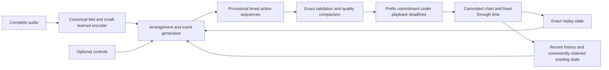

# Audio-conditioned choreography: target distribution and modeling primitives

This is a research proposal, not a V3 architecture specification. The objective
is a distribution of musically meaningful, playable arrangements. The existing
R1 checkpoint is a reproducible baseline and possible initialization; its timing
interface, memory, factorization and audio-free action decoder are revisable.
The [generation formulation](../formulation/notation.md) continues to own chart
legality and committed-prefix semantics.

The immediate research question is which dependencies a model must preserve to
turn complete music into varied, coherent timed actions under a playback deadline.
Selecting a larger network or reducing timing error does not answer that question.

## Current bounded direction

Fix the owner-confirmed repository music Mel representation and jointly learn
audio conditioning, event timing and complete-row generation from paired audio
and beatmaps. Do not make an encoder-sufficiency study a prerequisite: useful
information depends on the chosen decoder and training objective, and a freely
authored chart does not identify a unique sufficient audio representation.

Use `MUSIC_MEL_CACHE_CONFIG` and `compute_log_mel_10ms` from
[`mel_base.py`](../../src/ensomi_model/features/mel_base.py), together with the
repository waveform-loading convention. The frontend is mono 24 kHz, 128 Mel
bins, 10 ms hop, a 40 ms Hann window, `n_fft=win_length=960`, 20–12,000 Hz,
`center=False`, power 2, `norm=1`, natural log and a `1e-5` floor. Frame $i$ has
support $[10i,10i+40)$ ms and center $10i+20$ ms; repository right padding and
frame-count behavior remain authoritative. Feature spacing is not output-time
precision.

The first learned encoder should be small and explicit: a projection retaining
frequency information, a few residual temporal-convolution blocks with a declared
receptive field, and a shared audio-conditioning readout. Preserve the input time
resolution initially. Complete audio permits bidirectional context. Both timing
and action prediction receive the encoded audio; timing can inspect a bounded
upcoming sequence, and row prediction also receives context at its selected time.

Develop the generation structure and this encoder together. The available direct
supervision is paired beatmap/audio: event timestamps, complete actions, exact
replayed state and observed continuation/no-event intervals. Separate charts of
one recording remain separate training examples. No MERT-style pretraining
corpus, acoustic teacher labels, instrument annotations or complete style/demand
labels are assumed. BeatThis and broader encoders remain optional later
comparisons, not prerequisites for this baseline.

Defer new long-term musical-relation memory. Retain exact state and sufficient
recent generated history. The first implementation retains R1's 511-row finite
history encoder, historical query projection and compatible action heads. It
omits the seed residual, landmark memory and future-candidate consequence module.
This initializes a different model; it does not preserve the released R1 policy.

## What the first evidence changes

A bounded TRAIN audit compared different arrangements of the same hash-verified
audio. Its seed-eligible, at-least-60-second subset contains 416 charts and 584
same-audio arrangement pairs. Pair medians are descriptive: groups with more
arrangements contribute more pairs, and these are not population estimates.

| Observation | Consequence for the research question |
| --- | --- |
| Median head-time F1 at 20 ms is 0.785 between alternative arrangements; all-release F1 is 0.281 and release-only F1 is 0.092 | Matching one reference cannot define the full set of acceptable timings. Release choices are especially arrangement-dependent. |
| Among alternatives whose head densities differ by at most a factor of 1.2, head F1 is 0.941 but release-only F1 is 0.169 | A global rate condition leaves substantial hold/release ambiguity. |
| 78.7% of observed release rows coincide with a head row | Release-only events are not a separate exhaustive release target. Their membership depends on the chosen heads. |
| Long constant-spacing head runs occur, including hundreds of heads | Long rhythmic continuation must remain representable. This fact alone identifies neither Jack organization nor acoustic-onset correspondence. |

Source charts are examples of organization, not automatically positive playability
labels. The audit did not listen to audio or identify acoustic events. In
particular, a single musical cue elaborated into a long Jack is an explicit target
capability, not a conclusion inferred from constant-spacing counts.

The 48-chart audio pilot has one chart per audio recording. It therefore provides
no direct paired supervision of alternative arrangements of the same recording.
Its two-channel frame objective and threshold decoder are useful audio-transfer
baselines, but have not established a distribution over coherent alternatives.
With supplied coarse density conditions, frozen BeatThis features improved head
F1 from 0.677 to 0.732 on six assessment songs; release-only F1 remained low
(0.035 to 0.051). These are small, single-seed development results, not a quality
benchmark. The scores use the original fine-offset predictions before the later
native-millisecond materialization correction.

That pilot also used a separate experimental frontend (`n_fft=1024`, centered
windows, log10, a `1e-10` floor and different Mel/normalization settings), not the
owner-confirmed repository music frontend. Its audio-transfer results therefore
do not benchmark the newly fixed input contract. Preserve its original feature
identity; a canonical-frontend run needs a separate cache and evidence owner.

The R1 candidate experiment supplies a different observation. Adding unused
non-head opportunities changes the action distribution even though required head
times and the playable seed are fixed. Each intervention has 24 chart/seed pairs
from 12 songs and two seeds. For each pair, divide the changed chart's median
suffix-born LN duration by the baseline chart's median, then aggregate those
ratios. In the integer-millisecond rerun, adding one opportunity in every fourth
eligible gap produces a median ratio of 0.686 and a median LN-head-share increase
of 25.6 percentage points. Inserting into every eligible gap produces 0.375 and
68.6 percentage points respectively. This is total sensitivity to
the schedule, including changed timing features and RNG consumption; it does not
isolate a release hazard.

Beatmap Lens inspection separates this sensitivity from candidate quality failures.
In one generated SCREW passage, a lane closes at 90369 ms and is pressed again
at 90381 ms, while another lane is available. A second such relationship occurs
at 90709–90721 ms. These motivate comparison with equal-composition alternatives.
Conversely, inspected human examples contain legitimate short LNs, repeated
chords, mixed rhythmic gaps and asynchronous releases. Neither repetition,
irregularity, LN quantity nor disagreement with source density is a general BAD
label. No player trial or audio-listening verdict has been obtained.

## The modeled object

Let $A$ be complete source audio, $(H,g)$ the committed chart and fixed-through
time, and $c$ the optional style/demand requests from the formulation. For a future
window $W=(g,e]$, the target is

$$
P_\theta(Y_W\mid A,H,g,W,c),
\qquad
Y_W\in\mathcal V_{\mathrm{legal}}(H,g,e).
$$

This conditions on already chosen choreography as well as music. Two valid
arrangements of one recording need not have identical heads, durations, releases,
lane paths or local difficulty. A source imitation likelihood can be useful
training evidence without making a particular source the only correct output.

One possible latent factorization is

$$
P(Y_W\mid A,H,g,W,c)
=\int P_\psi(Z_W\mid A,H,g,W,c)
       P_\phi(Y_W\mid A,H,g,W,c,Z_W)\,dZ_W.
$$

$Z_W$ would describe a persistent arrangement choice, such as a continuing
rhythmic figure and its development. It is not assumed to be an annotated chorus,
a fixed section class, or a five-style label. A direct autoregressive joint model
is an alternative that can represent multimodality without an explicit latent
variable. The need for a separate $Z$ is a hypothesis, not a prerequisite.

The output remains complete simultaneous rows $(t_i,m_i)$. The first joint model
factors the next event into a waiting time and a conditional nonempty row:

$$
P_\theta(\Delta t_i\mid F_\eta(A),H_i,x_i,c)\,
P_\phi(m_i\mid F_\eta(A),H_i,x_i,\Delta t_i,c).
$$

$F_\eta$ is the small learned Mel encoder and $x_i$ is exact replay state.
The history contains the actions actually chosen, so a newly opened LN can affect
the next timing decision. Derive head-only, release-only and combined events from
the sampled complete row. An extra event-kind predictor is an optional future
factorization, not necessary supervision for the first model. This must also
account for no event before the horizon. A continuous-time construction needs a
declared density/measure and finite-sequence behavior. A discrete-time
implementation must state its clock and support restrictions. Quantization for
native `.osu` export is a materialization choice, not a new minimum-spacing rule
for the V3 chart language.

### Audio is not a list of permitted attacks

Music can support omission, accent selection, rhythmic elaboration, sustained
control, repetition and variation. There is no required one-to-one alignment
between acoustic onsets and chart heads. A transient may initiate a long rhythmic
figure; a sustained sound can support either holding or repeated articulation.
Additional acoustic onsets need not each become a required head.

An onset-expanded Jack is also not a timing-only property: repeating timestamps
can be realized as a Jack, a stream or alternating groups. The arrangement choice
must reach the action decoder, or timing and action must be modeled jointly.
This is a reason to reconsider the factorization, not to hard-code a Jack mode.

### A minimal source skeleton differs from serving opportunities

For a complete chart $Y$, let $R_Y$ be its actual row times, $B_Y$ its head-bearing
times, and $E_Y=R_Y\setminus B_Y$ its release-only times. These are a projection of
the complete arrangement. They do not identify a unique superset of unused but
acceptable release opportunities.

The released R1 can abstain at an extra non-head candidate, but its source timing
was the actual event union. Treating an arbitrary denser candidate schedule as
equivalent changes the input distribution. Conversely, an unobserved candidate
is not automatically a musically incorrect timestamp.

If a skeleton remains useful, distinguish actual event intent, uncertain proposals
and available execution support. Their meanings and supervision differ. A joint
time/action model can instead predict actual release rows directly, making a
separate opportunity process optional.

## Expressivity and boundary requirements

| Case | Required capability | A restriction that would lose it |
| --- | --- | --- |
| Regular subdivisions | Sustain a chosen pulse or subdivision with stable relative organization | Independent local mode switching or admission only at detected acoustic onsets |
| Tech, mixed fractions, tuplets and expressive offsets | Preserve fine, changing and non-grid timings; relate them to surrounding organization | A finite beat grid without a residual/general-time path; treating irregularity as an error |
| One cue expanded into a long Jack/dump | Continue a rhythmic and action relationship over a chosen span, with entry, development and exit | One head per audio peak, universal repetition penalties, or timing-only intent with unrelated lane generation |
| Repeated music with variation | Reuse relevant past organization while responding to changed sound content and current gameplay state | A hard chorus identity that copies a fixed chart template |
| Independent LN releases | Close one or several held lanes between heads or together with heads on other lanes | Release-only audio detection as the entire release model; independent lane clocks that cannot coordinate |
| Short LN articulation and long overlapping holds | Represent both, retaining exact endpoints and interacting taps | A minimum-duration cleanup rule, a universal LN percentage, or forcing every hold to fit one generation block |
| Rests and sustained intervals | Fix no-row decisions while preserving occupancy and advancing clocks | Treating absence of heads as absence of gameplay state or resetting memory after silence |
| Dense transitions | Anticipate upcoming demands and compare feasible action organizations | Filling the same density with arbitrary lane choices or suppressing difficult material to improve a score |
| Cold start | Generate from true BOS and the closed initial occupancy | Treating 30 supplied heads as a task law or inserting unplayed dummy history |
| Song end | Materialize every required close by the true end | Treating a crop boundary as terminal or implicitly releasing at playback end |

Finite compute or export support can bound an implementation, but those bounds
must be measured and declared rather than renamed as style or playability rules.
The current client's incremental LN protocol permits an emitted start whose close
is still unresolved. It therefore does not require short holds or waiting for all
future endpoints before playback.

## Shared audio conditioning

A timing-only interface implicitly proposes that the skeleton and chart history
are sufficient for downstream action decisions. In probabilistic terms, dropping
audio asserts an approximation such as

$$
P(\text{actions}\mid A,S,H,c)
\approx P(\text{actions}\mid S,H,c).
$$

The first joint design avoids requiring this approximation: the shared Mel encoder
conditions both predictions. Timbre, pitch movement, accents, texture and sustained
energy can affect arrangement through task training. Whether a particular network
uses those features well is an architectural and optimization question, not a
standalone information-sufficiency pass/fail metric. A scalar density or style
token is not assumed to preserve all relevant musical information.

Three complementary views are worth distinguishing:

- Local acoustic detail for transient shape, sustained activity and precise
  alignment. Temporal resolution and receptive support must be recorded.
- Metrical evidence, including uncertain beat/downbeat activity and relative
  phase. BeatThis contributes a useful learned view; its outputs are observations,
  not a compulsory clock or the entire representation of music.
- Broader musical content and relationships across time. Frame/sequence features
  from general music encoders can retain information beyond a beat objective.
  Full-song average embeddings alone cannot describe where the music changes.

[MERT](https://arxiv.org/abs/2306.00107) combines acoustic and CQT-based musical
pretraining targets. [MusicFM](https://arxiv.org/abs/2311.03318) studies pretrained
music representations across tasks. These provide candidate feature primitives,
not evidence that their embeddings already encode the arrangement semantics needed
here. They are deferred analogues. The current experiment learns its small encoder
from the chart-generation objective and does not require their pretraining setup.

## Primitives and the mechanisms they contribute

| Primitive and closest analogue | Mechanism to consider | What does not transfer automatically |
| --- | --- | --- |
| [Marked temporal point processes](https://proceedings.neurips.cc/paper_files/paper/2017/hash/6463c88460bd63bbe256e495c63aa40b-Abstract.html) | History-dependent event timing, marks and explicit probability of no event | Separate lane processes do not supply simultaneous complete rows; a generic intensity does not ensure musical structure or fast sampling |
| [Mixture inter-event-time models](https://arxiv.org/abs/1909.12127) | Multiple plausible gaps with tractable density, survival and direct sampling | Repeated local draws can drift between subdivisions; positive gaps alone do not prove coherent phrases or non-explosive conditional dynamics |
| [Hierarchical latent music generation](https://proceedings.mlr.press/v80/roberts18a.html) | A persistent choice can guide several lower-level decisions and their variations | Independent fixed subsequences would break occupancy and cross-boundary holds; latent codes are not automatically semantic controls |
| [Inverse sequence transformations](https://proceedings.mlr.press/v97/gillick19a.html) | Learn elaboration from deliberately simplified musical representations, preserving multiple possible realizations | A simplified chart is not an observed acoustic onset sequence; a drum grid is not the legal timing support for mania |
| [Music Transformer](https://research.google/pubs/music-transformer-generating-music-with-long-term-structure/) and [Museformer](https://arxiv.org/abs/2210.10349) | Relative relationships, detailed access to relevant older material and cheaper summaries elsewhere | Fixed bars, prescribed bar lags and source MIDI tokenization are not our section or timing contract |
| [Beat-aligned chart sequence generation](https://arxiv.org/html/2311.13687) | Direct audio-conditioned event sequences and useful metrical inductive bias | Its fixed beat-relative support and corpus exclusions do not cover all required dense/irregular cases; timing F1 is not playability |
| [Receding-horizon generative policies](https://diffusion-policy.cs.columbia.edu/) | Plan a longer joint continuation, commit a shorter prefix, reuse conditioning computation | Robot-action smoothness is not rhythmic quality; incomplete refinement is not a validated fallback policy |

These are competing or composable mechanisms, not a proposal to assemble every
named model. The source-bounded novelty assessment is adaptation of established
conditional sequence, latent-state and planning ideas. Any claim of a new
representation or useful combination requires evidence on the actual task.

### Musical coordinates as evidence

A soft beat coordinate can make regular subdivisions easy to learn while absolute
time preserves generality. One candidate uses a metrical position plus a residual;
another predicts a multimodal physical-time gap conditioned on beat evidence.
Both must represent fine fractions and non-grid events. Neither should turn a
half/double-tempo error into an irreversible exclusion of valid charts.

The research question is whether the musical coordinate improves learning and
coherence while retaining support. It is not whether a sufficiently fine lattice
can approximate the existing timestamps.

### LN release as conditional continuation

Two serious alternatives remain:

1. **Object duration planning:** propose a head/type and a duration or endpoint
   distribution jointly. This makes long hold intent available early, but future
   decisions must remain consistent with committed starts and other lanes.
2. **State-conditioned release events:** condition future complete rows on held
   lanes, hold ages, action history, future audio and the chosen arrangement.
   This naturally supports incremental closes, but needs learned duration and
   cross-lane dependencies rather than an unconditioned close probability.

A hybrid can carry a provisional duration plan while realizing releases through
the row process. An endpoint in a provisional plan is not automatically committed
history. Windowed training must handle holds whose endpoints lie outside the
window without fabricating closes at its boundary.

Release without a head is representable independently of head occurrence; release
is not statistically independent of heads, held state or other releases. The
entire simultaneous row remains the unit of exact validation.

For a waiting-time model, advancing through a quiet interval also requires
consistent residual survival. If $S$ is the current waiting-time survival and
$u$ has already elapsed without an event, remaining survival over $v$ is
$S(u+v)/S(u)$. Restarting the clock every time the scheduler replans would change
the modeled rest distribution.

## Deferred: memory without fixed musical sections

This section preserves future design considerations. It is not a prerequisite
for the initial shared-Mel, joint timing/row experiment.

Complete audio and generated-history memory answer different questions. Future
audio is available; future chosen actions are not committed facts.

Keep four kinds of information distinct:

1. **Exact replay state:** open lanes, actual starts and action clocks. This must
   survive arbitrary gaps and cannot be replaced by a compressed neural vector.
2. **Recent detailed history:** timing, complete rows and local relationships,
   with a measured receptive span in both events and seconds.
3. **Older paired music/arrangement memory:** summaries and selected detailed
   exemplars of what was generated in response to earlier musical material.
4. **Provisional plan state:** an uncommitted branch's intended continuation and
   possible durations. It is isolated from the committed memory.

A candidate older-memory entry binds an audio span to its actually committed
choreography. Current audio queries similar earlier spans through soft content
relations. The retrieved value describes their arrangement and boundary state;
the decoder can reuse, transform or depart from it according to current audio,
controls and exact occupancy. Similarity does not command literal copying.

This permits a repeated musical passage to recall a related pattern while a
changed melody, texture or accent changes its realization. No chorus label or
fixed section boundary is required. Overlapping time scales, learned span
summaries and selected event exemplars are candidate implementations. Their
adequacy is judged by retained relationships, not memory size alone.

The existing R1 landmark interval of 64 head rows is a bookkeeping choice. Its
duration varies with density and does not define a musical phrase. Keeping all
older information at equal detail is also unnecessary; the unresolved question is
which relationships need exact recall and which tolerate summarization.

## Information dependencies and real-time commitments

This is a dependency proposal, not a requirement for separate executables. Timing
and action heads can share a backbone; a slower interpretation module and a faster
event decoder are another factorization. R1 can initialize part of the action
decoder, acquire audio/shared-plan conditioning, or be replaced if another
factorization better preserves the required responses.

Real-time generation concerns publication deadlines relative to playback, not
causal observation of unknown audio. The scheduler owns clocks, budgets,
condition versions and the immutable published prefix. The fixed-through boundary
may be ahead of the player. No-row commits and open LNs remain meaningful state.

Plan duration, published buffer and player reading lead are distinct quantities.
Longer joint plans can support coherent dense passages while only a short prefix
is published. Audio representations can be cached; branch-dependent action state
cannot be shared as if all branches chose the same history.

The released R1's whole-schedule timing summaries are a compatibility issue for
that checkpoint, not an intrinsic task requirement. A new model can use bounded
future musical context and explicit uncertainty. Any change to planning horizons
must be reflected in training and cache dependencies. Compute degradation needs
its own quality evidence; dropping holds or reducing density is not a neutral
way to meet a deadline.

## Joint training with the available data

For teacher-forced source histories, optimize time/event-sequence likelihood and
complete-row likelihood jointly, including the probability of no event before a
censored window boundary. Both losses update the shared audio encoder and any
shared history/readout parameters. The row loss evaluated at source timestamps
does not backpropagate through a sampled time or train the time-head parameters
via that timestamp. This is joint statistical training, not a claim of direct
playability gradients through discrete generation.

The released R1 needs explicit adaptation to this task. Its future 16-candidate
roles/offsets, whole-schedule counts and normalized schedule position cannot
remain source-provided inputs during training if they are unavailable in native
generation. Replace that condition path with available audio/time/history
features. Reuse compatible R1 weights as initialization without claiming that
zeroing missing fields preserves its learned policy.

Likewise, use exact local row legality instead of feasibility tied to an unknown
future candidate list. An actual event row is nonempty; four held lanes still
permit a release-only row. Termination cannot leave an open LN, and a crop end is
not the song end. Train true BOS and short prefixes; do not expose future hold
endpoints unless the inference condition actually supplies them.

### First implementation: conditional hazards on the native clock

The bounded implementation uses a discrete event hazard at every integer
millisecond. Given the unchanged physical history, each candidate clock receives
its local audio context and exact elapsed-time features. A 10 ms query bin returns
ten hazard logits; this is vectorized computation, not a ten-millisecond event
lattice. After any sampled event, the next query can select the following
millisecond. Noninteger V3 times remain outside this native-export experiment.

For logits $l_j$, let $h_j=\operatorname{sigmoid}(l_j)$. The probability of the
next event at $j$ is $h_j\prod_{k<j}(1-h_k)$; no event through a window has the
corresponding survival product. An exponential draw is compared with accumulated
$\operatorname{softplus}(l_j)$ mass. Carry its remaining mass budget through
empty scheduler windows. Absolute bins, audio and physical history stay the same
across partitions, so splitting a query changes neither the distribution nor
the random draw. Advancing the fixed-through clock does not create a history row.

This branch lets timing inspect candidate-local music directly and gives long
rests an exact survival interpretation. A gap mixture would need an additional
mechanism to align its modes with future audio. Its potentially cheaper inference
remains a comparison if the hazard scan becomes the measured bottleneck.

The Mel encoder projects 128 frequency bins to 96 channels and uses six residual
depthwise temporal convolutions with kernel five and dilations 1 through 32.
Its halo is 126 Mel frames on each side. Interpolation uses actual frame centers
at $20+10i$ ms. Training crops include this halo and mask padding beyond the song;
native generation can cache the same full-song encoding. Timing and row heads
share it, without downsampling or pretrained acoustic supervision.

True BOS uses a cursor of -1 ms, allowing an initial event at zero. A normal
query end censors waiting and never forces a release. At the actual decoded
audio end, an open hold forces an event whose legal row closes every held lane
and opens none. With no held lanes, the model may finish without another event.
This terminal safety condition does not teach musically appropriate LN duration;
earlier releases must be learned from paired charts.

The experimental entrypoint is
`python -m ensomi_model.research.joint_audio_continuation.hydra`, with the packaged
`joint_audio` configuration. Preparation creates a fresh canonical Mel cache
and retains alternative TRAIN arrangements as separate samples. Training samples
groups, then charts; its BOS/event-prefix/absolute-time/outro query mixture is
explicitly recorded. Fixed-query memorization is a diagnostic, and validation
joint likelihood selects a development checkpoint only. Neither score is a
playability verdict. Each run requires a clean source revision and fresh output
directory; generation requires an explicit checkpoint path and SHA-256.

## Research trajectory and the next decision

The first runs change the direction in three ways:

- Source R/H is an arrangement projection, while arbitrary serving opportunities
  are a different object. The timing interface needs a declared semantic owner.
- The pilot is an audio-transfer baseline on a different frontend; the next model
  uses the fixed repository Mel and learns audio conditioning jointly with output.
- Lens inspection separates avoidable action choices from legitimate elaboration.
  A generic sparsity, regularity or repetition objective would erase valid modes.

The selected direction is **TEST**: can a small shared-Mel model learn the joint
timed-row distribution, initialized where useful from R1, while retaining the
required rhythmic and LN behaviors? The shared encoder and generation structure
are learned together under the fixed input contract.

1. Verify representation and state transitions before learning: adjacent-frame
   events, multiple same-role events within 10 ms, high fractions/off-grid times,
   long rests, cross-window holds, BOS, coincident heads/releases and true terminal
   closure. The frame pilot's peak picker suppresses adjacent occupied primary
   frames; extra same-frame slots do not repair that separate support limit.
2. Run a small learning check of the shared encoder, timing head and complete-row
   decoder together. Use only paired audio/charts; retain alternative charts as
   distinct samples and split by musical/audio identity. Check both likelihood
   terms, alignment and open-LN behavior before scaling data or parameters.
3. Generate native joint continuations. Compare source-time versus predicted-time
   continuation from matched prefixes as a diagnostic of error propagation, while
   keeping the fully generated result as the actual quality target. Inspect with
   Lens for specific burdens and preservation of valid difficult organization.
4. Choose one correction from an observed failure mechanism. Broader encoders,
   BeatThis conditioning, latent plans and new long-term memory remain deferred
   until the joint baseline exposes a reason to introduce them.

Short-horizon source likelihood does not establish rollout quality. Training on
generated prefixes or adding preferences may become necessary, but their targets
must be justified: paired audio/charts do not automatically label arbitrary
sampled continuations as good or bad. Do not convert a numeric gap threshold into
a universal playability rule or improve metrics by deleting difficult modes.

Evaluation keeps separate distribution coverage, musical correspondence, exact
mechanics, inspected action quality and deadline behavior. Style annotations
constrain declared scoped concepts; they are not numerical playability labels.
Human playtesting is still needed before final quality acceptance. Metrics should
also be tested against deliberate failure constructions: a repeated common loop
must not win simply because it raises self-similarity or likelihood. Recent
[chart-generation evaluation work](https://arxiv.org/html/2607.12857) motivates
that diagnostic practice, without replacing the Lens Foundation or human review.

## Evidence identity

- Product baseline for the audit and native-millisecond generation:
  `068988e670e174621f96627827dc28386b1e6775`.
- Released R1 checkpoint SHA-256:
  `4b3ec1561e33d0ebe2756cfe13571ec414fd5bb470b430f0c578545863115f70`.
- Study manifest SHA-256:
  `d416a1953bb4f0126c084457cd8d6c597c96533da9f40d8e3245949006af934c`.
- TRAIN distribution audit:
  `artifacts/audio-skeleton/20260923-v1/distribution-audit/`.
- Integer-millisecond candidate comparison:
  `artifacts/audio-skeleton/20260923-ms-sensitivity/sensitivity/summary.json`.
- Audio pilots and native continuation:
  `artifacts/audio-skeleton/20260923-v1/training/` and `integration-ms/`.
- Lens source/render review and actual tool traces:
  `artifacts/audio-skeleton/20260923-v1/lens-review/`.
- Lens implementation: `22e5c84f5cacb8493bdab5f1d0fdc09c5373dc60`; frozen
  Foundation: `15fa68913bdb2bf395a189df7ab433f6d5b126fc35c46c1dbc8e607ce2182e97`.

Generated artifacts may be absent in a fresh clone. The observations and their
limits are stated here independently of those local files.
