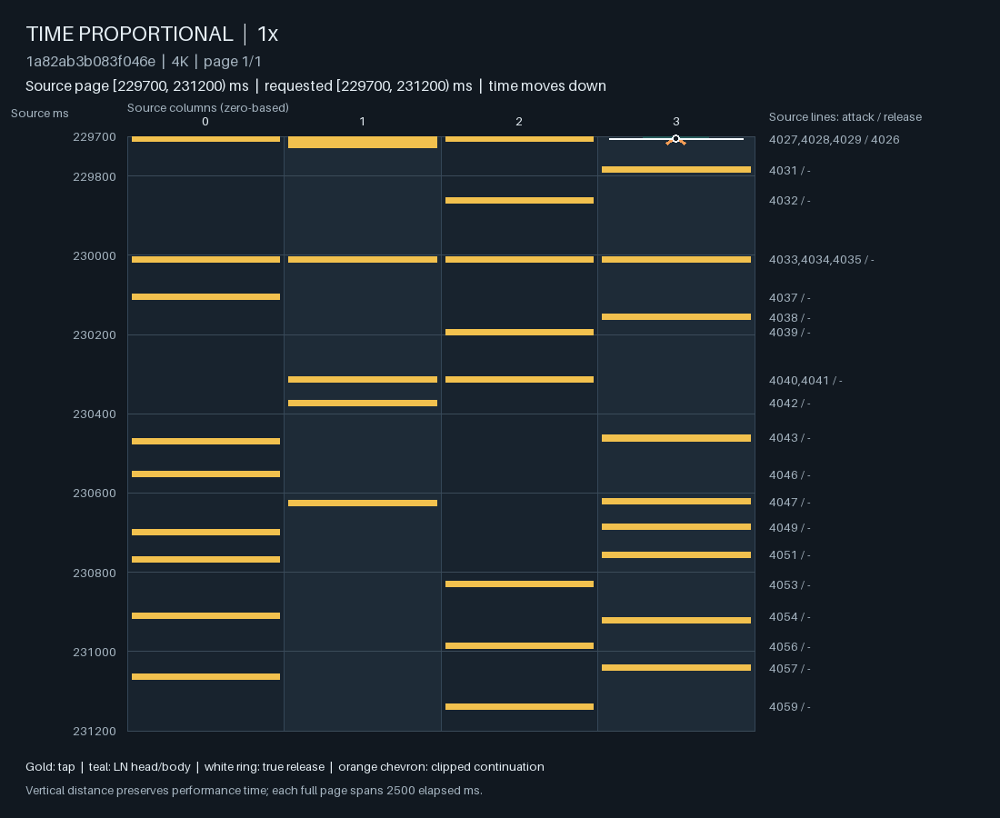
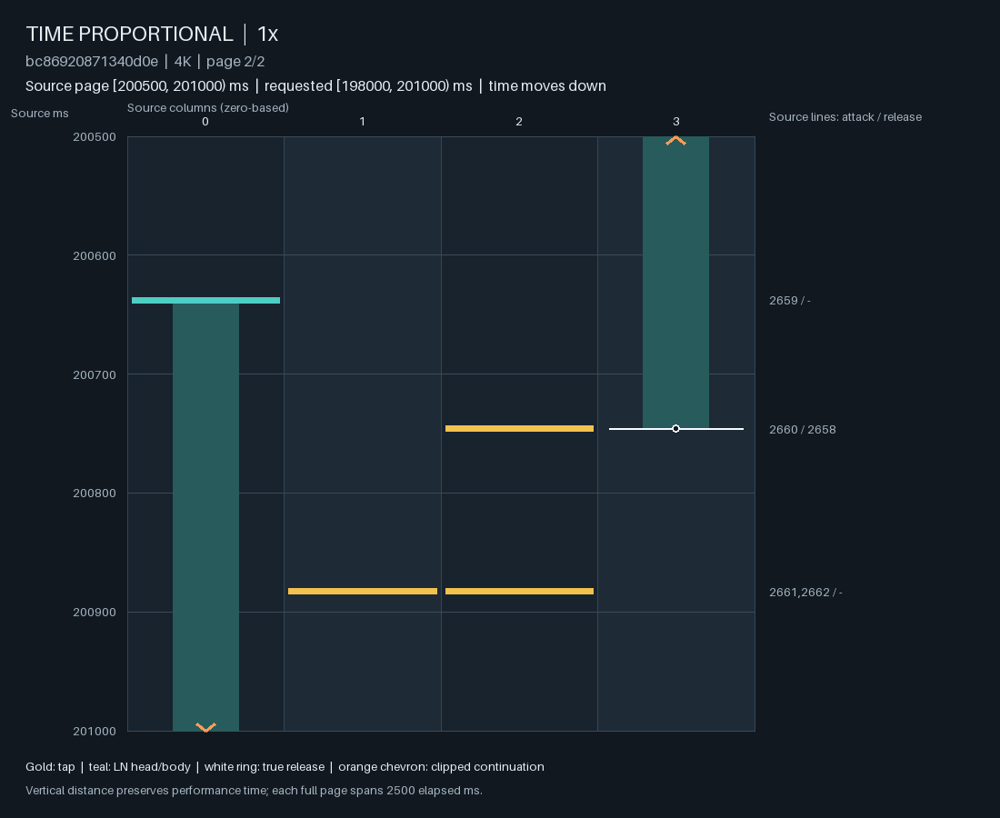

# 研究请教：如何学习可玩的 audio → skeleton + 按键编排联合分布？

证据截至 **2026-09-24**。本文与[数值证据](assets/audio_joint_expert_question/evidence.json)、
两张生成谱面图均受 Git 跟踪，可以在 GitHub 上独立阅读。源码见本文所在分支，
不能假设 `main` 已包含这些实现。无需聊天记录、Agent Notes、本地训练目录或
checkpoint；这里列出的测量是本地探索性结果，不是一个可在线复跑的完整数据包。

## 最需要你回答的问题

**只有成对的 beatmap + audio、现有区间风格标注和一台 24 GiB Mac，应该采用怎样的
条件输入、事件表示与训练目标，才能从完整音频生成可玩、可变化的 4K 编排？
请给出你最愿意实际训练的一种不复杂架构，以及能推翻它的小实验。**

我们尤其需要判断：当前失败主要值得通过扩大成对数据与训练覆盖来解决，还是
应先改变事件时间与动作的分解、音频与历史的交互，或加入小型编排意图变量？
请不要把修复下面的短连打、或消除一张谱的静默，当成整个目标。

当前模型、skeleton 接口、loss 和训练采样均可修改。R1 是可用的初始化与动作先验，
不是必须冻结的最终架构。希望你的建议能够解释目标分布，并给出可区分的预测，
而不是列一组可以尝试的网络名称。

## 目标与允许使用的信息

输入是完整歌曲，输出是 osu!mania 四列按下、保持和释放。最终监督对象是
**实际 note placement，包括 head、列位、和弦与 LN release**。同一音频允许有
多种好编排，重建某一参考谱的时间 F1、密度或 LN 比例不能单独定义生成质量。

**训练和推理都能使用完整音频 $x_{0:T}$。** 这里的实时性是生成结果要领先播放、
满足首次可玩窗口与密集段的计算期限，不是只允许观察实时到达的音频流。
因果限制主要约束已生成、已发布的动作，以及尚未决定的 LN 结尾。
如果完整对象表示先决定结尾，也可以改变这种决策顺序；客户端支持增量 LN 结尾，
无需为显示 head 而提前解决所有未来 release。

redline/timing-point 元数据的参考价值有限，**不作为节奏真值或允许落点集合**。
BeatThis 或其他 beat/downbeat 估计可以是可选证据；不能让估计的 beat grid
替代最终谱面监督，也不能禁止非标准细分与离网格表达。当前联合模型没有使用
redline、BPM 或 BeatThis。source-free 推理导出的 120 BPM 只是编辑器/滚动占位；
使用源谱模板的评测导出可保留原 header，这些元数据都没有进入模型条件。

需要保留的表达包括：

| 现象 | 表示与学习需要允许什么 |
| --- | --- |
| 一般 subdivision | 稳定的重复、节奏连续性与有组织的变化 |
| Tech、高 fraction、细微错位 | 原始时间精度，接近但不同的跨列事件，不强制简单节拍格 |
| Dump、长 jack | 一个声音动机可展开成许多动作；不能把每个 head 绑定一个独立声学 onset |
| Chordjack | 持续的重复和弦也是有效表达，不能用通用“去重复”目标删除 |
| LN coordination | 保留占用、独立释放、同时开启但不同结尾、release-only 与 head+release 同时发生 |
| 重复音乐中的变奏 | 音色、动态与全曲关系影响编排；不强制人工 chorus/section 分类 |

新增长程**生成谱面记忆**暂缓，不等于屏蔽已知的完整音频。我们现在希望先解决
音频条件与联合事件生成；以后会有风格和难度控制。已有区间风格标注可训练 readout
或控制接口，但缺失标签不能当负例，风格标签也不是 BAD-pattern/难度真值。
当前联合训练尚未使用这些标注。Lens 使用的 204 个人工例子是校准快照，不能
把它当成完整标注数据集规模或大规模生成偏好数据。

## 已确定的音频表示；尚未解决的全曲编码

采用人工确认过的仓库 canonical music Mel：24 kHz mono、128 bins、10 ms hop、
40 ms Hann window、FFT 960、20–12000 Hz、power 2、natural log、floor $10^{-5}$、
`center=False`，波形 peak normalization，末端补零。第 $i$ 帧覆盖
$[10i,10i+40)$ ms，中心是 $20+10i$ ms。Mel 后接什么网络仍开放；没有 MERT
级别的预训练数据或额外声学标签。

当前小编码器是 128→96 投影，加六个 kernel-5 的残差 depthwise temporal
convolution，dilation 为 1/2/4/8/16/32，不降采样。每侧需要 126 帧 halo。
它能够读到候选事件附近的频谱内容与有限未来，并非只读 onset 强度。

训练使用带完整 halo 的局部裁剪；推理为整曲计算同一编码。裁剪与整曲的逐点输出
以及实际 frame clock 已有测试。因此，当前实现没有“训练仅看过去，推理突然看未来”
的技术性失配，**但两边实际都只有有限局部音频感受野，没有充分利用全曲关系**。
“整曲一次性编码”不等于“每个位置获得整曲上下文”。

这是我们希望你重新设计的重要部分：如何以较小计算量让训练和推理都真正利用
完整音频，同时保留毫秒级局部证据？例如全曲较粗表示与局部精细表示如何交互、
如何仅靠谱面监督学习、是否需要很小的全曲意图/计划，均未确定。
不能用依赖目标事件的裁剪边界生成所谓全曲特征；全曲分支应由实际歌曲范围定义。

## 当前联合模型究竟生成什么

当前实现把 skeleton 视为完整动作事件的时间投影，而非外部检测器输出的必打点。
记 $A=E_\theta(x_{0:T})$，$H_i$ 为已生成行的有限编码，$S_i$ 为精确历史状态：

$$
p(t_i,a_i\mid A,H_i,S_i)
=p(t_i\mid A,H_i,S_i)\,p(a_i\mid t_i,A,H_i,S_i).
$$

这只是当前分解，不宣称它是最好的分解。事件行 $a_i$ 有四列，每列为
`EMPTY / TAP / LN_START / CLOSE`，精确归一化 256 个组合中的合法非空行。
关闭列可 EMPTY/TAP/LN_START，持键列可 EMPTY/CLOSE。普通窗口结尾不强制关 LN；
真实音频终点若仍有持键则强制关闭。当前语法不表示同列同一毫秒 close+restart，
这是实现边界，可挑战，不能当成所有可能谱面的定理。

时间 head 在绝对 10 ms bin 上输出十个独立的 native-ms hazard logits，
所以输出支持所有整数毫秒，允许同一 10 ms 中多个先后事件；没有峰值 NMS、
固定 slot 上限或 subdivision 白名单。令 $h_t$ 为下一事件 hazard、$q_t(a)$ 为
该时刻的合法行分布，则

$$
p(t,a\mid A,H,S)=\left[\prod_{u=c+1}^{t-1}(1-h_u)\right]h_tq_t(a).
$$

无事件窗口保留 survival；查询本身不向历史加入空行。推理以一个 Exp(1) 等待阈值
累加 $-\log(1-h_t)$，跨空窗口保留剩余阈值，真正提交事件后再抽下一次等待。
目前时间与动作两个 loss 共享编码，但 row loss 不穿过抽样时间反向传播。
源谱中的下一行时间用于训练 $q(a\mid t,\ldots)$，推理时这个时间由模型自己生成。

动作模块沿用 R1 的有限 causal TCN、左右手共享的完整行耦合与 routing。
总计 **2,950,458 参数**，其中音频编码 463,392；从发布 R1 复制 2,444,688 参数。
发布标签为 `r1-restored-6.75m`，原模型约 3.08M 参数，旧任务有给定 timing 和 seed；
其既有训练暴露不能算成新音频编码器与时间 head 的训练量。
历史上限 511 行，hidden 128。精确状态保存 occupancy、LN 年龄、各列/手距离
上次 head/release 的时间与计数，和 learned history 分开；没有未来源 LN 端点。

这不是冻结 R1 后接一个 detector。旧 R1 的 seed residual、landmark memory、
未来 candidate consequence 模块和未来 timing 输入列被省略；剩余模块联合更新。
当前模型从 BOS 自行生成，不用真实开头作 seed。发布 R1 的历史接口需要达到
30 个 **head** 的完整行；“首 30 个 head 的生成速度”仍测量，但没有把真值 seed
隐藏地提供给这个联合模型。

## 训练规模、目标与真正的信息失配

整个已审计 TRAIN catalog 有 11,564 张谱、约 1,608 万个 head；当前联合试验只用
**48 个 TRAIN 歌曲组、121 个独立编排，以及 12 首 validation 歌曲**。
替代编排要求同组、完全相同音频字节，分开作为样本，从不合并为逐帧标签并集。
这仍不是全面的音频级去重保证。没有打开 TEST 谱面做本轮选择。

训练按歌曲组、再按该组编排抽样，query 类型为 BOS 8%、事件前缀 70%、
随机绝对时间 17%、outro 5%。时间 loss 包含从 cursor 到目标的全部 survival
和目标 hazard；行 loss 是目标时刻合法行 NLL。长等待拆成相邻无重叠的窗口，
按一个逻辑 example 求和后再平均，保证目标不会因为超出 4 秒窗口而消失。
另有一次覆盖全部 39 个 TRAIN 长等待转移的 coverage pass。

交付的 `coverage-v1` 起点是在 2400-update 试验中按固定 development NLL 选出的
**第 2000 步**：batch 16，经历 32,000 个逻辑 examples、33,862 个物理 queries。
完整试验的 38,400 次抽样不能算进第 2000 步权重的训练量；抽样次数也不是独立
目标行数或完整 epoch。此处远没有证明模型已充分训练。

主要训练用 Apple M5、24 GiB 统一内存、PyTorch 2.11、MPS、FP32。
新模块 LR $3\times10^{-4}$，继承模块 $3\times10^{-5}$，AdamW、weight decay .01、
gradient clip 1。2400 步约 1118 秒，模型参数扩张尚无必要性证据。
计算预算允许先做分钟级验证，再开展整夜训练；当前 48 个组不是可用数据的上限。

与音频不同，**谱面历史存在真实的 train/inference 分布差异**：训练主要看到
真实前缀和目标时间，推理看到自己生成的动作、时间、LN 占用与累积节奏。
我们不能直接给一个改变了内容的生成前缀接上原谱下一行，称其为正确纠正标签。
另一方面，训练时有意屏蔽部分历史信息、边缘化未观察条件，是否能合法而有效地
学习更稳健的音频驱动，是开放问题。请区分缺少条件与篡改已发生动作这两件事。

## 已经得到的主要证据

### 小模型可以学到部分组织，训练 loss 不足以验收

32 个固定 query 的记忆实验能把 TRAIN joint NLL 从 9.619 降至 .00124，
validation 却从 10.494 升至 45.349，生成出现毫秒级重复。扩大到上述 48 歌曲组后
显著改善；complete-wait 模型的固定 48-query validation NLL 为 **6.091 nats**。
其中有 45 个实际事件目标，行 NLL 对事件另行计算。这个验证面板很小，已反复
用于开发，没有置信区间或独立泛化结论。

一个完整 YOASOBI 输出有 896 个动作事件、967 个 head、301 个 LN。
Lens 的完整事件检查和系统/针对性图像检查找到连贯 tap/LN 组织，可以交给人试玩；
这不是盲测，也没有音频听感或真实玩家结论。其他样本仍有明确的局部失败。

冷 Python 进程、OS 文件缓存已热的一次测量：含 imports、模型加载、解码、Mel、
生成，首 8 秒覆盖 1.44 秒，首 31 个 head 为 1.51 秒，整首 242.7 秒音频约 3.38 秒。
不含脚本开始前的解释器启动、客户端与网络。其他密集样本的逐步 P99 约 2–3 ms。
500 ms 与 4000 ms 查询已在具体样本和测试中保持相同行序列，缩短查询减少重复计算。
空谱很快完成不能算首窗口成功；性能必须和可玩的实际输出一起检查。

### 显式局部先验有效，但不等于学会编排

全 TRAIN 的同列相邻 head 间隔最小值为 27 ms，没有 ≤20 ms；这是该语料属性，
不是人类生理定律。一个可选、默认关闭的先验对新 head 使用

$$
a(m,t)=\prod_{j\in\mathrm{new\ heads}(m)}
\min\left(1,\left[\frac{t-t_j^{\mathrm{last\ head}}}{27\,\mathrm{ms}}\right]^4\right).
$$

release 不受此因子影响；它读 head-to-head，不把 LN tail 当作最近一次 head。
接受的联合质量变为 $h_tq_t(m)a(m,t)$，无接受事件的概率为
$1-h_t\sum_mq_t(m)a(m,t)$。被拒绝的 proposal 不进入物理或 learned history。
所有原 TRAIN 真实 head 都保留因子 1；所有正的新间隔仍有正概率。

同六 TRAIN/十二 VAL、同 seed 的 18 张输出中，≤10 ms 的同列连续 TAP 从 42 降至 0，
≤20 ms 从 157 降至 10，每谱 head 数相对起点的中位比值 .9866。所检查的和弦、
跨列细小错位与独立 release 仍在；YOASOBI 原型字节不变。但剩余 14–20 ms TAP
和更广音乐性仍未解决。此结果不授权一个通用最小间隔过滤器。

### 把先验蒸馏进网络，没有得到更好的最终模型

两份相同 `coverage-v1` 权重继续 600 步，均使用全体 121 TRAIN 编排、相同源样本
与顺序、batch 16、fresh AdamW；继承/新模块 LR 为 $10^{-5}/10^{-4}$。
control 只用原谱 likelihood；student 额外使用生成历史上的完整 next-event KL。

teacher 为固定起点加上述先验，目标枚举之后 80 ms 的全部“时间+完整行”质量，
加上窗口内无事件的 censor 质量。系数 1，每步四个 native contexts，不增加参数。
五首 TRAIN 歌曲给出 640 个抽样上下文，实际只有 390 个不同前缀；第六首
Scars of FAUNA 留作 native transfer probe（真实谱仍在普通 TRAIN）。它的 128 个
探针实际为 70 个不同前缀。**这些不是人类纠正标签。** 最终固定取第 600 步，
生成时关闭解码先验；没有事后从中间 checkpoint 挑最好听的一份。

| 指标 | 起点 | source-only | source + native KL |
| --- | ---: | ---: | ---: |
| 固定 validation joint NLL | 6.091 | 6.449 | 6.436 |
| 留出 native histories 上 KL | .0530 | .2012 | .1029 |
| TRAIN pressure contexts 上 KL | .1163 | .2562 | .0492 |
| 18 谱中 ≤10 ms 连续 TAP 对 | 42 | 11 | 2 |
| 每谱 head 数相对起点的中位比值 | 1 | .642 | .688 |
| 18 谱 LN head 总数 | 1839 | 3202 | 4091 |

student 学到了部分训练 pressure contexts，但没有迁移和保住所设的组成回归界限。
source-only 也明显漂移，故不能把全部变化归因于蒸馏。两份新权重均未替换原型。
36 张新谱全部通过机械重放、export/reparse 与 Lens 严格解析，依然不代表可玩。
八个 student 区间的完整动作表和 16 张生成图已检查，仍发现如下不同性质的关系：

| 谱面/时刻（ms，列从 0 开始） | 观察 |
| --- | --- |
| GR4VITY：230010 列 0/1/2，230011 列 3 | 跨列 1 ms 错位，不能用全局事件间隔规则删除 |
| GR4VITY：230460、230463 都为列 3 TAP | 残留 3 ms 同键重复，和上一行不是同一类关系 |
| Waltz：列 0 LN 144636→144820，TAP 144844、144853 | 需要区分 24 ms tail gap 与后续 9 ms TAP-to-TAP；前者不能自动判 BAD |
| Fffire：列 3 LN 200480→200746，列 0 LN 200638→201157 | 持续、交接与独立释放依然可以形成合理局部组织 |

### 除了过密反馈，还出现了难以恢复的静默

student 的 SCREW 输出仅有八行、十个 TAP head，全部位于 7046–7820 ms；
生成正常完成到音频真正终点 121033 ms，没有资源中止或未关闭的 LN。
完整八行已放进[数值证据](assets/audio_joint_expert_question/evidence.json)。

固定这八行，独立计算 7821→121033 ms 的累计 hazard：起点 7.4354、control 5.0947、
student 5.0165。student 的实际下一次 Exp(1) 等待阈值为 **6.3416**，没有被穿过。
独立积分与生成器消耗的 hazard 相差约 $2.3\times10^{-6}$；把 query 从 500 ms
改为 4000 ms 得到完全相同八行。这个案例的静默来自预测分布与抽样尾部。

从最后一行立即看，student 到歌曲结束都无下一事件的概率只有 .00663；
但**条件于已经无事件等待四秒**，此后整首仍无事件的概率升至 .754，
起点在同一前缀上也有 .512。不能把这个条件概率误写成总体断流率。

为避免只看一个失败，另从起点的 18 张完整输出各取八个合法、全列关闭、
至少 30 head 且有 12 秒余量的前缀，共 144 个。对它们假设尚未提交后续事件：

| 固定未来音频的条件 | 后 8 秒累计 hazard 中位数 | 后 8 秒无事件概率中位数 |
| --- | ---: | ---: |
| 真实前缀，已等待四秒 | 3.250 | .0388 |
| 全部前缀时间戳加 3800 ms，内容和相对间隔相同 | 16.846 | $4.83\times10^{-8}$ |
| 完整、一致的 BOS 条件：无已知动作与过去时钟 | 4.872 | .00766 |

平移不改变 content token，已逐项验证；它改变编排与音频的关系，没有音乐质量标签。
BOS 是另一个条件事件，不能据此在实际生成中直接删除历史。另做的“只把 learned
history 换成 BOS、保留非 BOS exact state”是非物理网络探针，不能支持真正 reset。

144 个前缀中，26 个在已等待四秒后，接下来八秒继续无事件的概率 >.5。
但从这些实际前缀先进入四秒空白的概率中位数只有 $9.21\times10^{-10}$，
仅 2/144 高于 1%。这个实验定位的是条件边缘状态，不是宣称 18% 谱面会断流。
它尚未辨明更多长等待/生成历史监督、改变时间参数化、独立音频驱动或编排意图
哪一种干预最有效。

## 请你重点帮助作出的选择

1. **全曲音频与小模型。** 训练、推理都可看完整 Mel 时，你会怎样组织局部精细证据
   与全曲较粗关系？仅靠 note placement 监督，怎样避免全曲编码成为昂贵但不被利用
   的支路？长期谱面记忆暂缓时，最少需要何种全曲上下文或意图？
2. **生成分布的基本对象。** 保留 next-time hazard + 完整行，改为 marked competing
   intensity、下一等待时间分布、局部 block/计划，还是另一种分解？请说明对真实细分、
   一个声学 cue 展开成长 jack、独立 LN release、多种合法编排分别有什么影响。
   “只要概率上能表示”与“有限监督下容易学会”应分开讨论。
3. **训练失配与稳定性。** 在不能给任意生成前缀套用原谱未来的条件下，应怎样训练？
   如何同时处理爆发、少发音、休止后恢复，以及时间误差传到选键/hold 状态的问题？
   显式音频驱动与随休止衰减的历史调制是否有价值，还是目前证据更支持先扩大
   成对训练覆盖？不要只优化我们列出的诊断阈值。
4. **可辨认的编排选择。** 同一音频多谱应如何进入目标分布，才能形成一次采样内
   自洽的密度、LN 组织与变化？若需要意图变量或 future controls，最小表示是什么、
   从现有谱面/区间标注怎样学习，并避免把参考图的未来信息暗中给模型？

希望你的回答最后收敛到：一个建议架构及其信息依赖图；一组明确的训练目标与
采样单位；最多两三个按优先级排列、在这台 Mac 上可完成的区分性实验。
请写出什么结果会否定你的选择、哪些 guard 防止靠稀疏化/固定循环取得假改善，
以及在什么证据出现后才值得扩大数据、训练时长或模型。也请指出现有测量中
不能支持我们推断的地方，必要时先提出一个更关键的诊断。

## 可直接查阅的代码

下列相对链接均指向本分支受跟踪源码；没有一个依赖本地 `artifacts/` 才能阅读。

| 文件 | 重点 |
| --- | --- |
| [model.py](../../src/ensomi_model/research/joint_audio_continuation/model.py) | Mel TCN、R1 初始化、共享条件、时间/整行分布 |
| [state.py](../../src/ensomi_model/research/joint_audio_continuation/state.py) | 精确历史 clocks、occupancy、合法行支持 |
| [data.py](../../src/ensomi_model/research/joint_audio_continuation/data.py) | canonical Mel、独立编排、观测前缀与标签分离 |
| [batching.py](../../src/ensomi_model/research/joint_audio_continuation/batching.py) | halo、真实 frame clock、目标时间与 predictor 输入边界 |
| [sampling.py](../../src/ensomi_model/research/joint_audio_continuation/sampling.py) | full-wait、query mixture、coverage pass |
| [training.py](../../src/ensomi_model/research/joint_audio_continuation/training.py) | 训练归一化、两类学习率、validation 选择 |
| [timing.py](../../src/ensomi_model/research/joint_audio_continuation/timing.py) | survival likelihood 与跨窗口采样 |
| [generation.py](../../src/ensomi_model/research/joint_audio_continuation/generation.py) | BOS、精确提交、真实终点、完整音频推理 |
| [distillation.py](../../src/ensomi_model/research/joint_audio_continuation/distillation.py) | 生成历史上的完整 next-event/censor KL |
| [测试](../../tests/research/joint_audio_continuation/) | CPU/MPS、裁剪/整曲等价、未知 LN 端点、分块与生成一致性 |

当前架构及这些实验的实现基线是 `16209eaf9000867de72ba9c5f04989e1b1e990f6`；
三个权重和主要数值来源的 SHA 在随文 evidence JSON 中。参数未因恢复诊断而更新。
较早的 `audio_skeleton` 目录属于另一 Mel 前端的 pilot，不是本轮已确认的输入契约。
仓库中 pre-V3 mapper/timing/ControlV3 代码也不是本研究的设计或正确性依据，见
[README 的边界说明](../../README.md#legacy-code-boundary)。
