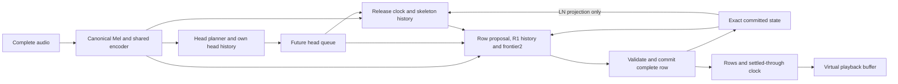

# Full-audio generation and playback budgets

The planned audio model has substantial compute headroom on the measured Mac
workloads. Fresh audio decoding, canonical Mel computation and generation of
the first 30 physical rows plus eight seconds of settled coverage take
0.55–1.05 s across nine fixed native cases with a resident model. A 585.495-s
source-head workload takes 1.90 s to become ready. These measurements support
a simple buffered scheduler while musical arrangement remains the primary
unresolved model question. They do not establish client latency, OS worst-case
behavior or chart playability.

## Information flow and scheduling ownership

The [planned model](planned_audio_continuation.md) uses full audio in training
and inference. The model and the probe's virtual consumer have this dependency
graph:

Rows directly read audio as well as future skeleton information. Release timing
reads occupied columns, active LN ages and its observation clock; it does not
read the row-content encoder or tap-layout history. The pilot head stream is
independent of LN state, a stronger restriction than the general information
contract. Extending LN feedback to that stream remains a model change, not an
incidental scheduler optimization. Full audio is immutable input, while chart
state is causal and changes only through complete committed rows.

Three quantities must stay distinct: the available head plan, the settled
row/no-row clock, and the player's audio clock. A row's latest timestamp does
not certify that the following interval is empty. Only the settled-through
clock provides that guarantee. Active holds can cross that clock without
known tails; the client protocol supports incremental LN endpoints.

A materialized row already depends on its supplied future H preview. Replacing
those Hs after committing the row would change the claimed joint sampling law,
even if the new chart happened to remain physically legal. A scheduler must
retain those dependencies or explicitly define a different replanning policy.
Keeping draft rows private until their dependencies are stable is separate
from mutating published rows. Head, release and row random streams, survival
residuals, temporal caches and exact replay all belong to the state that
speculative execution would need to preserve.

## What the measured deadline means

Let update $i$ settle the chart through audio time $g_i$ at wall time $u_i$,
in seconds. Playback starts at wall time $s$ with presentation lead $\ell$.
Immediately before the next update, available coverage is still $g_i$, so
its slack is

$$
\sigma_i=g_i-\bigl(u_{i+1}-s\bigr)-\ell.
$$

Evaluate this only after playback starts and before the complete-song
watermark has arrived. Negative slack means the generator missed the declared
presentation deadline. The probe uses $\ell=2$ s and starts playback when both
30 physical rows and eight seconds of coverage are ready. The start is fixed
by those requirements; it is not moved afterward to conceal later misses.

The first 30 rows are generated from BOS, without a source-chart seed. They
need not lie within the first eight audio seconds. Long empty intervals and
remaining LN tails use the true audio clock; scheduler chunks do not invent
closure or termination.

## Fresh-input and workload results

The probe uses conditional-release checkpoint
67b8fc8fbac5f7ca2debe99524e29ac002546f12cb8a3c4c9acf68d68d7f3839,
with short-attack correction off, on one CPU thread of an Apple M5 with
24 GiB RAM. Every case freshly decodes its audio and recomputes canonical Mel.
The model stays resident between cases. OS file caches are not evicted.
One-time Python imports take 0.880 s and model loading 0.168 s; those costs
are separate from the following resident-model readiness values.

| Workload | Source audio | Ready from audio file | Full generation from Mel | Slowest measured 8-s service interval |
| --- | ---: | ---: | ---: | ---: |
| Nine autonomous native cases | Fixed Who / Death Piano / Prom Queen / Good Luck / Airborne cases | 0.553–1.052 s | 1.078–5.533 s | 0.093–0.215 s |
| Dense source-H workload | 115.509 s; 180 H in one 8-s source window | 0.550 s | 3.834 s | 0.333 s |
| Long source-H workload | 585.495 s; 4325 source H rows | 1.899 s | 8.241 s | 0.211 s |

The two source-H cases test sequential service with authentic head schedules.
No source actions or LN endpoints condition generation, but these cases do not
establish autonomous skeleton quality. Selection is fixed by maximum H count
in an eight-second window and maximum decoded duration within the pinned
651-chart corpus, with source-hash tie breaking. Their generated charts remain
qualitatively unreviewed in this study.

All nine native outputs reproduce the cached-Mel baseline rows exactly. All
eleven charts complete and independently reparse, with no strict same-column
attack pairs below 20 ms. This verifies the unchanged sampling path and a narrow
diagnostic, not musical quality.

Virtual playback has zero missed deadlines on all eleven measured traces,
including generation wall-cost multipliers of four and ten with corresponding
startup readiness, and a single simulated one-second stall at each trace's
worst eight-second service interval. Lowest unscaled slack is 5.998 s; lowest
tenfold slack is 5.981 s. These deterministic trace replays omit client
rendering, network delivery, background contention and unmeasured extremes.

## Which complexity the evidence justifies

The initial serving path can encode full audio once, fill head lookahead,
interleave release and row generation, and publish settled coverage into a
buffer. The measured workloads do not require a draft model to meet deadlines.
The [audio-only streaming entrypoint](planned_audio_continuation.md#generate-and-stream-from-an-audio-file)
implements this contract with visible per-stage timing. It retains native
quality diagnostics rather than equating successful scheduling with successful
choreography. The producer is local and synchronous; client transport and
playback remain outside this repository.

Exact speculative decoding uses draft proposals and a verification rule that
preserves the target distribution; it is not simply replacing expensive steps
with cheaper predictions. That principle transfers from
[Leviathan et al. (2023)](https://proceedings.mlr.press/v202/leviathan23a.html).
An Ensomi verifier would need timing survival factors, release support and
complete-row probabilities under the same LN state. A row-correction kernel
defines a different target from the raw neural softmax. A measured latency
bottleneck should precede that additional machinery.

The read/write scheduling analogy with
[STACL](https://aclanthology.org/P19-1289/) is limited: that task acts while input
is still arriving. Here all audio is available, and output computation must
finish before playback deadlines. Importing a causal audio restriction or
discarding available future audio would change the task and training conditions
without evidence that it helps.

## Shared arrangement conditions as a model direction

Scheduling headroom allows work on coherent joint arrangement rather than
accumulating independent decoding patches. In the paired TRAIN corpus, 184 of
240 audio assets have multiple arrangements. Their median within-audio ranges
are 2.826 H rows per second, 0.364 heads per H row, and 0.093 LN-head fraction.
Audio alone therefore does not identify a unique choice of these properties.
This descriptive observation does not prove that the current model cannot
represent their joint distribution.

A small, interpretable candidate is a shared arrangement condition containing
H-row rate, mean chord width and LN-head fraction, supplied to head, release
and row modules throughout a chart. Each real chart remains a separate target.
Training can derive these conditions from the target chart; audio-only
inference needs a learned conditional prior or an explicit user request, never
hidden reference-chart information. A prior should retain multiple plausible
combinations instead of returning componentwise means that may not describe
a real arrangement. This is a proposed direction, not an implemented control.

These measurements are neither calibrated difficulty nor substitutes for Tech,
Jack or LN-coordination judgments. Native tests must check realized behavior,
local musical alignment and Lens-inspected organization. Style supervision
belongs only to its annotated scopes; missing labels remain unreviewed. Lower
conditional NLL is insufficient: target statistics make likelihood easier even
when generation remains poor. Sparse-piano sampling and coordinated future
release choices remain distinct unresolved questions.

## Evidence identity

Product source: 7ea2e82eebd9afbc97ec8db23cf361885fc8e0a1. Local run owner:
artifacts/joint-audio/20260924-playback-budget-v1/run-v2. Freeze:
0a40f2a5f65800315a062c311c9365874f509bec3f6a30dac57146d1d6b2c913.
Result: d7a07c92412562e23d5b0cf9deef0751af0ca24fc842c98849cfd82f60078b2f.
The eleven-case run took 37.248 s. Corpus manifest:
4ad9abfd0ae7798e0a85b96a5dbecdaefd2a81f78bf181438407442b964118e1.

The [candidate-response study](head_plan_row_response.md) contains the separate
quality intervention and its failed full-chart release-to-head guard. Neither
study promotes the checkpoint as a final playable system.
