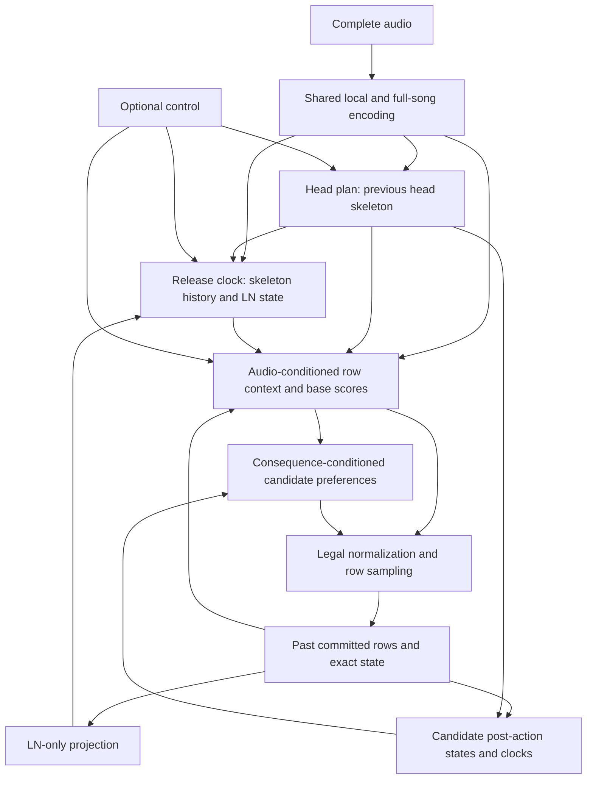

# Audio, skeleton and row information contract

This document fixes input requirements and a small candidate factorization.
The [planned head/release prototype](planned_audio_continuation.md) implements
that factorization; playability remains under evaluation. The
[scoped complete-row restoration](controlled_audio_continuation.md) carries its
decision ownership into the control-conditioned study. The earlier flat joint
audio and typed resource models remain diagnostic baselines.

## Required information paths

Complete canonical Mel audio is available during training and inference. It
conditions both skeleton generation and row materialization directly. Skeleton
is an arrangement, not acoustic onset detection: one sound may support many
heads, and irregular placement must remain possible. Reference note placement
provides supervision; redlines are not timing truth.

Skeleton preference networks read their own history and an explicit projection
of committed LN state. They do not read learned row-content history or a generic
replay object that exposes unrelated history. The scoped sampler additionally
receives R1's required release window from an execution-feasibility response.
Row materialization reads audio, skeleton,
its own row history and exact physical state. It chooses columns, chords,
tap/LN kinds and releases. Its design must also account for how candidate
actions change the responses to subsequent legal continuations. The
[gameplay frontier](../formulation/gameplay-state.md#target-response-and-frontier)
owns that conceptual role; the finite evaluator and its training targets remain
research choices. Incremental publication does not require deciding an LN
endpoint when publishing its head.

An H skeleton event requests a head-bearing row, not a head count, chord, LN
count or column allocation. Those choices belong to R1's complete-row policy,
which receives the controls directly. Release timing does not prescribe which
held columns must close. An internal count/layout factorization may organize
R1's probability law, but must not become an upstream typed-count requirement.
Candidate frontier effects must survive normalization across count families.

Let $A$ be audio, $C$ an optional external control, $K$ skeleton, $R$ rows and
$S_i$ exact replay state. Define $O_i=\pi_{\mathrm{LN}}(S_i)$ explicitly:
occupied columns, active-LN start times and the observation clock. Ages derive
from those times. Tap layouts, cumulative row/head counts, learned row embeddings
and unrelated action clocks are excluded.

At fixed model parameters, the preference-network independence is

$$
f_{\rm timing}(A,C,K_{<i},O_i,R_{<i})
=f_{\rm timing}(A,C,K_{<i},O_i).
$$

Changing TAP count or placement while preserving the listed inputs leaves the
timing-network outputs unchanged. Changing actual LN state may change them.
Row prediction remains sensitive to row history. Joint gradients through a shared
audio encoder are compatible with this independence. Row draws must not advance
the head or release generator's random stream.

The complete release distribution also depends on its admissible waiting window.
R1/scheduler computes that response from committed recovery clocks and the
proposed H continuation, then supplies only earliest/latest release bounds to
the sampler. In the scoped prototype, HH=60 ms and RH=50 ms mean that an old held
key can release/repress before a newly tapped key recovers. LN occupancy alone
cannot determine the required deadline. Consequently, the earlier independence
claim for the entire skeleton distribution is too strong: effective release
sampling intentionally responds to R1's feasibility constraint. H prediction
and release preferences retain the restricted neural information paths above;
head count and release identity remain R1 decisions.

## Dependencies in the earlier flat joint model

The [flat joint timing path](../../src/ensomi_model/research/joint_audio_continuation/context_model.py)
uses an audio/LN-state base plus a bounded residual reading the row TCN and full
historical exact-state vector. The base has the appropriate restricted physical
input. Bounding the residual does not remove its row-content dependency.

The [row decoder](../../src/ensomi_model/research/joint_audio_continuation/model.py)
receives local and full-song audio directly through `audio_residual` and
`context_condition`. Its skeleton input in that model is the sampled event time;
there is no separate forward skeleton input. Audio can suggest possible future
arrangements but does not identify which one will be sampled. This missing
interface is not a proof that the joint distribution is unrepresentable.

Neither flat joint model instantiates R1's `row_consequence` module. Its transfer
also removes its supplied future-timing inputs. As verified in the
[transfer audit](r1_transfer_stability_audit.md#what-actually-transfers), the
6.5M and 6.75M R1 checkpoints initialize identical joint models: the final
`frontier2` correction has no direct parameter effect in those flat models. This
is a missing candidate-action consequence path, not a measurement of how much
of the new system's generation failure it explains.

The [planned model](../../src/ensomi_model/research/planned_audio_continuation/model.py)
restores `RowConsequence(hidden, 'frontier2')`, explicitly copies its released
weights, and includes its scores in both training and native row selection.
It trains at the inherited R1 learning rate. The flat-model omission therefore
does not describe this prototype; the remaining consequence approximations are
defined [below](#candidate-consequences-and-the-gameplay-frontier).

A controlled audit uses a complete Airborne Robots output from checkpoint
`02f6511fbd146a656b84e6aaf95821068d56f9dc16b3a0d36c51e0267a3be910`.
Only preceding taps are moved to available lanes. All event times, H/R roles,
per-row tap counts and LN starts/releases remain identical. Both prefixes are
physically legal; the same full audio is used, with no reference-suffix loss.

| Prefix cutoff | LN occupancy | Maximum timing-logit change | Next-event CDF within 50 ms, original / altered |
| --- | --- | ---: | ---: |
| 147207 ms | None | 0.45880 | 61.81% / 58.95% |
| 148249 ms | Columns 0 and 1 | 1.41904 | 61.36% / 73.08% |

The timing base and gate are exactly equal across each comparison. The change
is in the residual containing row history and non-LN clocks. This locates an
active path forbidden by the new interface. It does not separate those two
residual inputs, establish that the altered layout is good, or prove this path
caused a particular bad pattern.

## Candidate factorization: head plan and release clock

A small candidate predicts head times ahead, then places additional releases
using committed LN state. This is a proposed inductive bias, stronger than the
general contract: LN state affects the release part of skeleton, while the head
stream stays independent of row realization. It is not a claim that every
desirable head rhythm is independent of LN choices.

Feedback refers to earlier committed events, not an algebraic cycle within a
decision. The head generator uses audio, controls and its own head-time history.
Native-millisecond support permits regular subdivisions, high-fraction timing
and a long head sequence following one sound. Column repetition belongs to row
realization; its continuing head rhythm belongs to the head plan.

Between heads, the release clock reads active holds, audio, prior skeleton and
upcoming head times. No new LN can begin in that interval. With no active holds,
a release-only physical event is impossible. Otherwise the clock predicts the
next release-only time and the row decoder chooses a nonempty held subset to
release. At a head time, the row decoder produces at least one head and may
release other held columns. Its audio input remains present in both roles.

This version models **actual release-only events**. Optional release opportunities
with empty row realizations are another possible representation, but then many
skeletons can realize the same chart. These meanings require different support
and likelihood definitions; they must not be mixed silently.

A release-clock event cannot become a new head. In the earlier flat model,
one hazard predicts every nonempty event, then the row distribution chooses
heads and/or releases. A probability increase through hold-related timing inputs
is not structurally required to resolve a hold. It can be spent on heads and new
holds, changing later history and timing. This is a possible amplification path,
not yet a confirmed cause of the observed LN-heavy outputs.

## Candidate consequences and the gameplay frontier

The formulation's frontier is a response function over legal continuations
and explicit horizons. It is not a single difficulty score or the name of one
network. For the same past, choosing a tap, opening a hold or releasing a lane
can change the responses to later actions. A row policy therefore needs a way
to compare these consequences alongside its musical and arrangement preferences.
The numerical target responses remain unspecified; paired charts and style
annotations alone do not supply calibrated gameplay costs.

The [R1 consequence module](../../src/ensomi_model/research/bounded_typed_continuation/consequence.py),
reused by the planned model, is a limited implementation of this idea. A small
mirror-equivariant network adds one residual score per complete candidate row.
It reads candidate action,
post-action occupancy, immediate head/release intervals, and clocks passively
advanced to the next strictly future H. Its shared timing features include the
next candidate and next H; `frontier2` adds the gap to the second H. It does not
simulate all actions at those two heads or encode the full frontier.

Two distinct approximations must remain visible:

- The feature module assumes no intervening actions when advancing clocks. Its
  earliest-release field is a possibility from the supplied schedule, not a
  predicted or committed LN tail. The next candidate can itself be H.
- The final-stage [response preference](../../src/ensomi_model/research/bounded_typed_continuation/response.py)
  evaluates an optimistic future with one tap at each of the next two H events
  and unknown holds released at their earliest legal opportunities. It counts
  heads with a same-lane prior-head or prior-release gap below 30 ms. That
  machine preference is neither a complete playability target nor an inference
  legality constraint.

The planned prototype retains the candidate-action interface in the row
decision. For every legal candidate $a$, it computes the exact immediate
transition
$S_i^a=T(S_i,a)$ and consequence features $\phi_i(a)$ from the past, this
hypothetical state and the available head preview. Its candidate score is

$$
\ell_i(a)=\ell_{\mathrm{row}}(A,C,K,R_{<i},S_i,a)
+g_\theta\bigl(h_i^{\mathrm{row}},\phi_i(a)\bigr),
$$

followed by normalization over legal rows. The row context includes direct
audio and skeleton inputs. Candidate-dependent occupancy and release effects
can distinguish tap/LN alternatives even when head and release masks coincide;
the existing mask-only routing terms cannot do that at a fixed context.
An uncalibrated learned residual is a consequence-conditioned preference,
not an estimated canonical demand quantity merely because it uses these features.

Immediate transitions are exact. Further continuation responses are evaluated
on declared hypothetical futures, with an explicit horizon and approximation.
They must not use future actual rows, reference LN endpoints or future actual
occupancy. A generated head preview is available to the row policy; upcoming
release-only times are still conditional on LN choices. Their realized times
remain unknown unless explicitly queried as hypothetical futures. On the
prototype's native clock, the next millisecond is the earliest possible release
opportunity, including an H clock where another lane can provide its required
head. This structural lower bound retains the old feature's meaning without
predicting a tail. Its distribution differs from supplied R1 candidates.
Substituting the next H for the earliest opportunity would change that meaning.
Copying old weights requires compatible input semantics, not just compatible
tensor shapes, and does not establish policy parity.

Hypothetical queries do not mutate committed state or consume publication RNG.
After one row is chosen, its actual LN projection feeds release preferences.
The scoped scheduler also supplies the required release window from R1's exact
feasibility response. This is distinct from feeding learned row-content features
or using a full-history quality score to resample H plans; those changes require
a separate design. Candidate consequence scoring remains inside row selection.

The prototype trains the residual jointly with the row likelihood on the same
inputs available at inference, including explicitly marked finite lookahead.
The old 30 ms preference is not automatically inherited as a universal target. Test
same-head-mask tap/LN choices, release-before-head alternatives and increasing
lookahead on matched states before attributing native improvements to a richer
frontier approximation. Legal support, source likelihood and inspected
playability answer different questions.

## Feasibility, lookahead and publication

The head plan is available before rows depending on it are committed. The
release preference network reads already-committed LN state. Its feasibility
window derives from the same committed prefix and proposed H path, never an
actual future occupancy trajectory. Row materialization receives a bounded head preview.
An exhausted lookahead queue is unknown future, not EOS.

Every committed head must remain realizable. Four active holds leave no free
column under the present action alphabet, so at least one must end before the
next head. If no intervening integer time exists, the preceding row cannot leave
all columns held. Conditioning a release waiting-time distribution on such a
deadline requires the same normalization in training and sampling. The
prototype implements this with `condition_full_holds=true`. Its default mode
preserves the earlier deadline atom: only the last raw hazard changes to one,
assigning remaining survival mass there. Conditional normalization also has a
certain last hazard, but changes preceding hazards to preserve the normalized
first-event shape. Incompatible external prefixes and plans must be detected
before publication.

Physical feasibility is not comfortable play. Release-to-head gaps, chord
burden and sustained occupancy still need contextual inspection. Valid Tech,
LN coordination and long repeated figures cannot be replaced by a universal
anti-repeat objective. Same-column close-and-restart is not added without
source evidence requiring it.

Successive attacks in the same column less than 20 ms apart are a high-confidence
bad pattern and an independent generation-quality failure. Attack means TAP or
LN head; this strict threshold does not classify exactly 20 ms. Cross-column
attacks, LN duration and release-to-head gaps have separate meanings. The
criterion is a quality requirement, not a change to chart syntax or physical
occupancy legality. The [candidate-response analysis](head_plan_row_response.md)
shows why avoiding such a repeat can require changing an earlier chord before
the later head becomes unavoidable.

Only true audio termination resolves remaining holds. Cache boundaries,
training intervals and resource pauses do not. Independent RNG streams and
immutable publication frontiers prevent scheduler order from changing content.
Runtime query partitioning must not alter model-level decisions. Startup uses
an explicit BOS row state and ordinary decoding to build its first context,
not a fictitious observed 30-head seed or known tails for newly generated LNs.

The scheduler caches full audio, maintains head lookahead, then interleaves
state-conditioned releases and mandatory heads with row materialization.
Speculative decoding and compute-dependent fallback policies follow this
contract; they should not hide an unresolved dependency cycle.

## Training invariants and approximation choices

Each source chart separately provides head times, release-only times and rows.
An H row has a tap or LN start and may also have releases. A release-only row
has releases and no heads. No external audio pretraining labels or redline grid
is required. Alternative charts are never combined into a union of labels.

For actual-event skeletons, training factorizes into head-stream likelihood,
release waiting/survival likelihood between heads and legal conditional row
likelihood. Teacher-forcing the reference intermediate head plan computes a
legitimate joint likelihood; it does not require a gradient through a sampled
time. At inference that plan is predicted, so its errors and distributional
shift still require native evaluation. A changed row prefix must not be trained
against the old suffix as though the same physical world had occurred.

Finite head/row histories, coarse audio resolution, lookahead length and deadline
treatment are explicit modeling or computation choices. Full audio in both
modes, causal LN observations, exact replay and matching clocks are invariants.
The current 511-row history counts physical events: extra releases shorten its
span in seconds. That history must not silently become the separated head
generator's memory definition.

At a fixed condition $z$, current row logits have the form

$$
J(z,a)+U(z,\mathrm{heads}(a))+V(z,\mathrm{releases}(a)).
$$

Within a fixed head-mask/release-mask family, the latter terms cancel on
normalization. They cannot directly change relative tap/LN kinds in that family.
The audit checks 54 legal families with maximum probability difference below
$6\times10^{-8}$. They can still change selected masks and later visited states;
during joint fitting their losses can update shared conditioning features.
A fixed-state invariant is therefore not a long-form preservation guarantee.

NLL, LN fraction and short-gap counts are diagnostics. Selection depends on
generated rhythm/action organization, expressive coverage, LN articulation and
startup/dense-passage behavior. A worse proxy alone does not reject better charts.
The next implementation should enforce the dependency and physical invariants
before using extra capacity to compensate for unresolved coupling.

Audit source: `4db2335bec1996626f7eec526ecb3a7bb8f7ab9e`; result SHA-256:
`2038a5f2be4bcb422496273affc9317212e4bdd0a69aa3b645781dbb1d0b861a`.
Local owner: `artifacts/joint-audio/20260924-skeleton-input-audit-v1`.
This audit adds no listening or player judgment. The three joint-lineage models
and incomplete native sweep remain evidence about the earlier architecture.
