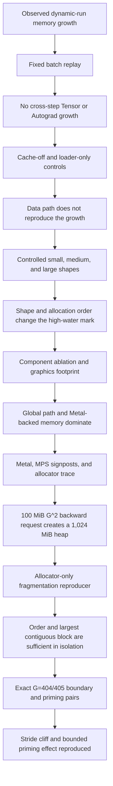

# Root-Cause Analysis of Persistent MPS Memory Growth in Mapper v2.1

- Date: 2026-07-31
- Status: attribution experiments complete; production mitigation not yet implemented
- Scope: Mapper v2.1 full-song global training path
- Fixed starting point: checkpoint step 44,250
- Version scope: PyTorch 2.11, macOS 26.6, and the checkpoint/configuration above

## Executive Summary

We investigated a recurring rise in process memory during variable-length
full-song training on Apple MPS. The investigation moved from Python object
retention and the data pipeline to MPS allocator behavior and Metal heap
placement.

The evidence supports the following conclusions:

1. Fixed-shape training does not accumulate Python tensors or Autograd graphs
   across steps. Replaying one batch for 80 steps kept the Python tensor count
   constant, left zero live tensors with `grad_fn` after each step, and raised
   MPS current memory by only 6.7 MiB.
2. Variable full-song shapes create a native high-water mark. The matched
   80-step dynamic runs raised RSS by about 2.8 to 3.0 GiB and reached
   4,017.5 MiB of MPS driver memory, while MPS current memory remained nearly
   flat.
3. The data path is not the main source. Disabling all data LRU caches did not
   improve the result. Running the same 80 batches through loading and collation
   without MPS compute reduced RSS by 285.7 MiB.
4. Metal graphics-backed memory accounts for most of the controlled
   large-shape footprint. In the 20,480-frame arm, physical footprint grew by
   2,410.8 MiB, of which 2,134.0 MiB, or 88.5%, was graphics-owned.
5. The largest controlled backward pass contains a 100 MiB float32 request with
   shape `[2, 8, 1280, 1280]` in global encoder self-attention. When the
   existing heap lacks a suitably sized contiguous block, PyTorch MPSAllocator
   creates another 1,024 MiB private Metal heap. The new heap initially has
   924 MiB free.
6. Allocation order changes whether that second heap is needed. Controlled
   shape orders with the same shape multiset differed by roughly 640 to
   676 MiB in peak driver memory. A pure allocator reproducer showed that the
   same 954 MiB allocation multiset and the same 576 MiB live set can leave
   either 448 MiB or 70 MiB as the largest aligned free block. The same 100 MiB
   probe reused the first heap in the former layout and created a new 1,024 MiB
   heap in the latter.
7. Fixed `global_stride=16` creates a verified one-frame allocator cliff for
   the current `B=2`, `H=8`, float32 path. `F=6464` maps to `G=404` and a
   9.96 MiB square request that uses 32 MiB heaps. `F=6465` maps to `G=405`
   and a 10.01 MiB request that creates a 1,024 MiB heap.
8. Application-level priming can influence the later layout, but the result is
   specific to the tested sequence. A `G=404 -> 1280` pair used one XL heap and
   peaked at 1,863 to 1,873 MiB. A `G=405 -> 1280` pair used two XL heaps and
   peaked at 2,555 to 2,557 MiB.

The controlled 1 GiB jump is therefore an allocator amplification event:
a real 100 MiB `G^2` request meets an unsuitable heap layout and a 1,024 MiB
heap policy. The evidence does not support a 1 GiB attention tensor, a 1 GiB
per-backward MPSGraph workspace, or a framework bug claim. This mechanism
explains the main extra jump in the controlled full backward pass. It does not
yet account for every byte in the long 80-step dynamic run.

The mitigation priority follows the mechanism. Reducing the live request
through long-song `B=1`, better length pairing, or a smaller `G` is more direct
than manipulating allocator history. Priming and order-aware scheduling remain
bounded experiments. `empty_cache()` is useful as a pressure guard after a
large window, but it can raise the next peak if called immediately before a
larger shape.

## 1. System and Measurement Model

### 1.1 Initial symptom

During the real continuation from step 44,000 to 44,250, system available
memory fell by about 3.28 GiB and swap grew to about 2.2 GiB. MPS current
memory, MPS driver memory, process RSS, and system compressor usage followed
different sawtooth patterns. System memory returned after the process exited.

Apple Silicon uses unified memory, so these counters overlap without being
interchangeable. This report never adds RSS, MPS driver memory, and physical
graphics footprint together.

Every critical sample first calls `torch.mps.synchronize()` and then records:

- `torch.mps.current_allocated_memory()`, which approximates active MPS tensor
  storage;
- `torch.mps.driver_allocated_memory()`, which includes allocator cache and
  some MPS, MPSGraph, and Metal framework allocations;
- process RSS and virtual memory size;
- system available memory, swap, and compressor pages;
- decoder tokens, physical full-song frames, and global tokens for the batch;
- Python tensor count, live tensors with `grad_fn`, and data-cache occupancy.

### 1.2 Environment

| Item | Value |
|---|---|
| macOS | 26.6, arm64 |
| Python | 3.10.20 |
| PyTorch | 2.11.0 |
| Device | MPS available |
| MPS fallback | `PYTORCH_ENABLE_MPS_FALLBACK` disabled |
| Fixed checkpoint | step 44,250 |
| Seed for the main three-arm test | 1337 |
| Batch size | 2 |
| Canonical DataLoader workers | 0 |

The allocator conclusions in this report are version-scoped to PyTorch 2.11
and the MPS allocator policy observed in this environment.

### 1.3 Full-song memory geometry

Mapper v2.1 pools physical full-song frames with `global_stride`:

```text
G = ceil(F / global_stride)
```

The current configuration uses `global_stride=16`. The controlled longest
shape has `F=20,480`, so `G=1,280`.

`_GlobalSongEncoder` applies self-attention to `[B, G, D]`. Its square
attention intermediates scale with `B x H x G^2`. The mapper decoder then
cross-attends from `T` decoder queries to the global memory, producing buffers
that scale with `B x H x T x G`.

The largest controlled batch uses:

| Symbol | Value | Meaning |
|---|---:|---|
| `B` | 2 | batch size |
| `H` | 8 | attention heads |
| `D` | 384 | model width |
| `F` | 20,480 | physical full-song frames |
| `G` | 1,280 | pooled global tokens |
| `T` | 213 | decoder tokens |

One float32 global self-attention square buffer is:

```text
2 x 8 x 1280 x 1280 x 4 bytes
= 104,857,600 bytes
= 100 MiB
```

One float32 global cross-attention buffer in the same batch is:

```text
2 x 8 x 213 x 1280 x 4 bytes
= 17,448,960 bytes
= 16.64 MiB
```

The 100 MiB buffer observed in the native trace belongs to the `G^2` global
self-attention backward path. It is not a `T x G` cross-attention buffer.

### 1.4 The allocator threshold that makes stride discontinuous

For the current `B=2`, `H=8`, float32 square buffer:

```text
request_bytes = B x H x G^2 x 4 = 64G^2
G = ceil(F_batch_max / 16)
```

Collation pads both tracks to the largest physical frame count in the batch.
One long track therefore places the entire two-track global encoder at the
larger `G`.

PyTorch 2.11 MPSAllocator uses the following relevant heap policy on this
unified-memory system:

| Square request | `G` in this configuration | `F` with stride 16 | New-heap policy |
|---|---:|---:|---|
| `<= 1 MiB` | `G <= 128` | `F <= 2,048` | 8 MiB heap |
| `> 1 MiB` and `< 10 MiB` | `129 <= G <= 404` | `2,049 <= F <= 6,464` | 32 MiB heap |
| `>= 10 MiB` and `< 512 MiB`, without memory pressure | `405 <= G <= 2,896` | `6,465 <= F <= 46,336` | 1,024 MiB heap |
| `>= 512 MiB`, or under memory pressure | `G >= 2,897` under this formula | `F >= 46,337` | request rounded to a 2 MiB grain |

The allocator tests whether an existing heap can satisfy a request using
Metal's `maxAvailableSizeWithAlignment`. This value is the largest aligned
contiguous free block, not the sum of all free bytes. Fragmentation can
therefore force a new heap even when total free capacity is larger than the
request.

This model gives the one-frame boundary:

```text
F = 6,464 -> G = 404 -> 9.96 MiB request -> 32 MiB heap class
F = 6,465 -> G = 405 -> 10.01 MiB request -> 1,024 MiB heap class
```

### 1.5 Safety and reproducibility

Each diagnostic arm ran in a fresh process. The stop conditions were:

- system available memory below 2 GiB;
- swap growth above 4 GiB in one arm;
- non-finite loss;
- the arm exceeding its time budget;
- any byte or timestamp change in the checkpoint or formal training report.

The diagnostics did not modify the production model, Hydra configuration,
checkpoint, or formal training report.

## 2. Debugging Strategy

We used the smallest intervention that could separate adjacent hypotheses.
Fixed replay separated cross-step retention from variable-shape behavior.
Cache-on and cache-off runs separated data retention from compute. Loader-only
removed MPS compute while preserving data loading and collation. Controlled
shape orders separated maximum shape from allocation history. Component
ablations separated global encoder and cross-attention costs. Native tracing
then isolated one backward pass, and a pure allocator reproducer removed the
model, data, Autograd, attention, optimizer, and MPSGraph executable.



The full screening matrix appears in Appendix A. The sections below follow the
order in which the evidence narrowed the problem.

## 3. Evidence in Investigation Order

### 3.1 Fixed replay ruled out cross-step Python and Autograd accumulation

Three fresh processes started from the same checkpoint. The two real-data arms
consumed the same 80 batches. Their decoder shapes and full-song frame counts
matched, and their maximum loss difference was `3.58e-7`.

| Metric | Fixed batch | Real, cache=8 | Real, cache=0 |
|---|---:|---:|---:|
| Runtime | 141.1 s | 204.4 s | 209.5 s |
| MPS current, start to end | 309.5 to 316.2 MiB | 309.5 to 314.0 MiB | 309.5 to 314.0 MiB |
| MPS current net change | +6.7 MiB | +4.5 MiB | +4.5 MiB |
| MPS driver, start to end | 719.0 to 759.0 MiB | 719.0 to 1,760.1 MiB | 719.0 to 1,786.1 MiB |
| MPS driver peak | about 759 MiB | 4,017.5 MiB | 4,017.5 MiB |
| RSS net change | -303.6 MiB | +2,878.7 MiB | +3,020.9 MiB |
| System available net change | +218.2 MiB | -2,123.4 MiB | -3,952.8 MiB |
| Compressor net change | none | about +918 MiB | about +568 MiB |
| Python tensor count | fixed at 1,726 | no stepwise accumulation | fixed at 1,674 |
| Live tensors with `grad_fn` | 0 | 0 | 0 |
| Data LRU | bounded | map=8, timepoint limit 64 | all zero |

The fixed arm reached its high-water mark on the first shape and stayed there.
The real arms repeatedly raised driver memory without a matching rise in active
MPS tensor storage. This pattern is inconsistent with one retained Autograd
graph or tensor set per step.

Every 20 steps, the real arms ran Python GC and `empty_cache()`. The cache=8 arm
released about 1,224, 2,160, 1,256, and 1,360 MiB of driver allocation. The
cache=0 arm released about 1,224, 2,168, 1,280, and 1,328 MiB. The fixed arm
released only about 48, 48, 48, and 16 MiB.

The dynamic runs therefore built a large, cacheable native high-water mark.
After model and training teardown, while the process was still alive, Python
tensor storage and MPS current memory reached zero and driver memory fell to
82 to 88 MiB, while RSS remained around 4.4 GiB. That residual RSS is a
process-lifetime native or VM residency observation. The available counters
cannot assign it uniquely to MPSGraph, Metal, allocator fragmentation,
compression accounting, or a general native runtime.

### 3.2 Cache-off and loader-only controls ruled out the data path as the main source

Turning every data LRU off did not change the 4,017.5 MiB driver peak. The
loader-only arm then consumed the same 80 cache-free batches, preserving the
dataset, Parquet and beatmap reads, and collation while removing device transfer
and model compute.

| Metric | Loader-only result |
|---|---:|
| Runtime | 42.1 s |
| MPS current | 0 throughout |
| MPS driver | about 0.44 MiB throughout |
| RSS | 1,633.0 to 1,347.3 MiB, net -285.7 MiB |
| System available | net -240.7 MiB, no persistent downward trend |
| Compressor | net -18.7 MiB |
| File-backed pages | net +231.7 MiB |
| Swap | net -8 MiB |
| Teardown RSS | 1,070.8 MiB |

File reads increased reclaimable page cache, but the loader-only process did not
reproduce the roughly 3 GiB RSS rise. Under the canonical `num_workers=0`
configuration, data loading, parsing, collation, and the bounded LRUs are not
the main cause of the observed growth.

### 3.3 Controlled shapes showed that full-song length drives high-water differences

Each arm used the same checkpoint and real batch content. Only the physical
full-song length changed. The fixed arms ran six steps. The cycle ran
small, medium, and large twice.

| Arm | Physical frames | Global tokens | Driver peak | MPS current peak | Driver after cleanup | Teardown RSS |
|---|---:|---:|---:|---:|---:|---:|
| Small fixed | 6,408 | 401 | 719.0 MiB | 632.9 MiB | 671.0 MiB | 1,465.8 MiB |
| Large fixed | 20,480 | 1,280 | 2,531.0 MiB | 1,255.8 MiB | 1,491.0 MiB | 1,458.9 MiB |
| Shape cycle | 6,408, 12,288, 20,480 | 401, 768, 1,280 | 1,891.7 MiB | 1,273.3 MiB | 819.7 MiB | 1,545.1 MiB |

The small fixed arm stabilized near 718 MiB after its first forward pass. In the
large fixed arm, moving the first batch raised driver memory from 272.4 to
1,296.7 MiB while active MPS tensor storage rose only from 228.6 to 255.5 MiB.
The global encoder and four cross-attention layers brought driver memory to
1,498.2 MiB, forward ended at 1,506.2 MiB, and backward reached 2,530.7 MiB.
Later steps did not exceed that mark.

The cycle reached only 1,891.7 MiB even though it contained the same largest
shape. A prior allocation history had changed how the large step reused native
memory.

### 3.4 Shape order changed peak memory

The next experiment held the small, medium, and large shape multiset constant
and changed only its order.

| Order | Frame sequence | Driver peak | Main trigger | Released by cleanup |
|---|---|---:|---|---:|
| Ascending | small, medium, large, repeated | 1,891.7 MiB | first large backward | 1,072.0 MiB |
| Descending | large, medium, small, repeated | 2,551.7 MiB | later small forward hooks | 1,040.0 MiB |
| Large-small-medium | large, small, medium, repeated | 2,531.8 MiB | second large cross-attention | 1,040.0 MiB |
| Medium-large-small | medium, large, small, repeated | 2,567.7 MiB | third cross-attention layer in first large step | 1,040.0 MiB |

The same-ordinal controls sharpened the result. `small -> large` peaked at
1,873.4 MiB, while `medium -> large` reached 2,567.4 MiB. In these controlled
arms, small-first was sufficient to produce the lower observed peak. That is
not a production scheduling guarantee.

Allocator logs showed two 1,024 MiB private heaps in the large-first step. The
first existed during forward, and a 100 MiB backward request created the
second. The second heap began with 924 MiB free. In the
`small -> medium -> large` arm, four 100 MiB requests reused one 1,024 MiB heap,
which still had 123.98 MiB free after the fourth request.

### 3.5 Cleanup before a larger shape caused a higher peak

Two arms used the same `small -> medium -> large` sequence, checkpoint, dropout
ordinal, and no-update path. The second arm called `zero_grad`, Python GC,
MPS synchronization, and `empty_cache()` immediately before the large step.

| Arm | Driver before large | Driver after cleanup | Large peak | Difference |
|---|---:|---:|---:|---:|
| Cache retained | 1,779.3 MiB | not cleaned | 1,891.7 MiB | baseline |
| Cleanup before large | 1,779.3 MiB | 331.3 MiB | 2,563.7 MiB | +672.0 MiB |

Both arms produced the same three losses:
`1.0442727804`, `1.0299683809`, and `1.0521066189`.

Cleanup released 1,448.0 MiB before the large step. The subsequent batch move
then created the first 1 GiB heap, and backward created the second. In this
paired experiment, retained allocator or cache state enabled the lower peak.
Graph compilation history alone cannot explain the result. Cleanup can still
protect the system after a high-`G` window, but calling it immediately before a
larger shape is not monotonically beneficial.

### 3.6 The large-shape footprint was primarily graphics-backed

| Arm | Physical-footprint growth | Graphics-owned growth | Graphics share | Graphics released by cleanup |
|---|---:|---:|---:|---:|
| Small fixed | 677.0 MiB | 426.0 MiB | 62.9% | 78.0 MiB |
| Large fixed | 2,410.8 MiB | 2,134.0 MiB | 88.5% | 1,082.0 MiB |
| Shape cycle | 1,795.0 MiB | 1,454.0 MiB | 81.0% | 1,106.0 MiB |

In the large fixed arm, graphics-owned physical footprint grew from 292 to
2,426 MiB. During the same interval, `MALLOC_SMALL` grew by about 223 MiB,
`MALLOC_LARGE` by 25 MiB, and untagged `VM_ALLOCATE` by less than 1 MiB.
Cleanup released 1,082 MiB of graphics memory while MPS driver memory fell by
1,040 MiB.

CPU heap growth and anonymous `VM_ALLOCATE` cannot explain the controlled
large-shape increase. The remaining driver-minus-current gaps after cleanup
were about 357.5 MiB for small fixed, 1,160.4 MiB for large fixed, and
509.0 MiB for the shape cycle. Public tools do not partition those residuals
uniquely among MPSGraph state, Metal resources, allocator fragmentation, and
other native state.

### 3.7 Component ablation showed a multi-part memory floor

All primary component arms used the same 20,480-frame batch with `G=1,280` and
`T=213`. Each mode ran for three steps in a fresh process.

| Mode | Driver peak | Interpretation |
|---|---:|---|
| Neither global component | 528.6 MiB | non-global mapper, loss, and optimizer floor |
| Cross-attention only | 1,466.6 MiB | real four-layer `T x G` cross-attention |
| Encoder forward only | 1,472.8 MiB | real full-song encoder, identity cross blocks |
| Encoder backward, zero-weight dependency | 1,473.0 MiB | encoder backward alone does not create the second heap |
| Full connected path | 2,531.0 MiB | encoder plus cross-attention and connected backward |
| Cross-attention input gradient | 1,466.7 MiB | input gradient alone does not create the second heap |
| Encoder backward, nonzero dependency | 1,473.0 MiB | nonzero encoder gradient alone does not create the second heap |

Using 528.6 MiB as the shared baseline:

```text
cross-attention excess = 1,466.6 - 528.6 = 938.1 MiB
encoder and physical-input excess = 1,472.8 - 528.6 = 944.2 MiB
full excess = 2,531.0 - 528.6 = 2,002.5 MiB
```

The isolated excesses account for 94.0% of the full excess under this
inclusion-exclusion view. The remaining 120.2 MiB is a non-additive
connected-graph and allocator interaction under peak subtraction. It is not
the same quantity as the second 1,024 MiB heap seen in the trace, because each
isolated arm independently creates and reuses large heaps.

The global encoder and global cross-attention both establish substantial
floors. Neither encoder backward nor a cross-attention input gradient was
sufficient by itself to reproduce the second heap. In the connected full path,
the allocator cannot find a suitable 100 MiB block when the late square request
arrives. Saved tensors and workspaces are likely contributors, but their
identities and lifetimes have not been mapped.

### 3.8 Native tracing identified the exact 1 GiB event

The native trace surrounded one known reproducing `loss.backward()`. The
observation surfaces were:

- Apple Metal System Trace;
- `MTLDevice.currentAllocatedSize`;
- MPS operation signposts and buffer IDs;
- PyTorch MPS allocator allocation, reuse, and release logs;
- a serialized-dispatch control using `wait_until_completed=True`.

Allocator logging used `PYTORCH_DEBUG_MPS_ALLOCATOR=31`. The main trace used
`PYTORCH_MPS_LOG_PROFILE_INFO=512`, and the operation-order trace used `513`.
Apple Instruments Metal System Trace succeeded. Programmatic `.gputrace`
capture was unavailable and unused because `is_metal_capture_enabled()`
returned false in this environment.

| Arm | Dispatch | Driver at backward start | Driver at backward end | Delta | Released by explicit cleanup |
|---|---|---:|---:|---:|---:|
| Cross-attention only | asynchronous | 1,466.125 MiB | 1,466.375 MiB | 0.250 MiB | 40 MiB |
| Full | asynchronous | 1,506.359 MiB | 2,530.734 MiB | 1,024.375 MiB | 1,040 MiB |
| Full | serialized | 1,506.359 MiB | 2,530.734 MiB | 1,024.375 MiB | 1,140 MiB |

Serialized and asynchronous full backward produced the same start, end, and
second-heap event. Asynchronous command-buffer overlap is not required for this
jump.

The aligned native events were:

| Phase | Trace time | Event |
|---|---:|---|
| Backward | 13.777160 s | Metal current allocated size is 1,579,876,352 bytes |
| Backward | 13.778471 s | Metal current allocated size becomes 2,653,618,176 bytes |
| Backward | 13.778512 s | allocator creates private heap `#24`, size 1,024 MiB |
| Backward | 13.778635 s | allocator creates buffer `#1135`, request 100 MiB, leaving 924 MiB |
| Explicit cleanup | 15.283079 s | buffer `#1135` is released |
| Explicit cleanup | 15.289952 s | Metal current allocated size falls from 2,637,201,408 to 1,563,459,584 bytes |
| Explicit cleanup | 15.290057 s | allocator releases heap `#24`, size 1,024 MiB |

The buffer-release row is an allocator-cache release during explicit cleanup.
Its logical tensor use had already ended, as reflected by the lower MPS current
memory before cleanup.

The Metal counter increased and decreased by exactly:

```text
1,073,741,824 bytes = 1 GiB
```

The operation sequence around the allocation was:

```text
aten::bmm_out_mps_impl
Allocated private heap #24: 1024 MiB
Allocated private buffer #1135: requested 100 MiB
aten::bmm_out_mps_impl
aten::mul ... Float[2, 8, 1280, 1280] ... buffer #1135
aten::softmax_backward_mps_out ... Float32[2, 8, 1280, 1280]
```

This sequence places buffer `#1135` in the global encoder's square
attention-gradient and softmax-backward path. Its unique Autograd symbolic
identity remains unresolved. It may be `dP`, `dS`, or another temporary with
the same shape.

The request-to-heap amplification is `10.24x`, and the new heap is 90.23% free
immediately after allocation. Between backward completion and explicit
cleanup, MPS current memory falls from about 1,257.4 to 351.7 MiB while driver
memory stays near 2,530.7 MiB. The heap remains cached during that interval and
is released by the explicit cleanup shown above.

### 3.9 A pure allocator reproducer isolated fragmentation and order

The reproducer removed the model, data, Autograd, attention, optimizer, and
MPSGraph executable. Every fresh process allocated nine 64 MiB live buffers and
nine 42 MiB disposable buffers. Both layouts reached 954 MiB of active bytes
inside one 1,024 MiB heap. After releasing the disposable buffers and running
cleanup, both retained the same 576 MiB live set.

| Layout | Allocation order | Largest aligned free block | Probe driver delta | Result |
|---|---|---:|---:|---|
| Grouped | nine 64 MiB, then nine 42 MiB | 448 MiB | 0 MiB | 100 MiB probe reuses heap `#1` |
| Interleaved | nine pairs of 42 MiB then 64 MiB | 70 MiB | +1,024 MiB | probe creates heap `#2` |
| Interleaved repeat | same order in a new process | 70 MiB | +1,024 MiB | probe creates heap `#2` |

Allocation order and the largest aligned free block are sufficient to reproduce
the amplification in this allocator-only setup. The result is consistent with
the model trace, but it does not identify the actual occupants of the model's
first XL heap.

### 3.10 The effect is not uniform across tracks or across `G`

The real cache-free 80-step sequence contained 80 batches, 160 track slots,
157 distinct beatmap paths, 77 distinct batch maximum frame counts, and
75 distinct `G` values. The range was `F=2,000..20,341` and `G=125..1,272`.

Driver increases of roughly 1 GiB occurred at several shapes:

| Step | `F` | `G` | `T` | Driver increase |
|---:|---:|---:|---:|---:|
| 2 | 11,270 | 705 | 206 | +1,052.9 MiB |
| 8 | 12,734 | 796 | 339 | +1,105.0 MiB |
| 13 | 15,440 | 965 | 140 | +1,092.9 MiB |
| 27 | 16,442 | 1,028 | 276 | +1,114.9 MiB |
| 41 | 20,341 | 1,272 | 118 | +1,100.9 MiB |
| 59 | 15,837 | 990 | 245 | +1,117.0 MiB |

`G` does not determine the driver delta by itself. Steps 4, 19, and 20 set new
maximum values of `G=921`, `994`, and `998`, yet driver memory increased by only
about 52.9, 14.9, and 0.9 MiB. Step 8 increased driver memory by about
1,105 MiB at `G=796`, even though that was not the maximum `G` of the run.

For fixed `B`, `H`, and dtype, `G` determines the size of the square request.
The decision to create a new heap also depends on the live set, pool history,
largest contiguous aligned block, and prior cleanup.

Of the 80 batches, 11 had `G <= 404` and 69 had `G >= 405`. Of 160 track slots,
51 source lengths were at most 6,464 frames. The first batch already used
`G=401`, yet the full run still reached 4,017.5 MiB. A generic small warm-up is
therefore insufficient to control a long dynamic sequence.

### 3.11 The exact `G=404/405` stride cliff reproduced

The boundary experiment used the same real two-track batch, a fresh process,
the same checkpoint, and the same no-update training path.

| `F` | `G` | Square request | 1,024 MiB heaps | Driver peak |
|---:|---:|---:|---:|---:|
| 6,408 | 401 | 9.81 MiB | 0 | 718.98 MiB |
| 6,464 | 404 | 9.96 MiB | 0 | 718.97 MiB |
| 6,465 | 405 | 10.01 MiB | 1 | 1,424.97 MiB |
| 6,481 | 406 | 10.06 MiB | 1 | 1,424.97 MiB |
| 6,464 repeat | 404 | 9.96 MiB | 0 | 718.94 MiB |
| 6,465 repeat | 405 | 10.01 MiB | 1 | 1,424.97 MiB |

Allocator logs placed the `G=404` buffers in 32 MiB heaps. The first 10.01 MiB
buffer at `G=405` immediately created a 1,024 MiB heap. One additional masked
physical frame changed the native heap class. The process peak differed by
about 706 MiB rather than the full 1,024 MiB because the `G=404` path had
already created several 32 MiB heaps.

### 3.12 Manual priming changed the layout of an identical target

Each fresh-process arm fixed the same `F=20,480`, `G=1,280` target at step 2.
Only the predecessor changed by one physical frame.

| Predecessor -> target | Repeat | Arm peak | XL heaps | Placement of four 100 MiB buffers |
|---|---:|---:|---:|---|
| `G=404 -> 1,280` | 1 | 1,873.36 MiB | 1 | all in heap `#34` |
| `G=405 -> 1,280` | 1 | 2,555.38 MiB | 2 | first three in `#16`, fourth creates `#25` |
| `G=404 -> 1,280` | 2 | 1,863.23 MiB | 1 | all in heap `#34` |
| `G=405 -> 1,280` | 2 | 2,557.39 MiB | 2 | first three in `#16`, fourth creates `#25` |

The paired peak differences were 682.0 and 694.2 MiB. The target loss was
`1.0339210033` in all four arms.

The tested `G=404` predecessor populated the 8 and 32 MiB pools. When the target
arrived, it opened a cleaner XL heap that held all four 100 MiB buffers. The
tested `G=405` predecessor opened and occupied an XL heap earlier. Three target
buffers still fit, but the late backward request created a second XL heap.

This is direct evidence that real-model shape order can change a later target's
native layout. It also disproves the assumption that creating an XL heap earlier
is always beneficial. The evidence is limited to the tested
`G=404 -> 1280` and `G=405 -> 1280` pairs.

### 3.13 Physical padding was not strictly equivalent

Padding the same real batch from 6,408 to 20,480 physical frames preserved all
finite and non-finite mask positions, but it did not preserve logits exactly.

| Device | Maximum finite-logit absolute difference | Loss absolute difference |
|---|---:|---:|
| MPS | 0.0077712536 | `5.0068e-6` |
| CPU | 0.0077710152 | `5.1260e-6` |

The nearly identical CPU and MPS differences make an MPS-specific correctness
defect unlikely. They also prevent treating extra physical padding as a
strictly equivalent production optimization without separate quality and
numerical validation.

## 4. Causal Attribution and Confidence Boundaries

### 4.1 Causal model for the controlled 1 GiB jump

Physical length sets the request geometry:

```text
physical length F -> G = ceil(F / 16)
-> B x H x G^2 square backward request
```

The allocator event then follows:

```text
square backward request plus the current live set and heap history
-> allocator checks size class and largest aligned free block
-> no suitable block in the current heap layout
-> new 1,024 MiB private Metal heap
-> 100 MiB buffer placed in the heap
-> backward completes and live tensor storage falls
-> heap stays cached until explicit cleanup
-> driver and graphics-backed high-water remain elevated
```

At `B=2`, `H=8`, and `G=1,280`, the direct request is 100 MiB. The 1 GiB
increase is the heap that carries it. Serialized dispatch produced the same
event, so asynchronous overlap is not required. Cleanup can release the cached
heap after the step, but it cannot remove the live request while backward is
running.

One fixed 20,480-frame arm is enough to produce this single event. Dynamic
training changes `F` over time, which changes request sizes and heap history
and creates repeated opportunities to refresh the high-water mark.

Allocation history determines whether an existing heap has a sufficiently
large contiguous aligned block. The pure allocator reproducer proves that
order and fragmentation are sufficient to create this amplification in
isolation. The model trace is consistent with that mechanism, while the exact
occupants of the model's first XL heap remain unknown.

### 4.2 The 1 GiB event is not the whole memory footprint

The controlled floor also includes:

- about 272.4 MiB after MPS and runtime initialization;
- about 528.6 MiB for the non-global mapper, loss, and optimizer path;
- about 1,472.8 MiB for physical full-song transfer and the isolated global
  encoder path;
- about 1,466.6 MiB for isolated four-layer `T x G` cross-attention;
- connected-graph liveness, allocator reuse, graph variants, and framework
  resources that are not individually assigned.

Global encoder self-attention directly triggers the traced 100 MiB request and
second heap. Cross-attention remains an important part of the roughly 1.46 GiB
component floor.

### 4.3 Strongly established within the tested scope

- No Python tensor or Autograd graph grows linearly across fixed-shape steps.
- The cache-free loader and collation path does not reproduce the approximately
  3 GiB process-memory rise.
- Variable full-song shape is a primary input to the driver high-water mark.
- Most of the controlled large-shape physical increase is graphics-backed.
- The full 20,480-frame backward contains a 100 MiB
  `[2, 8, 1280, 1280]` float32 request in the global encoder
  attention-gradient and softmax-backward path.
- That request directly creates a second 1,024 MiB private Metal heap in the
  traced full path.
- Asynchronous dispatch overlap is not required.
- Cleanup can release the cacheable heap after the step.
- Allocation order changes the largest available contiguous aligned block and
  can decide whether the same request reuses a heap or creates another one.
- The current fixed stride creates a repeatable `F=6464/6465`,
  `G=404/405` heap-class boundary.
- The exact tested predecessor changes the heap layout of an identical
  `G=1,280` target.

### 4.4 Reasonable inference that remains unresolved

- Buffer `#1135` is likely `dP`, `dS`, or another same-shaped attention
  temporary. The trace cannot assign a unique Autograd name.
- In the connected full path, the allocator cannot find a suitable block in
  the first XL heap for the late 100 MiB request. Saved tensors or workspaces
  are likely contributors, but their identities and lifetimes are not yet
  mapped.
- Some long-run high-water refreshes likely use the same contiguous-space
  mechanism. The 80-step run may also contain new graph or resource variants.
- Residual process RSS after model and training teardown, while the process
  remains alive, may combine native runtime residency, VM high-water behavior,
  and compression accounting. Current counters cannot partition it.

### 4.5 Claims this report does not make

- PyTorch leaks a 1 GiB attention tensor.
- MPSGraph allocates a 1 GiB workspace on every backward pass.
- Every track or every value of `G` produces the same jump.
- Every byte in the 80-step rise comes from one class of 1 GiB heap event.
- Calling `empty_cache()` solves the problem.
- Padding, bucketing, or priming preserves model outputs without validation.
- The behavior is a PyTorch or Apple Metal bug.

## 5. Mitigation Implications

### 5.1 Idea quality

Three application-level variables are controllable:

- `B` changes the square request linearly;
- `G` changes global encoder attention quadratically;
- shape order changes allocator reuse without reducing the live request.

Reducing the live request is the most direct strategy. Layout manipulation can
lower a peak for a specific sequence, but it remains sensitive to subsequent
shapes. The first mitigation experiment should therefore test long-song
`B=1`. Length-aware batching is the next implementation family and needs its
own Experiment Card before coding. Priming and order-aware replay should be
tested separately on the exact real sequence.

Changing allocator watermarks or rewriting attention would answer a broader,
more expensive question before the smaller experiments are exhausted.

### 5.2 Related work and analogies

The closest implementation families are long-sequence microbatching,
length-aware batching, bounded random bucketing, shape warm-up, coarser global
pooling, activation rematerialization, memory-efficient attention, and
allocator minimal reproducers.

There is no representation novelty claim here. The work concerns training
scheduling, backend behavior, and memory implementation tradeoffs.

### 5.3 Implementation families

| Priority | Candidate | Expected benefit | Main risk |
|---:|---|---|---|
| 1 | Use `B=1` for the longest full-song bucket, then accumulate gradients | halves the identified 100 MiB square request without changing model representation | lower throughput; weighted loss and optimizer semantics need verification |
| 2 | Pair batches by full-song length with a separate policy for very long tracks | reduces padding and the frequency of large `G` | more complex sampling, resume behavior, randomness, and coverage |
| 3 | Keep bounded cleanup triggered by pressure or after a high-`G` window | releases cached heaps before system pressure becomes unsafe | does not reduce the live request; cleanup before a larger shape can raise the next peak |
| 4 | Test process-start `G=404 -> representative Gmax` no-update priming while retaining cache | may prepare small pools and a clean maximum-shape XL layout | only `G=404 -> 1280` is verified; the original run already starts at `G=401` |
| 5 | Increase `global_stride` | reduces `G^2` quickly | changes the representation and requires retraining and quality evaluation |
| 6 | Use chunked or memory-efficient global self-attention | may avoid full `G x G` materialization | highest implementation, numerical, and performance risk |

An offline ideal sort using the 160 per-track full-song lengths recorded as
`batch_frame_counts` provides an upper bound, not a runtime result. Adjacent
full-song-length pairing reduced:

- the sum of batch maximum frame counts by 18.02%;
- within-batch padded frames by 97.84%;
- theoretical global-token `G^2` work by 29.37%.

A production sampler would need bounded random windows rather than a global
sort so that resume behavior, sample coverage, and randomness remain valid.

### 5.4 What can be controlled through the public MPS interface

The current public Python interface does not provide direct Metal heap
placement.

| Control | What it does | What it does not do |
|---|---|---|
| `torch.mps.empty_cache()` | releases unused cached memory | does not move live buffers or compact a heap |
| `torch.mps.set_per_process_memory_fraction()` | sets a hard limit relative to recommended memory | does not reserve space or improve placement |
| high and low watermark environment variables | change hard-limit, GC, and adaptive-commit pressure behavior | do not place a request in a chosen heap |
| current and driver counters, profiler, Metal System Trace | provide observability | do not change layout |
| allocator replacement, explicit reserve, or snapshot | no public MPS Python equivalent is available | cannot be used like CUDA `MemPool` |

The first indirect control candidate is an exact shape-order protocol:

1. Run the verified real full-path `G=404` no-update batch to establish the
   8 and 32 MiB pools. Other `G <= 404` predecessors remain an unverified
   family.
2. Immediately run a representative maximum shape to establish its XL layout.
3. Clear gradients and restore the required random-number state, but retain
   the allocator cache.
4. Avoid padding a `G=404` batch upward to `G=405`.
5. Place cleanup after a high-`G` window or behind a pressure trigger, not
   immediately before a larger shape.

Dummy tensor reservation is not recommended. A dummy allocation may use a
different pool, pay the 1 GiB cost early without improving reuse, or create new
fragmentation. Directly changing the 10 MiB or 1 GiB allocator policy requires
a patched PyTorch build and would affect every MPS workload.

## 6. Next Bounded Experiments

The priming replay appears first because it closes the main diagnostic question
from this investigation. The `B=1` card remains the first mitigation priority.
Both cards are proposals. Neither experiment has run, and both require owner
approval before implementation.

### 6.1 Proposed Experiment Card A: Real-sequence priming replay

#### Hypothesis

We will test whether the exact `G=404 -> representative Gmax` no-update
sequence reduces either peak driver allocation or the number of new XL heaps
in the same real 80-step shape sequence, compared with an unprimed fresh
process. Later shapes may overwrite the prepared layout.

#### Minimal code change

Add a diagnostic-only startup mode that:

1. snapshots model state, optimizer state, and random-number state;
2. executes a real full-path `G=404` batch without an optimizer update;
3. executes the representative maximum-shape batch without an optimizer
   update;
4. clears gradients and restores all state that affects training semantics;
5. retains the MPS allocator cache;
6. runs the original 80 batches in their original order.

No production sampler, model, or Hydra configuration changes are required.

#### Dataset slice

Use the exact 80-batch cache-free multiset from the main comparison in three
fresh processes:

1. original order without priming;
2. exact `G=404 -> representative Gmax` priming;
3. `G=405 -> same Gmax` as a negative allocation-order control.

A later experiment may add bounded local reordering, but it should not be
mixed into the priming test.

#### Metrics

- peak and per-step MPS driver and current memory;
- RSS, system available memory, swap, compressor pages, and graphics footprint;
- count and timing of new 1,024 MiB heaps;
- largest aligned free block before each high-water refresh;
- loss difference per real step after state restoration;
- priming overhead and per-step wall time;
- cleanup release amounts and all safety guards.

#### Positive signal

The exact primed arm removes at least one new XL heap or lowers peak driver
memory by at least 512 MiB, while every real-step loss remains within `1e-6`
of the baseline and runtime overhead remains below 10%.

#### Negative signal

The primed arm reaches the same high-water mark, creates the same number of XL
heaps, changes the loss sequence beyond tolerance, or adds more than 10%
runtime.

#### Kill criteria

- system available memory below 2 GiB;
- swap growth above 4 GiB;
- any arm longer than 10 minutes;
- non-finite loss or gradient norm;
- any change to the checkpoint, formal training report, production model, or
  production configuration.

#### Expected runtime

Fifteen to thirty minutes for smoke checks, three fresh-process arms, native
allocator logging, and comparison.

#### Files likely to change

Only the diagnostic runner, structured JSONL and native logs, verifier output,
and this research report. Production code, configuration, checkpoint, and the
formal training report stay unchanged.

#### Verification and failure modes

The test must restore random-number and optimizer state before the real
sequence. Otherwise a loss difference cannot be separated from changed dropout
or optimizer history. The first real batch already has `G=401`, so a generic
small-only warm-up is not a meaningful control. Natural predecessors below the
cliff need a separate sweep before `G=404` can be generalized.

#### Result interpretation

A lower peak would support exact startup priming as a bounded scheduling
optimization. An unchanged peak would show that later dynamic shapes erase the
two-step advantage. A higher peak would show that priming itself creates an
unfavorable long-run layout.

### 6.2 Proposed Experiment Card B: Long-song `B=2` versus `B=1`

#### Hypothesis

At fixed `F=20,480`, `G=1,280`, and `H=8`, reducing `B` from 2 to 1 should
reduce the square request from 100 to 50 MiB. We will test whether it avoids or
delays the second 1,024 MiB heap and whether two `B=1` microbatches reproduce
the masked-loss semantics of `B=2` when each loss component is weighted by its
true denominator.

Dropout changes random-number consumption in training mode, so elementwise
identity is not a valid requirement there. A separate dropout-disabled
numerical precheck is required.

For `B=1`, the 10 MiB size-class cliff moves from `G=405`, `F=6465` to
`G=573`, `F=9153`. Longer tracks remain in the XL family, but the live square
request is halved.

#### Minimal code change

Add diagnostic-only long-song microbatch selection and optional two-step
gradient accumulation. Dividing each microbatch `total_loss` by two is
incorrect when the samples have different valid-token counts or confidence
weights. Accumulate the components as:

```text
L_acc =
  sum_i(token_loss_i x valid_target_tokens_i)
    / sum_i(valid_target_tokens_i)
  + lambda_close
    x sum_i(close_loss_i x valid_close_positions_i)
    / sum_i(valid_close_positions_i)
  + lambda_density
    x sum_i(density_loss_i x density_confidence_sum_i)
    / sum_i(density_confidence_sum_i)
  + lambda_adapter
    x sum_i(adapter_reg_i x valid_input_positions_i)
    / sum_i(valid_input_positions_i)
```

Use the full-batch zero-component behavior whenever a denominator is zero.
Run gradient clipping once after both backward calls, then run one optimizer
step. The current preset uses `lambda_close=0.05`, `lambda_density=0.05`, and
`lambda_adapter=1e-5`.

#### Dataset slice

Use the same two samples with 20,480 physical frames and decoder length 213.
Run each arm in a fresh process:

1. `B=2`, training-mode forward and backward, no optimizer step;
2. `B=1`, one-sample training-mode forward and backward, no optimizer step;
3. `B=2`, one complete training step with one clipping operation;
4. two consecutive weighted `B=1` microbatches with one clipping operation and
   one optimizer step;
5. a dropout-disabled numerical precheck comparing `B=2` with two weighted
   `B=1` microbatches from identical model and optimizer state.

#### Metrics

- MPS current, driver, and Metal current allocated size around backward;
- whether a second 1,024 MiB private heap is created;
- whether the square request is 50 MiB;
- peak graphics-owned physical memory;
- forward, backward, clipping, optimizer, and end-to-end wall time;
- all four loss components and their true denominators;
- total-loss absolute difference;
- relative L2 error of gradients before clipping;
- relative L2 error of the parameter delta;
- cleanup release amount and all safety guards.

#### Positive signal

`B=1` removes the second heap or lowers the full-backward peak by at least
512 MiB, and the two-microbatch arm does not recreate it. In the
dropout-disabled precheck:

- total-loss absolute difference is at most `1e-5`;
- gradient L2 relative error before clipping is at most `1e-3`;
- parameter-delta L2 relative error is at most `1e-3`.

Per-sample wall time must remain within 1.5 times the full-step `B=2` baseline.

#### Negative signal

The 50 MiB request still creates the second heap, gradient accumulation
recreates the same high-water mark, any numerical check exceeds its tolerance,
or per-sample wall time exceeds 1.5 times the baseline.

#### Kill criteria

- system available memory below 2 GiB;
- swap growth above 4 GiB;
- any arm longer than 10 minutes;
- non-finite loss or gradient norm;
- any change to the checkpoint, formal training report, or production files.

#### Expected runtime

Fifteen to thirty minutes for smoke checks, five fresh-process arms, a Metal
trace export, and comparison.

#### Files likely to change

Only the diagnostic runner, structured JSONL and native logs, verifier output,
and an independent experiment report. The production model, Hydra
configuration, checkpoint, and formal training report remain out of scope.

#### Verification and failure modes

The memory arms retain real training mode but require only finite losses and
gradients. The numerical precheck disables dropout and starts from identical
model, optimizer, and input state. A failed precheck should first be treated as
a loss-aggregation error. Batch-dependent normalization would require separate
analysis; the current architecture primarily uses LayerNorm, but runtime
verification still takes precedence.

#### Result interpretation

If `B=1` removes the second heap, application-level request reduction can avoid
the current allocator boundary. The next decision would compare throughput and
gradient-accumulation cost. If memory falls by only about 50 MiB and the second
heap remains, the first heap's largest free block is still below the request
and its occupants need to be mapped. If the controlled peak improves but the
80-step run still grows, the traced mechanism covers only part of the long-run
problem.

## 7. Verification and Integrity

All primary arms completed their planned steps with finite losses. Guards
confirmed that the checkpoint and formal training report remained unchanged.

Checkpoint SHA256:

```text
aa956847234315251a6553305d0c792615ca74a12e8690f56c7c7c32affd5ecd
```

The formal training report was already modified in the worktree before this
investigation. Its bytes and modification time remained unchanged. SHA256:

```text
5d52f2efa35c69e95cdb1e907d15e0d3ce716f75271864d2ddd321d6011c3f9e
```

The diagnostic entry points passed Python compilation and real MPS smoke
tests. Native `vmmap`, `footprint`, and Apple Instruments Metal System Trace
succeeded. The scoped diagnostic verifiers and guards passed.

The allocation-order primary arms, cleanup pair, and same-ordinal controls
completed with finite losses. The allocator-only paired verifier confirmed the
same fill current, the same post-cleanup live current, one initial heap, and
the expected probe heap IDs in grouped, interleaved, and repeated-interleaved
arms.

All six `G=404/405` threshold arms passed. Both boundary repeats selected the
same heap class as their originals. All four manual priming arms passed. Both
`G=404 -> 1280` runs used one XL heap, and both `G=405 -> 1280` runs used two.

No production model, training configuration, checkpoint, or formal training
report was changed by the diagnostic experiments.

## Appendix A. Screening Matrix

| Task | Hypothesis | Test | Result |
|---|---|---|---|
| T0 | The memory counters may be misleading | record MPS current, driver, RSS, available memory, swap, shape, and object counts together | established one synchronized measurement model; counters are not additive |
| T1 | Hidden state, past state, KV state, or motif memory survives across steps | inspect the training interface and replay one fixed batch for 80 steps | negative; batches are independent and tensor count stays fixed |
| T2 | Losses accumulate before one backward, or the loop uses `retain_graph=True` | inspect the training loop and loss lifetime | negative; each step has one independent backward and no retained graph |
| T3 | History stores losses, logits, embeddings, or attention tensors | inspect observers and metric containers; count live `grad_fn` tensors | negative; history stores Python scalars and live `grad_fn` count is zero |
| T4 | Python concatenates full-song context across steps | inspect context construction and record physical lengths | negative; context is padded only within the current batch |
| T5 | Dynamic shapes create an MPS or Metal high-water mark | compare fixed-batch and real dynamic-batch 80-step runs | positive; dynamic driver peak is 4,017.5 MiB while fixed replay is stable |
| T6 | DataLoader, parsing, collation, or LRU cache owns the growth | compare cache=8, cache=0, and loader-only arms | negative under canonical `num_workers=0`; cache-off does not help and loader-only does not reproduce growth |
| T7 | A generic shape-independent MPS leak exists | replay one fixed shape and inspect cleanup and process exit | negative in scope; fixed shape stabilizes and variable-shape compute is required |

T5 initially left MPSGraph, Metal, and allocator state as candidate owners.
Later native traces rejected the specific claim of a single 1 GiB MPSGraph
workspace and identified the 100 MiB allocator-visible request instead.

## Appendix B. Native Hypothesis Ledger

| Hypothesis | Result | Evidence |
|---|---|---|
| H1: full backward creates an allocator-visible second block | supported | full backward creates a second 1,024 MiB heap; cross-only does not |
| H2: the extra 1 GiB is an operation-local MPSGraph workspace | rejected as stated | the operation-local request is 100 MiB; the 1 GiB object is its heap |
| H3: asynchronous command-buffer overlap is required | rejected | serialized dispatch reaches the same peak and heap event |
| H4: allocator size class and cache amplify the real request | supported | a 100 MiB request creates a 1,024 MiB heap with 924 MiB initially free |

## Appendix C. Open Questions

- What is the complete byte accounting of graph and cache variants in the
  80-step dynamic run?
- How much of the post-cleanup driver-minus-current residual belongs to
  MPSGraph state, Metal resources, allocator fragmentation, or other native
  runtime state?
- What is the unique Autograd symbolic identity of buffer `#1135`?
- Which saved tensors or workspaces occupy the first XL heap when the late
  100 MiB request arrives?
- How many real-run high-water refreshes come from insufficient contiguous
  space, and how many come from new graph or resource variants?
- Does the `G=404/405` cliff reproduce across multiple naturally sized track
  batches rather than masked-frame variants?
- Does exact startup priming survive the full real 80-step sequence without
  changing randomness, throughput, or training semantics?
- What are the memory, throughput, and quality effects of long-song `B=1`,
  bounded length bucketing, a larger stride, or memory-efficient attention?
- How would a modified MPS heap policy trade peak memory against
  fragmentation, allocation cost, and out-of-memory behavior?
