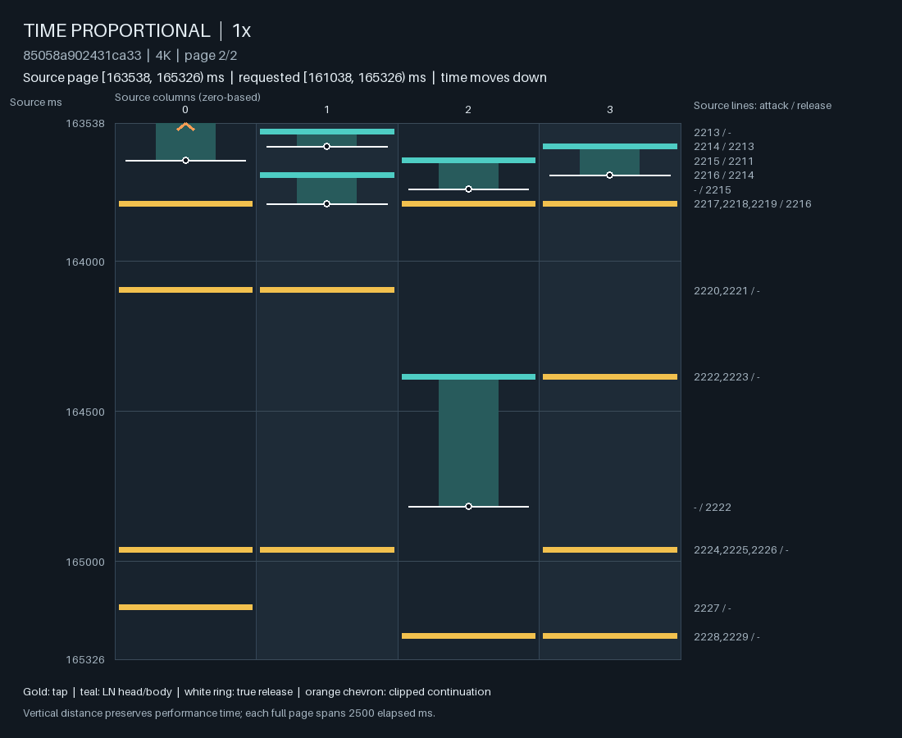
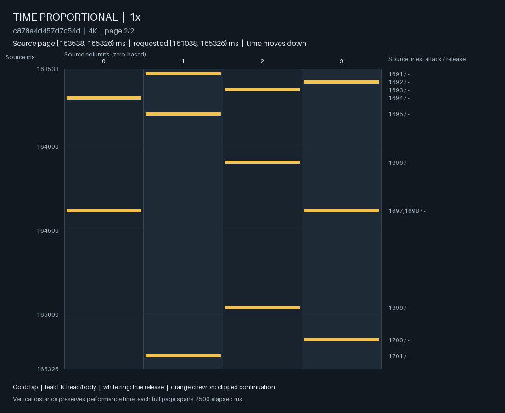

# 向外部研究者请教：Pulsefield 下一轮究竟应该学习什么？

证据截至 2026-09-18。本文可独立阅读；代码、汇总数据和两张谱面图随本文一起提交。
不需要聊天记录、Agent Notes、训练目录或本地 checkpoint。这里报告的是探索性结果，
尚未完成新的独立测试集验证，也未宣布模型达到可玩质量。

GitHub 代码与本文位于
[Pulsefield/Pulsefield-model 的 codex/oracle-time-formulation-review 分支](https://github.com/Pulsefield/Pulsefield-model/tree/codex/oracle-time-formulation-review)。
请查看这个分支，`main` 不包含这组实现；下方相对链接从 GitHub 上的本文可直接打开。

## 最想知道答案的一个问题

**在单台 24 GiB Mac、现有 4K 谱面语料和下述证据下，下一轮应该固定什么
“条件输入—预测对象—训练上下文”契约，才能最有效地学到可玩的多尺度编排？
请选出你认为最值得押注的契约，并设计一组足够小、能推翻它的实验，区分
“任务表示造成的偏置”和“训练方式造成的学习不足”。**

我真正不确定的是：我们是否把因果性、完整历史重放、事件时刻必须非空等实现选择
过早当成了目标，随后一直修补这些选择带来的症状。与此同时，现有实验远未排除
“原表示可行，只是模型见得太少、学得不充分”的解释。

请把当前模型、损失、采样器、时间骨架定义都视为可替换。逐事件行、完整音符/LN
对象、带空事件的候选时间网格，乃至另一种分解都可以；这些只是尚未排除的方向。
希望得到一个有因果解释和否证条件的选择，而不是一个架构名词清单。

## 目标、自由度和实际限制

Pulsefield V3 要生成 osu!mania 四列谱面的动作编排。当前阶段不输入音频：给出
时间条件和至少 30 个 note head 的源谱开头，模型续写完整谱面。TAP 是一次按下；
LN（long note）需要按下后持续占用该列，直到释放。相同时间可有多列动作。

成功意味着生成内容具有可辨认、可持续、可变化的组织，局部手指负担合理，能处理
LN 重叠、独立释放、段落过渡和长空隙。合法文件、低 teacher-forced NLL、某个
短 token 模式出现、减少极端连打，单独都不够。也不要求生成谱逐段复制源谱的
风格标签或 LN 比例；合理的不同编排是允许的。

“时间骨架”没有被最终目标锁死。可以改变它，增加明示的 LN 意图条件，或者把
部分时刻降为可选候选。需要清楚区分给定的信息和模型真正学到的内容；提供未来
源谱 LN 配对可作为诊断上界，但不能把给定的结构当成模型生成能力。

- 硬件：Apple M5，10 核 CPU（4P+6E），24 GiB 统一内存，macOS 27.0。
  这些实验用 Python 3.10.20、PyTorch 2.11.0、FP32；主要训练用 CPU 4 线程，
  生成用 CPU 1 线程。MPS 已做实现和资源检查，但这套计算图没有稳定的大幅加速。
- TRAIN：11,564 张谱、3,169 个组、11,522,113 个事件行；11,563 张满足续写条件。
  validation：1,652 张谱、435 个组、1,870,326 行；没有使用 test 的谱面内容。
- split 按谱集、beatmap、归一化歌曲身份形成传递分组。它不保证音频级去重，
  也不保证同组不同谱的时间轴对齐，不能直接把同组谱面的时间并集当负例池。
- 已有一小批人工区间判断用于校准质量语言，不足以视为大规模生成偏好训练集。
  目前没有把这些标签用于训练上述生成模型，也没有系统的人类游玩盲测结果。
- 下一步应能在这台 Mac 上完成一个有区分力的有限实验；没有必须保留 20M 参数、
  所有历史缓存或当前模块边界的要求。

## 现有任务究竟是什么

### A. 非空事件行模型

令 R 是源谱所有 head 和 LN release 的时间并集，严格递增，保留原始毫秒。
每个 t∈R 都必须生成一行 a=(a₀,a₁,a₂,a₃)，每列动作属于：

| 值 | 含义 | 合法前态 |
| --- | --- | --- |
| EMPTY | 此列没有新动作；若 LN 已开启则继续保持 | 任意 |
| TAP | 短音符按下 | 此列关闭 |
| LN_START | 开启 LN | 此列关闭 |
| LN_CLOSE | 释放 LN | 此列开启 |

整行不能是 EMPTY。一个时刻同列不能同时 close 和 restart。真正最后一行必须
关掉所有打开的 LN；未占用列仍可 TAP。普通训练窗口的尾部不冒充歌曲终点。
最小 seed 保留达到 30 个 head 的完整行；原模型只看已经发生的物理行，不知道
seed 中仍按住的 LN 在未来何时结束。

模型学习 p(aᵢ | a₍<ᵢ₎, 时间条件)，在 4⁴=256 个行类别上做精确合法性 mask。
实现只编码接下来至多 16 个无类型时刻的 offset/gap，而非所有未来事件内容；
不输入未来动作、onset/release 角色或源 LN 的首尾配对。

这产生一个确定的支持集效应。举一个简化例子：

| 时间 | 源谱动作 | 一个可能的生成历史 |
| --- | --- | --- |
| 100 ms | 列 0 开启 LN | 改成 TAP，之后所有列关闭 |
| 124 ms | 只关闭该 LN | 仍须输出非空行；无 LN 可关，因此必须再产生至少一个 head |

124 ms 的生成按下是当前支持集迫使的；**它不强迫选择列 0，也不证明任何短间隔
重复都不可避免**。源谱本身是合法解，足够好的联合模型理论上可保持首尾一致。
问题是这种支持集是否让有限训练和自由运行更容易走入不良分布。

直接解禁全 EMPTY 行不能检验“学会不发事件”：原训练数据在 R 上没有全 EMPTY
正例。必须另行定义候选时间、空事件监督、loss 权重和生成时的候选分布。

### 当前网络和训练计算

主模型约 20M 参数：共享左右手参数的局部动作编码、按 attack/release/LN 身份
检索的 relation 编码、分层时间记忆，再接联合行分布。左右手各有 16 个二列动作
unary score，加低秩手间耦合；保持左右镜像等变。时间层 6 层、宽 512，局部和
relation 宽 128，8 个 attention heads。时间记忆含最近 512 行及较粗汇总，
因此也并非保存无损的所有历史。

每行先用 pre-row 状态预测，提交真实或生成动作后才写内容状态。精确 occupancy、
LN 年龄、各列/手距上次 attack/release 的时钟与 learned cache 分开保存。
训练一个窗口前，从真实歌曲 BOS 以当前权重无梯度重放整个前缀；同一 update 内
可复用同源前缀，optimizer 更新后不保留旧 learned state。目标块为 64 行，块间
detach 做 TBPTT。这保证了当前定义的执行一致性，但带来大量无监督前缀计算。

训练目标是合法联合行的 NLL，加三个同一分布的精确 marginal NLL：按下数量、
双手按下配置、occupancy 转移。marginal 总权重 .3。有效 batch 为 8 个窗口，
microbatch 1；损失按固定分母 8×128=1,024 归一化，不按本次目标行数归一化。
AdamW 主 LR 3e-5、weight decay .01、warmup 20、clip norm 1；新增 timing/
clock 分支可用 LR 1e-3。较长目标窗口也改变了梯度聚合，不能被解释成纯计算优化。

## 已有证据：什么是真的，什么仍未被辨别

所有 NLL 单位为 nats。下表中的行 NLL 比较使用同一份预先固定的 broad validation：
128 个组，各抽一张谱和一个窗口，共 5,709 个目标行，完整重放 48,807 个前缀行。
pooled NLL 按目标行加权；equal-group NLL 先求每组平均再等权。置信区间是在组
级重采样的 5,000 次 paired bootstrap。此 validation 已被反复用于探索，绝非
未触碰的最终测试集。不同条件任务的 NLL 不能横向当成同一个能力分数。

### 更大模型没有替代更充分的训练

20M 与 77M 从共同的 500-update 祖先继续 300 updates。77M 在一个小验证集上
看似更好，扩展到上述 128 组后：20M/77M pooled NLL 为 2.317914/2.334990，
差值 +.017076，95% CI [−.005530, +.040169]，64/128 组分别偏向两者。
77M 在内存上能训练，这里没有证明增加容量带来更广泛收益。

该阶段的覆盖审计为 287,852 次监督行暴露、249,676 个不同目标行，即 TRAIN 行
的 2.17%，涉及 1,460 张谱、1,276 个组。无梯度 prefix replay 不算监督。
**这是 500+300 阶段的覆盖率，不是后面 clock100 权重的最终覆盖率。**

沿实际权重继承链继续合并 long300 和 clock100 的保留训练日志后，最终 backbone
共经历 1,200 个 updates、826,515 次监督行暴露，覆盖 618,689 个不同目标行：
TRAIN 的 **5.37%**，涉及 2,083 张谱、1,698 个组。该数按同一 source 的目标行
区间求并集，排除前缀重放及被回滚的更新；不是按行均匀训练了 .0537 个 epoch。
后面的冻结 endpoint 拟合没有增加 backbone 的监督暴露。

之后从 20M timing-u300 出发，配对 300 updates/2,400 次窗口抽样，只改物理目标
时长；两组各计算 476,759 个前缀行：

| 目标时长选择 | 监督目标行 | pooled NLL | equal-group NLL | 保留 updates 的累计秒数 |
| --- | ---: | ---: | ---: | ---: |
| 1/4/16 秒 | 115,215 | 2.308612 | 2.337321 | 2,399.35 |
| 4/16/64 秒（long300） | 408,820 | 2.259720 | 2.301557 | 4,576.65 |

pooled 差值 −.048892，CI [−.071915, −.027364]，81/128 组改善。保留 update
的监督吞吐增加 1.860×；中断重算和并行诊断不在该比值中，它不是总墙钟速度。
生成仍有快速重复和弦失败。此结果支持提高训练利用率，但没有单独识别覆盖、
目标长度、梯度权重中谁导致收益。一个 shifted-stream 工程原型只取得整体
约 1.11× CPU / 1.06× MPS，未解决前缀计算开销。

### 同一事件行任务仍能显著减少极端重复

给行 head 加一个直接读取物理时钟的共享手 MLP（clock readout），绕过历史压缩
后加到 unary logits。输入为已有 pre-row clocks、上一行、occupancy、终点标记和
16 个无类型未来时刻；不加重复惩罚或最小 attack 间隔。增加 152,080 参数到
20,239,704。最后一层零初始化，初始行为与 long300 相同。

两个分支都从 long300 重新初始化 AdamW，训练 100 updates、129,843 个目标行，
800 次窗口选择一致，全部 backbone 参数也继续训练：

| 权重 | pooled NLL | equal-group NLL |
| --- | ---: | ---: |
| long300 起点 | 2.259720 | 2.301557 |
| 继续训练的 control100 | 2.292337 | 2.329364 |
| 加 clock readout 的 clock100 | 2.275240 | 2.311868 |

clock−control pooled 差值 −.017097，CI [−.028051, −.006502]，72/128 组改善。
两者都比起点 NLL 差；不能只报告配对改善。

三个已暴露失败的 validation 源谱 × seeds 17/19，温度 .85、top-p 1、无 repetition
penalty，自由生成共六对。control→clock 的同列相邻 attack 间隔 <40 ms 的数量
合计从 583 降到 45。此阈值只是异常定位器，不能定义可玩性。图像检查显示移动
单点/和弦组织仍在，一些输出有重叠 LN；更广的 8 源谱、两 seed 的 58 个固定
区间页面仍见局部速度尖峰。它反驳“所有失败必然由骨架造成”，但不能孤立归因
到 readout 某一个参数，因为整个网络都重新学习。

支持集审计也有反例：谱 871955 的 control 两个 seed 中，301/241 个 <40 ms 对
有 117/92 个落在源谱 release-only 时刻，其中 94/63 个生成前态全关闭。
另一谱 ecc496 的较早输出有 73 个快对，全部不在 release-only 时刻。
骨架压力只能解释部分失败来源。

长空隙检查中，较早模型曾在一张 72 分钟 TRAIN 谱上生成 89,356 ms 的 LN，跨过
77.6/84.7 秒空隙；clock100/seed17 没有跨越这两个空隙，最长 LN 13,200 ms，
与源谱最后一个 LN 的时段一致但列不同。这只是单个 TRAIN 样例、不同权重/策略
的观察，不能当成 held-out long-gap 问题已解决。

## B. 已尝试的“起音 + 完整 LN 端点”任务

### 先看数据本身

对全部 TRAIN 做完整审计：11,522,113 行中，onset 行 11,014,010，release-only
行 508,103（4.41%）。2,548,286 个 LN 中，1,852,846 次释放与某个 onset 同时。
349,291 个同时开启多个 LN 的行中，175,872 行（50.35%）的 LN 终点不同。
所以把同一行 LN 强制成同一个 duration 不符合语料；去掉 release-only 行也仅
减少 4.41% 行数。对象表示的主要动机是首尾关联和决策语义，而非数量级压缩。

按 R 中后续候选的序号计，69.77% LN 在下一个候选结束，99.9483% 在 16 个以内，
所有 TRAIN LN 都在 128 个以内；最长物理时长 35,375 ms。稀有长尾依然保留。
后续探针对**所有**未来候选归一化，没有截到 16 或 128。

### 条件端点学习取得有限收益

每个已选定的 LN head 预测一个未来 R 索引。新输入还包括 H⊆R，即哪些时刻是
必须出现至少一个 head 的 onset；R\H 只作为可选释放候选。H 是额外源信息。

冻结 clock100，在真实行历史上抽取特征，选 128 个 TRAIN 组与 32 个 validation
组、每组一张 16–6,000 行且 seed 后至少 16 个 LN head 的谱，每谱至多 64 个 head，
得到 7,010/1,794 个训练/验证目标。确定性 SHA 排序抽样，seed 20260920；没有按
人工标签或失败程度选样，但这是 LN-rich 子集，不能代表全体谱面。

两个 156,389 参数的 endpoint head 使用相同初始化、batch 32 和随机抽样：

- generic prior：只读候选的相对 duration、rank、前后 gap、onset 角色和终点标记。
- context：再读冻结 backbone 的 pre-row hidden、当前**已选定**行的动作、该 LN
  所在列、精确 clocks，以及此前 LN 对象已经决定的结束时刻。context 为 1,096 维，
  每候选 20 维；同时开启的其他 LN 的当前端点标签不进入输入。

此前 LN 的端点在 teacher forcing 中来自真实对象，在生成中必须来自已生成的
对象。它们相对于物理行历史可能在未来，但相对于“先决定完整对象”的分解已是
过去决策。这是明确改变因果分解，不是原行模型凭空预知未来。

| updates | prior / context 等组 NLL | context−prior 的 95% CI | 改善组数 |
| --- | --- | --- | --- |
| 400 | .955568 / .894912 | [−.155882, +.017844] | 22/32 |
| 1,600 | .949939 / .868903 | [−.161373, −.013947] | 24/32 |

400 步未达到事先的门槛；看到结果后，把固定预算调整为 1,600 步，重走同样抽样，
第 400 步权重与原 run 完全一致，然后继续。1,600 步达到修订后的门槛：改善至少
.05 nats、CI 上界 <0、准确率不退步超过 5 个百分点。这是同一验证集上的自适应
探索，不是第二次独立确认，也没有挑选最优中间 checkpoint。

1,600 步等组 exact accuracy 仅从 73.9007% 到 74.0960%，平均 MAP 端点误差
89.169→88.810 ms。直接选下一个候选已有 74.30% 的逐 head 准确率；验证集只有
一个端点超过后续 16 个候选。收益主要表现在概率质量，未证明罕见长 LN 泛化。
这也只回答“已决定是 LN 后，结束在哪”，没有学习“何时选择 LN”。

该探针处理 160 张谱共 186,005 行，实际抽取到目标的前缀 176,817 行；冻结特征
准备计入中断/恢复成本约 36.5 分钟，而两组 1,600-step 小 head 拟合共约 48.4 秒。
这提示完整前缀计算可能比 head 的学习本身更值得优化。

### 自由生成并没有随 NLL 改善而得到证实

构造 H-required、R-optional 调度器：每个 H 至少生成一个 head；LN 在出生时选择
完整端点，未来释放由这些承诺确定；未使用的 R 候选不物化成行，也不更新行缓存。
它没有训练一个全 EMPTY 分类器。

同一 30-head seed 额外附上 seed 内 LN 对象的完整端点。这比旧 seed 提供更多
信息，但没有输入 suffix 中新出生 LN 的真实类型、列或端点。行 head 仍是冻结的
clock100，只额外 mask 必须攻击、到期释放和未来可行性；**没有按新任务重训**。
未来 onset 角色和已有计划端点不作为 TAP/LN 选择头的显式特征，只通过调度支持
和已经发生的动作间接作用；endpoint head 才直接使用这些信息。

若四列都会被占用，端点联合分布条件化为下一个 H 前至少有一列严格提前释放。
不限制 LN 最大时长，不用源端点兜底。下面六次输出都没有触发该联合条件化分支。
调度器能从真实完整对象精确还原上述 160 张谱的 186,005 行；生成均通过 onset
覆盖、端点成员关系、占用、最终闭合及独立导出/重解析检查。

三个失败源谱，每个 endpoint arm 生成一次，行 seed17、端点 seed100020，行温度
.85、端点温度 1、top-p 1。两种新 arm 仅换 endpoint head/context 开关；它们
与旧 clock 输出的对比同时改变了条件信息、分解和随机数消费过程，不是单因素实验。

| 源谱 SHA 前缀 | 源谱 notes / LN | 旧 clock notes / LN | 新 prior notes / LN | 新 context notes / LN | 新 prior / context 跳过候选数 |
| --- | ---: | ---: | ---: | ---: | ---: |
| 85058a902431 | 2,516 / 1,042 | 2,151 / 145 | 1,899 / 6 | 1,894 / 6 | 245 / 244 |
| 871955cefaa2 | 4,688 / 2,207 | 4,673 / 102 | 3,733 / 6 | 3,730 / 6 | 583 / 583 |
| ecc49676c356 | 2,675 / 43 | 1,585 / 23 | 1,848 / 13 | 1,587 / 67 | 4 / 3 |

统计包含保留的 seed。源谱 notes/LN 数是背景，不是要求模型复制的质量目标。
两种新 arm 的行 RNG 和端点 RNG 分开，但路径分叉后不能把相同 seed 理解成相同行。

| 源谱 | 全谱最短同列四次 attack 的跨度：旧 clock / 新 prior / 新 context |
| --- | --- |
| 85058a | 209 / 288 / 288 ms |
| 871955 | 131 / 260 / 260 ms |
| ecc496 | 250 / 250 / 250 ms |

最短相邻同列间隔在新方案仍分别为 48、22、36 ms。极端四连变缓与 LN 大量减少
同时发生，不能自动叫质量收益。新方案两个 arm 的 20 个固定人工区间生成页面已
全部检查：主要是移动单点/稀疏和弦，前两谱几乎没有 LN 编排。context 在 ecc496
的 67 个 LN 大多在这些区间外，尚未全部做视觉判断；最快连打处和匹配失败区间的
补充检查也未全部完成。当前没有整谱质量通过结论。

下面是 85058a 在同一 163,538–165,326 ms 的源谱与新 context 输出。该位置来自
生成极端重复附近的事后选择，不是随机质量样本。时间向下，黄色是 TAP，青色是
LN，白线/圈是释放；源谱有错开的持续占用，生成主要变为移动 TAP。图只是展示
改变了什么，不把未复制源谱当成失败判据。

## 判断质量所用的概念

质量参照是独立标注工程的 V2 Foundation 和当前人工区间判断。本文给出足够的
概念边界，不要求访问该工程：Stream 是随时间移动的动作分布；Jack 是持续的
同列重复负担；Trill 是持续的两个位置之间交换，四个 AB 符号不足以认定；Tech
需要有意义的协调/转换复杂性，不能等同于“变化多”；LN coordination 需要同时
承担多个持续占用并出现独立动作/释放，仅有两个重叠长条也不充分。

判断跨局部、持续段和更大组织尺度，presence、salience、confidence 分开。
当前固定样本为 8 张 validation 源谱的 32 项高置信人工观察，包含 Stream、Jack、
Trill、LN coordination 的正例及负例。它们用来校准观察方法；对生成页面的机器
判断不能冒充新增人工标签，也不能把没检查的区域记为 absent。

尚缺：足够广的生成盲评、稳定的目标难度标定、长尾 LN 验证、跨 seed 的新表示
评估，以及一个同时防止“快速和弦爆炸”和“全变简单 TAP”的成功标准。

## 我希望你的回答能做出的决定

请围绕开头的一个问题，给出一个首选契约和一组决定下一步的实验。为了使答案
能直接用于实现，希望它明确：

1. 哪些条件给定，哪些对象/时刻由模型决定，哪些此前的 LN 计划对预测器可见；
   EMPTY/NO_EVENT 的语义和监督从何而来。若应增加 LN 意图信息，请说明合理的
   信息量及如何避免把任务改成复制 oracle。
2. 训练预算有限时，优先重训新表示、扩大原表示的有效暴露，还是采用有限 learned
   context 配合完整精确状态。有限 context 可以牺牲远期 learned 历史，但不能把
   窗口边缘误作 BOS、忘记仍开启的 LN，或悄悄混用陈旧 cache。
3. 一个具体可实施的比较：控制什么、允许什么变化、预算量级、主要判据、必要的
   生成检查，以及什么负面结果会让你放弃首选。请区分相同预测任务下的因果比较，
   与相同计算预算下不同任务契约的实用比较。

我目前倾向先让表示和训练匹配，再考虑更多 decoder 修补，但这个倾向并没有被
现有结果证实。请尤其指出上述证据中最容易误导研究方向的混杂或未测量变量；
如果最好的建议是退回一个简单 baseline，也请明确它需要保留和去掉的部分。

## 代码入口与可独立检查的证据

主实现是实验 baseline，不是必须遵循的最终 V3 架构。已有旧 mapper/V2 系统不是
本问题的语义或架构约束。优先查看以下文件，无需遍历整个仓库：

| 要检查的内容 | 入口 |
| --- | --- |
| 原任务、pre-row 因果边界与行支持集 | [schema.py](../../src/pulsefield_model/research/oracle_time_continuation/schema.py)、[engine.py](../../src/pulsefield_model/research/oracle_time_continuation/engine.py)、[model.py](../../src/pulsefield_model/research/oracle_time_continuation/model.py) |
| clock readout 与时间信息 | [features.py](../../src/pulsefield_model/research/oracle_time_continuation/features.py) |
| 完整 prefix、TBPTT、采样与 loss | [training.py](../../src/pulsefield_model/research/oracle_time_continuation/training.py)、[windows.py](../../src/pulsefield_model/research/oracle_time_continuation/windows.py)、[objective.py](../../src/pulsefield_model/research/oracle_time_continuation/objective.py) |
| LN 对象编码、特征和端点 head | [core.py](../../experiments/oracle_time_formulation/linked-endpoint-head-v1/scripts/core.py) |
| 端点抽样、冻结特征、400/1,600-step 拟合 | [extract.py](../../experiments/oracle_time_formulation/linked-endpoint-head-v1/scripts/extract.py)、[fit.py](../../experiments/oracle_time_formulation/linked-endpoint-head-v1/scripts/fit.py)、[fit1600.py](../../experiments/oracle_time_formulation/linked-endpoint-head-v1/scripts/fit1600.py) |
| 新生成调度及真实信息边界 | [schedule.py](../../experiments/oracle_time_formulation/onset-endpoint-generation-v1/schedule.py)、[generate.py](../../experiments/oracle_time_formulation/onset-endpoint-generation-v1/generate.py) |
| 32 组端点比较、支持集审计、生成计数、原 readout SHA | [evidence.json](../../experiments/oracle_time_formulation/evidence.json) |
| 原样实验源码清单、检查命令及缺失输入说明 | [实验源码 README](../../experiments/oracle_time_formulation/README.md) |

实验脚本按实际运行版本原样保存，源码 hash 可核验。训练数据、权重、完整 runs
未附带，驱动脚本仍引用当时的 artifact 路径；不能在 fresh clone 无输入重跑训练。
小型 codec/概率/调度测试不依赖这些数据。主实现与测量所用的冻结运行源码关系、
本次检查范围另见 [发布验证记录](oracle_time_review_publication.md)。

### 可参考的近邻工作

[REMI / Pop Music Transformer](https://arxiv.org/abs/2002.00212) 把 note duration
靠近 note onset 表示；[Compound Word Transformer](https://arxiv.org/abs/2101.02402)
组合相关音乐属性；[Music Transformer](https://arxiv.org/abs/1809.04281) 讨论相对
和局部 attention。它们提供表示和计算的类比，不构成四列 LN 协调或可玩性的证据。
这里已经按四列成行，不能直接移用 MIDI token 数量压缩的收益预期。

[Mug Diffusion](https://github.com/Keytoyze/Mug-Diffusion) 和
[Mapperatorinator](https://github.com/OliBomby/Mapperatorinator) 是可查的谱面生成
实现，但音频/条件设置与本文不同；这里没有匹配预算或生成质量的直接对比。
