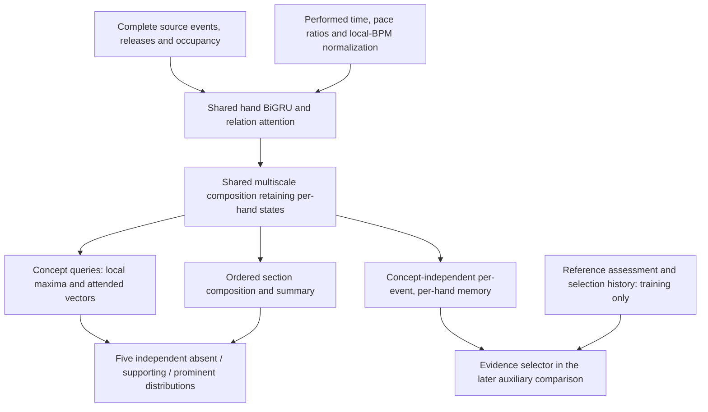

# Scoped style seed 17: results, unresolved mechanisms, and next questions

Evidence reviewed on 2026-09-14. This report covers seed 17 of the paired
`style-only` and `style+evidence` experiment, the confirmed direction for its
next architecture, and supplementary probes using existing models and labels.
The upgrades and probes below have not been implemented or run. They concern
the scoped style classifier, not a Pulsefield V3 reference architecture.
The [frozen study](scoped_style_witness_generation.md) and
[training implementation guide](scoped_style_training.md) describe the seed 17
contract; the human-inclusive training policy below is a deliberate new contract.

The evidence arm has slightly lower machine validation NLL and higher human
validation NLL. Both arms miss every human Trill and Tech positive at the declared
presence threshold. Stream and Jack have predictive signal, but aggregate
per-concept scores do not establish joint selectivity on the same input.
The next model adds physical-time/local-pace features and multiscale readout
with a direct path from short local expression to section assessment. Existing
human judgments supply its targets. Probes determine implementation choices and
remaining bottlenecks before broadly increasing parameter count.

## Experiment and measurement scope

The classifier assesses five independent concepts: Jack, Stream, Trill, Tech,
and LN coordination. Each assessment has three classes: absent, supporting,
and prominent. Concepts can coexist, including multiple prominent concepts.
Supporting and prominent express strength, not confidence.

Both arms train on machine judgments from the same prepared cohort, with shared
encoder/assessor initialization and paired minibatch draws. Sampling chooses a
concept, then a represented group, then a record uniformly at each level. The
evidence arm adds a teacher-forced selector loss with weight $\beta=0.1$ to the
assessment loss; the other arm uses $\beta=0$. The selector is absent from
assessment inference. There is no class weighting or augmentation in this run.

| Setting | Seed 17 value |
| --- | --- |
| Machine training population | 3,526 resolved assessment cells |
| Machine validation population | 487 cells, 53 groups |
| Human validation population | 79 cells, 26 groups |
| Optimizer | AdamW, learning rate 0.0003, weight decay 0.0001 |
| Batch size; dropout; gradient norm cap | 16; 0.1; 1.0 |
| Hand GRU hidden size per direction | 32, producing 64-dimensional states |
| Relation attention | One block, four heads, feedforward dimension 128 |
| Section GRU hidden size per direction | 32 |
| Training bounds | 30 epochs, patience 5, 4,800 charged seconds per arm |
| Execution | MPS, Python 3.10.20, PyTorch 2.11.0 |

Each arm completed 2,701 updates and 43,096 sampled records: 12 complete epochs
and part of epoch 13. Checkpoints were selected independently by the lowest
machine validation assessment macro NLL: epoch 9 for style-only and epoch 10
for style+evidence. Human and evidence metrics did not select checkpoints.

The pair stopped together under the wall-clock rule. Charged time was 4,821.50
seconds for style-only and 4,614.41 seconds for style+evidence, including shared
preparation charged to each arm. Style-only exceeded its bound by 21.50 seconds.
Final diagnostics cost another 24.50 and 27.88 seconds respectively. Matching
updates does not establish equal convergence. This report evaluates only saved
validation outputs; it adds no model forward passes, training, test evaluation,
or relation ablation. The preset names seeds 17, 29, and 43, but conclusions here
are restricted to seed 17.

Metrics follow [the metric implementation](../../src/pulsefield_model/research/scoped_style_modeling/metrics.py):

- Three-class NLL averages cells within each concept/group, then groups within
  each concept, then the five concepts. Lower is better.
- Presence uses $p_P=p_{\mathrm{supporting}}+p_{\mathrm{prominent}}$ and threshold
  0.5. Balanced accuracy (BA) averages the two class recalls, with records
  averaged within represented groups before groups.
- Positive strength uses $p_{\mathrm{prominent}}/p_P$ on **all reference-positive
  records**, including missed positives. Its NLL and BA retain that population.
- Confusion counts use three-class argmax and raw cell counts. They are distinct
  from the group-weighted binary presence decision.

Macro presence NLL and conditional positive-strength NLL use different
populations and cannot simply be added to reconstruct macro three-class NLL.
Machine and human layers are reported separately. These validation layers have
no exact source/scope/concept matches in the inspected cohort, so their metric
gap is not a paired estimate of annotator disagreement.

## Results and what they support

### Aggregate assessment

| Validation metric | Style-only | Style+evidence |
| --- | ---: | ---: |
| Machine macro NLL | 0.4952 | 0.4832 |
| Machine presence NLL | 0.2978 | 0.2909 |
| Machine positive-strength NLL | 0.5422 | 0.5203 |
| Human macro NLL | 1.0393 | 1.0722 |
| Human presence NLL | 0.7046 | 0.7035 |
| Human positive-strength NLL | 0.7026 | 0.7677 |

The machine macro NLL reduction is about 2.4%; human macro NLL increases about
3.2%. Human presence NLL is almost unchanged while positive-strength NLL
increases about 9.3%.

Define gain as $L_{\mathrm{only}}-L_{\mathrm{evidence}}$, so positive favors
evidence. A paired group bootstrap gives:

| Layer | Macro NLL gain | Conditional 95% interval |
| --- | ---: | ---: |
| Machine | +0.0119 | [-0.0357, +0.0635] |
| Human | -0.0328 | [-0.1101, +0.0453] |

These are percentile intervals from 1,000 resamples using NumPy
`default_rng(170914)`. Each layer resamples groups uniformly with replacement,
keeping paired predictions and all represented concepts with each group's
multiplicity; a draw missing an entire concept is redrawn. Both intervals
include zero. They condition on the chosen checkpoints and exclude training
seed variation and checkpoint-selection uncertainty. Machine validation also
selected the checkpoints, so this is not independent test evidence.

### Concept distinctions

Each arrow below is style-only to style+evidence. BA is expressed as a percentage.

| Concept | Machine cells/groups | Machine NLL | Machine presence BA | Human cells/groups | Human NLL | Human presence BA |
| --- | ---: | ---: | ---: | ---: | ---: | ---: |
| Jack | 101/53 | 0.6614 → 0.6727 | 78.5 → 79.3 | 13/13 | 1.2054 → 1.2027 | 51.7 → 46.7 |
| Stream | 100/53 | 0.6322 → 0.6111 | 78.4 → 83.1 | 12/12 | 0.6794 → 0.7291 | 75.0 → 75.0 |
| Trill | 95/52 | 0.4780 → 0.4672 | 51.7 → 51.1 | 14/14 | 1.1259 → 1.0491 | 50.0 → 50.0 |
| Tech | 96/53 | 0.3459 → 0.3927 | 63.6 → 53.2 | 24/23 | 1.6365 → 1.8423 | 50.0 → 50.0 |
| LN coordination | 95/53 | 0.3584 → 0.2724 | 91.5 → 78.8 | 16/16 | 0.5495 → 0.5376 | 95.0 → 86.7 |

**Stream/Jack joint selectivity has not been evaluated in these aggregate
results.** Their machine results show predictive signal, and human Stream
presence BA is 75%. Existing human sections with both readouts directly test
which concepts the model detects on the same input, including coexistence.
The next audit uses those judgments. Additional controls holding pace or density
fixed could investigate mechanisms, but are not prerequisites for assessing
agreement with the human labels.

**Trill and Tech positive detection fail on this human validation slice.**
For both arms, all 14 human Trill cells and all 24 human Tech cells have absent
as their three-class prediction. Presence positive recall is also zero. This
misses four Trill positives (one supporting, three prominent) and ten Tech
positives (four supporting, six prominent). Trill's lower evidence-arm NLL
therefore does not establish recognition. Machine Trill positive recall is
only 3.3% in both arms.

**LN's NLL improvement accompanies worse positive detection.** Machine LN
positive recall drops from 88.5% to 57.7%, and positive-strength BA drops from
76.4% to 65.9%. The raw three-class confusion counts expose the shift:

| Reference | Style-only predictions: absent / supporting / prominent | Style+evidence predictions: absent / supporting / prominent |
| --- | ---: | ---: |
| Absent | 74 / 1 / 1 | 76 / 0 / 0 |
| Supporting | 2 / 8 / 3 | 10 / 1 / 2 |
| Prominent | 0 / 1 / 5 | 0 / 3 / 3 |

The machine LN NLL gain of 0.0861 decomposes into +0.1759 from absent cells,
-0.0676 from supporting cells, and -0.0222 from prominent cells. This decomposition
keeps the original all-cell group denominators, assigning zero contribution to
other classes; it is not a sum of independently normalized class NLLs. The gain
is consequently insufficient evidence that LN coordination was better learned.

### Priors and the auxiliary objective

A constant baseline estimated only from machine training labels, using
group-weighted class frequencies separately for each concept, has macro NLL
0.7613 on machine validation and 1.0679 on human validation. Both models improve
substantially over this baseline on machine validation. On human validation,
style-only is only slightly lower and style+evidence slightly higher. For human
Jack, Trill, and Tech, both models have worse NLL than this concept-specific
prior. A prior comparison establishes neither density independence nor learned
relationships; simple pace, density, recurrence, and LN-amount baselines remain
useful controls.

Training group-weighted absent proportions are 80.2% for Trill, 88.6% for Tech,
and 82.5% for LN. Imbalance, sparse human support, and differences between the
label layers remain plausible contributors. They do not identify a sufficient
cause of failure or displace the temporal representation and readout hypotheses.

The evidence branch adds 83,082 training parameters: 106,423 total parameters
for style-only versus 189,505 for style+evidence, with 106,423 used at inference
in both arms. At 28 logged gradient observations, the median ratio of weighted
evidence-gradient norm to assessment-gradient norm on the shared encoder is
4.3%, ranging from 0.54% to 21.5%. Gradient direction was not measured. These
norms do not establish that increasing $\beta$ would help or that objectives
conflict.

Teacher-forced normalized evidence NLL is 0.2508 on machine validation and
0.3506 on human validation. It conditions on the reference assessment and
reference selection history. Human assessments do not by themselves establish
independently human-authored selections. This metric measures conditional
selection prediction, not free evidence generation, classification improvement,
or the causal importance of selected notes.

## Structures available to the model, and the missing temporal coordinates

The [replay](../../src/pulsefield_model/research/scoped_style_modeling/replay.py)
and [tensor construction](../../src/pulsefield_model/research/scoped_style_modeling/tensors.py)
retain exact source action ordering, complete attack groups, LN head/tail
identity, occupancy before and after actions, and lane-relative timing facts.
The graph supplies the following relationships:

| Relation family | Information available | What availability does not prove |
| --- | --- | --- |
| Event succession and attack succession at distances one and two | Event order, including releases/boundaries, and original attack-row order | Sustained flow, meaningful resets, or fixed A/B episodes |
| Same-lane recurrence | Return to a lane and intervening attack-row count | Adjacent Jack organization versus two-row Trill return |
| Simultaneous and same/other-hand relations | Complete four-column groups, action/occupancy facts, relative hand roles | Recognition of a particular coordinated expression |
| LN identity and occupied-role relations | Original heads/tails and actions around occupied lanes | LN coordination from overlap alone |

These are deterministic input relations, not learned connectivity discovered
by this analysis. No attention attribution or relationship intervention has
established which ones drive the saved predictions.

The [encoder and assessor](../../src/pulsefield_model/research/scoped_style_modeling/model.py)
already contain temporal sequence models. A shared bidirectional GRU processes
each hand across the complete review context before one relation-attention
block. At each section event, an MLP processes both hand orders and averages
them; a concept-conditioned bidirectional section GRU then supplies terminal
states and an event-masked mean, with section duration and an empty-section flag.
The receptive field is therefore not limited to one graph hop, and section
readout is not an orderless mean. Nevertheless, a small recurrent state may
struggle to retain local repetition, duration, interruptions, and transitions.
An event mean also does not directly weight evidence by physical duration.

Current time features are signed `log1p(abs(milliseconds)/1000)` plus
availability where needed. This monotonic transform does not inherently
quantize away fine differences. The specific gap is that source parsing does
not consume `.osu` timing points: no redline beat length, beat distance, or beat
phase reaches the model. Deriving pulse ratios and rhythmic equivalence from
millisecond channels is left to learning.

The annotation method exposes richer temporal observations. Its initial brief
includes active timing and timing changes; articulation inspection provides
LN duration in milliseconds and beats, interior attack rows, release position
relative to attacks, and other continuing holds. The inspected files match the
frozen harness inventory. See the pinned [brief construction](https://github.com/Pulsefield/beatmap-lens/blob/ee71da102a604df4d3673fd19b66263c3f739625/annotation/section_evidence.py),
[inspection implementation](https://github.com/Pulsefield/beatmap-lens/blob/ee71da102a604df4d3673fd19b66263c3f739625/harness/harness_inspection.py),
and [method inventory](https://github.com/Pulsefield/beatmap-lens/blob/ee71da102a604df4d3673fd19b66263c3f739625/annotation/methods/astra-1000-20260912/harness.json).
This establishes an information difference between labeler tooling and model
input. It does not establish how often agents used each view or whether that
difference caused the observed errors.

The frozen [Foundation](https://github.com/Pulsefield/beatmap-lens/blob/647009ab60ed69d98190712a6ab025807cca07b8/annotation/foundations/15fa68913bdb2bf395a189df7ab433f6d5b126fc35c46c1dbc8e607ce2182e97.json)
and [method skill](https://github.com/Pulsefield/beatmap-lens/blob/ee71da102a604df4d3673fd19b66263c3f739625/annotation/methods/astra-1000-20260912/skill/SKILL.md)
require distinctions that should guide the next diagnostics:

- Jack requires repeated-column organization in complete attack groups. A
  fixed disjoint A/B pattern can revisit each lane every two rows while Jack
  remains absent; speed alone does not decide the label.
- Stream involves flow, direction, chord placement, continuity, and resets.
  Continuous activity and fixed alternation alone are insufficient.
- Trill uses repeated alternation of fixed disjoint groups, which can be chords
  and can lie within or across hands. A clear expression may occupy a very
  short part of a section. The reviewed judgment determines its meaning;
  neither a brief A/B fragment alone nor a minimum section-coverage threshold
  supplies the label.
- Tech concerns concrete sequence, rhythm, and articulation relationships.
  Density, variation, entropy, model surprise, or failure to fit another label
  are insufficient definitions.
- LN coordination requires at least two simultaneously LN-occupied columns
  under this Foundation, but overlap alone is insufficient. Exact release
  placement and continuing occupancy must remain available.

## Confirmed direction for the next model

Physical-time/local-pace enhancement and multiscale readout are part of the
next architecture. The supplementary experiments determine their implementation,
connections, and remaining bottlenecks. Their adoption as research directions
is distinct from evidence that a particular implementation improves accuracy.

Style judgments describe gameplay experience. Existing human section judgments
supply the targets, including simultaneous readouts of different concepts and
Trill expressed in a very short part of a larger section. A local expression
need not occupy much of the section to affect its label. Presence and
supporting/prominent remain learned judgments, without a minimum coverage rule.

| Target problem | Required upgrade | What the probes must determine |
| --- | --- | --- |
| Stream/Jack need selective predictions on the same input | Preserve action order, recurrence versus return, and interval magnitudes/ratios; assess both on the same human-labeled input | Which errors reflect poor ranking, calibration, or inaccessible temporal relationships? |
| A clear short Trill must influence a larger section's assessment | Expose representations at several scales directly to concept readout, alongside ordered section context | Can existing encoder states support this path, and which composition/pooling implementation generalizes? |
| Interval ratios have no explicit representation in the current input | Supply performed-time, adjacent-gap ratios, local-pace ratios, and redline local-BPM normalization during encoding | How do enhanced time features interact with local composition? |
| Tech supervision must follow High-confidence human judgments | Train Tech only from those judgments, using shared temporal representations | Does the new supervision improve the old architecture, and what remains for architecture to improve? |
| Better local detection must preserve specificity and strength/LN judgments | Let local and whole-section paths jointly determine the three-class distribution | How much context and capacity are needed to qualify local responses? |

Local BPM is a normalization reference obtained directly from redlines at
inference. Learning beat grids, fractional-beat prediction, and audio timing
inference are outside this iteration. The modeling emphasis is on action order,
interval size, and multiplicative pace relationships. The missing timing-point
input in seed 17 does not establish timing metadata as its dominant failure.

Observed readout stability under some playback-rate changes remains a useful
sensitivity hypothesis. Neither unchanged nor changed labels under arbitrary
rate transformations are prescribed. Rate inspection is optional and does not
become a prerequisite for the architecture work.

## Supervision, shared inputs, and evaluation

### Use the existing human multi-readout sections

A read-only inventory of the pinned seed 17 cohort establishes immediate probe
support. Counts below cover training and validation only. A shared input has
identical source bytes, section, review context, and playback rate; `chart_key`
identifies the first three in this 1x-only preparation.

| Human support in the existing cohort | Training | Validation |
| --- | ---: | ---: |
| Resolved concept cells | 466 | 79 |
| Distinct source groups | 150 | 26 |
| Distinct input contexts | 174 | 31 |
| Inputs with all five human readouts | 73 | 12 |
| Inputs with one human readout | 101 | 19 |
| Jack present / Stream present | 41 | 6 |
| Jack present / Stream absent | 8 | 3 |
| Jack absent / Stream present | 23 | 2 |
| Jack absent / Stream absent | 1 | 1 |

The last four rows count inputs with both labels, rather than independent source
groups. The 12 validation pairs already cover all four combinations, with very
small support in some combinations. Evaluate these existing judgments directly;
no additional contrast-labeling campaign is required to begin. Retain both
concepts' supporting/prominent targets and report constituent class errors as
well as joint correctness. No comparison requires Jack probability to exceed
Stream probability, or vice versa.

Human Trill support is 100 training cells (64 absent, 18 supporting, 18 prominent)
and 14 validation cells (10 absent, one supporting, three prominent). Use the
actual reviewed examples to identify the short-local-expression inspection
slice. A known human-localized interval can support position/scale inspection;
a section-only judgment supports section classification. Evidence selection
is not an episode annotation: its first and last selected notes cannot define
an exhaustive interval, particularly for distributed witnesses. The count of
explicitly localized short Trill examples has not been established by this
inventory and must be reported when the slice is assembled.

### Human-priority targets and High-confidence Tech

The next training cohort uses the following target policy:

- For Jack, Stream, Trill, and LN coordination, use the effective resolved human
  judgment where it exists; otherwise retain the selected machine method's
  eligible judgment. Retain confidence as an evaluation stratum rather than
  silently discarding historical human judgments with missing confidence.
- For Tech, admit only effective human judgments with explicit
  `human_confidence="high"`, including absent, supporting, and prominent.
  Low or unspecified confidence supplies no Tech target. Other labels on the
  same input remain usable.
- Resolve human precedence at exact source/section/concept/rate identity.
  Preserve the chosen observation's context and provenance. Unresolved or
  conflicting human observations do not authorize a machine fallback; inspect
  the publication's exclusions as well as its resolved cohort.
- Use the current effective observation and its confidence, not any historical
  High in its ancestry. Confidence is per concept, independent of salience,
  and never becomes a model input or a prominence target.

The confidence semantics are owned by the pinned [human-confidence contract](https://github.com/Pulsefield/beatmap-lens/blob/ee71da102a604df4d3673fd19b66263c3f739625/docs/annotation/human-confidence.md).
The existing prepared records preserve `human_confidence` in `provenance_json`;
no confidence inference from rationale, origin, or model scores is needed.

| Existing High-confidence human Tech | Absent | Supporting | Prominent | Cells / groups |
| --- | ---: | ---: | ---: | ---: |
| Training | 16 | 5 | 5 | 26 / 26 |
| Validation | 5 | 0 | 1 | 6 / 6 |

This support permits a training-fit diagnostic and six-case held-out inspection.
It cannot estimate supporting-versus-prominent Tech validation discrimination:
there is no supporting validation example. Strength balanced accuracy is
unavailable; conditional NLL and prominent recall describe just the one positive.
A single changed positive prediction is not a robust generalization result.
Use any subsequently frozen existing human judgments to update the support
inventory before stronger claims; do not repurpose test groups to fill gaps.

On the pinned preparation, human and machine exact cells do not overlap.
Applying the policy above therefore yields 3,200 training cells: 811 Jack,
778 Stream, 804 Trill, 26 Tech, and 781 LN coordination. This is a derived
eligibility count, not an already prepared new training artifact. The original
trainer samples only machine records and must be adapted to the selected target
pool. Human training-group labels now become supervision, so retrain the old
architecture on this cohort. Seed 17 remains a historical reference, not a
control that isolates architecture from this supervision change.

### Encode once without changing the loss distribution

Share encoding only for identical source, scope, review context, and rate. Do
not widen a context to combine five labels. Group all rates and related sources
under the existing source-group split. Missing readouts remain masked, not absent.

Continue concept/group/cell sampling over eligible training targets, uniformly
at each level, for all comparisons. A batch may encode its distinct inputs once
and evaluate five concept queries, while gathering the sampled concept losses
with their original multiplicities. This preserves the sampling objective.
A naive mean over every available label in every sampled input would overweight
some complete five-label sections and change the objective; it is not merely a
throughput optimization.

Primary assessment reporting uses human labels for the four non-Tech concepts
and High-confidence human labels for Tech, with concept/group weighting as
previously defined. Retain the broader historical human and machine views as
separate diagnostics; they do not supply Tech training targets. Report presence
ranking and operating-point errors, conditional strength on all true positives,
per-class/source-group support, and paired changes on the same inputs. The small
Tech slice must remain visible beside any five-concept macro result.

The four common evaluation views are same-input Stream/Jack selectivity, reviewed
short-local Trill, High-confidence human Tech, and LN/positive-strength guards.
They use one frozen cohort and inspection inventory. Existing validation remains
development evidence after it has guided design; test stays outside probe and
pilot selection.

## Architecture specification for the first implementation

### Temporal features encode magnitude and ratios early

For distinct complete attack groups at source times $t_i$, let playback rate be
$r$, performed gap $d_i=(t_i-t_{i-1})/r>0$, and active local performed beat length
$L_i=L_{\mathrm{source}}(t_i)/r$. Let $\widehat d_i^{(s)}$ be a robust reference
gap at local scale $s$, computed from positive attack gaps within the declared
review context. The temporal feature family contains

$$
\left[d_i,\quad \log\frac{d_i}{d_{i-1}},\quad
\frac{d_i}{\widehat d_i^{(s)}},\quad \frac{d_i}{L_i}\right].
$$

Numerical embeddings can transform these values while retaining physical
magnitude and availability. Median positive gaps in two overlapping short/medium
neighborhoods are a simple starting reference; their window sizes are tunable
implementation choices. Retrospective context is allowed, but no statistic may
consume notes outside the declared review context. Missing predecessors or
references remain unavailable. Simultaneous notes belong to one attack group;
zero event gaps and signed release offsets retain separate exact representations
rather than entering logarithms of positive attack-gap ratios.

Apply comparable performed-time and pace-relative descriptors to per-lane
recurrence, same/other-hand interactions, and LN release-to-attack relationships.
Global attack pace alone cannot distinguish these action assignments. Feed the
features into lane/row encoding and relation-attention bias/value messages,
where actions are combined, as well as local composition metadata.

Use the active redline at the query event for local normalization. Across a
redline change, a gap divided by that local beat length is a local coordinate,
not an integrated beat count. Scroll velocity does not define BPM. The new
representation does not require beat phase, metrical quantization, or a learned
beat estimator. Exact simultaneity, event order, LN occupancy, and original
source identities remain intact.

Retain absolute performed-time channels: the model can learn stability in a
range of rates without being forced to ignore speed. Local-BPM normalization
and ratios do not replace those channels. [Time2Vec](https://arxiv.org/abs/1907.05321)
is an analogue for a learnable time embedding, but the first implementation's
main change is to expose the relevant magnitude and ratio relationships.

### Shared multiscale composition preserves positions and hand roles

Keep the existing hand BiGRU and relation-attention backbone initially. Add a
small concept-independent temporal composition module to its per-event,
per-hand output. It retains the hand axis and exposes intermediate scales to
assessment. Shared parameters across hands and the current symmetric hand-pair
projection provide a starting point without a separate fusion search.

A recommended initial module is a residual temporal convolution at width 64,
with one kernel-size-3 convolution per block, dilation sequence 1, 2, 4,
stride 1, and no temporal pooling. Retain the incoming states and all three
block outputs. These blocks combine neighborhoods of 3, 7, and 15 source-event
positions; releases and
boundary events are included. They are additional composition spans over
already contextual BiGRU states, not raw-input receptive-field limits or
semantic episode boundaries. Exact widths and dilations remain probe choices.

Attach physical span, attack count, and section-relative position to the scale
representations. The enhanced temporal setting also supplies its local-pace
descriptors. Keep padding and boundary availability explicit. If errors track
release density or equal event counts at very different attack paces, compare
attack-anchored neighborhoods or explicit time
spans as a focused follow-up. An attack-anchored variant must retain the complete
release/occupancy event path; LN information cannot disappear between anchors.

[Temporal Convolutional Networks](https://arxiv.org/abs/1608.08242) provide an
analogue for combining several temporal scales. This proposal adapts that
mechanism to section judgments and contextual hand states. The module does not
claim to discover fully localized style episodes.

### Local responses and ordered section context meet at the classifier

The assessment branch applies concept queries to each exposed scale, producing
internal responses $a_{\ell,i,s}$ and associated local vectors. Its local path
keeps, for each scale, a strongest-response scalar and an attention-weighted
vector. The scalar supplies a route for a short expression that does not first
pass through an average over the entire section. The vectors supply its content
and context. Responses are not calibrated local style probabilities.

A separate section path processes a learned mixture of scale representations
in temporal order, initially reusing the section BiGRU and its summaries. The
final concept-conditioned three-class head receives both paths, duration/span
information, and the empty-scope state. It learns how local expression relates
to section presence and strength. Presence is not defined as a maximum, and
prominence is not defined as coverage.

The local candidate mask admits anchors in the target section. Context informs
those anchors but does not become an extra pool of positive instances. Handle
empty scopes explicitly and inspect windows crossing section boundaries.
A max response can increase with the number of candidate positions; attention
can still dilute a short response. Check section-length strata and false
positives rather than assuming either aggregation solves the problem alone.

[Attention-based multiple-instance learning](https://proceedings.mlr.press/v80/ilse18a.html)
is a close analogue for learning a global label from local instances. Here,
ordered encoding precedes aggregation, a separate ordered section path remains,
and each concept has three assessment classes. Attention weights are not
witness targets or causal explanations.

A concept-independent projection of the shared scales supplies fixed-width
per-event, per-hand memory to the selector. This keeps the existing selector's
basic interface and lets a later auxiliary loss reach the new composition
module. Concept-conditioned aggregation belongs to the assessment branch.
Reference assessment, masks, and teacher-forced history remain isolated from
assessment inputs. Evidence selection is never a dense activation-map target.

If residual errors concentrate on cross-time hand correspondence, test later
hand fusion as one conditional branch. Whole-chart mirror consistency does not
require independent hand-swap invariance at every instant. The current backbone
already carries temporal hand context, so this remains an implementation
comparison rather than an established defect.

## Supplementary probes and the decisions they support

### Probe A: audit existing scores and same-input readouts

**Available now:** both seed 17 arms save logits for all 79 human validation
cells, including all five labels on the 12 complete inputs. Join predictions
to the prepared cohort by layer/cell identity to recover exact context, rate,
and confidence. No forward pass is needed for these labeled comparisons.
Complete five-query outputs on the other 19 inputs require additional inference;
unlabeled outputs would remain inspection-only.

For each concept inspect

$$
p_P=p_{\mathrm{supporting}}+p_{\mathrm{prominent}},\qquad
p_{\mathrm{strong}\mid P}=\frac{p_{\mathrm{prominent}}}
{p_{\mathrm{supporting}}+p_{\mathrm{prominent}}}.
$$

Plot labeled score distributions, ranking metrics such as AUROC/AP where both
classes exist, and the existing 0.5-threshold false positives/negatives. For
weighted ranking, give cells equal total weight within each source group before
computing the concept's curve. Report support, and retain conditional-strength
scores for all reference positives, including missed ones.

For the 12 joint Stream/Jack inputs, show each reference/predicted presence pair,
both three-class distributions, and errors within each of the four combinations.
Inspect the existing short-local Trill examples with section length and scale
context. This is a score and error audit, not a new semantic labeling exercise.

If Trill positives outrank negatives while all scores stay below 0.5, zero
recall alone does not establish absent representation. If ranking and concept
selectivity are poor, a threshold shift cannot repair them. Do not optimize a
threshold on these validation cases and count the resulting recall as an
architecture gain; report any operating-point analysis separately.

**Deliverable:** one section-level error table and compact score/joint-readout
plots, with checkpoint, target, context, confidence, and source-group identities.
Probe A requires only a small analysis adapter and the saved files. It informs
interpretation of B/C rather than deciding whether the two upgrades proceed.

### Probe B: frozen backbone, two newly trained readouts

Use the style-only seed 17 best checkpoint as the initial backbone. Cache its
`model.encoder(chart)` output in evaluation mode, before the assessor's hand-pair
projection. Preserve the full `[event, hand, 64]` tensor, valid lengths, section
masks, and chart-derived timing sidecars. Cache keys include checkpoint hash,
input identity/rate, and tensorization version. No assessment or evidence target
enters these features. Cache on CPU/disk and stream batches to the accelerator.

Both variants use the same frozen states, new supervision policy, sampled cells,
update budget, and matched initialization of common readout components. Keep
the temporal setting at seed 17's features: R1 may compute the multiscale spans
from existing source facts, but does not add the gap-ratio/local-BPM package.

| Variant | Trainable part |
| --- | --- |
| R0 | Reinitialize and train the current assessor, including pair projection, concept embedding, section GRU, and head |
| R1 | Train the proposed multiscale composition plus local/ordered assessment paths on the same frozen backbone output |

The new composition module is trainable in R1 and later becomes part of the
shared encoder in the end-to-end architecture. Reuse that implementation in C.
Do not compare an old machine-trained assessor directly against a new
human-supervised R1 and attribute the difference to readout structure.

| Observation | Consequence for implementation |
| --- | --- |
| R1 improves short-local Trill and concept selectivity without strength/LN regression | Existing contextual position states contain useful information for the new path; prioritize temporal features and composition over broad backbone expansion |
| Training fit improves but validation does not | Inspect source support and generalization; more readout width is not the default next action |
| Neither readout fits clear training positives | Check targets, sampling exposure, optimization, and whether frozen states hide the needed distinctions; C must allow joint adaptation |
| R1 increases recall together with false positives or strength errors | Refine how local responses interact with ordered section context; inspect candidate-count effects |

Success establishes usefulness of contextual position states, not a pure local
Trill detector: the cached BiGRU has already read the whole review context.
Failure cannot prove that the backbone contains no relevant information. If R1
wins, a single capacity-matched R0 extension can distinguish extra capacity
from the proposed path before making a mechanism claim. Hand-fusion variants
are conditional on specific remaining errors, not an initial grid.

**Deliverable:** paired training/development curves, the four common evaluation
views, and per-position/scale responses on reviewed examples. Local plots must
show their composition spans and section boundaries, without labeling them as
causal attribution or dense ground truth.

### Pilot C: time by multiscale, trained end to end

Run all four arms on the same new cohort at $\beta=0$:

| Arm | Temporal representation | Composition/readout |
| --- | --- | --- |
| C0 | Seed 17 time features | Current assessor |
| CT | Performed time + local pace + local-BPM normalization | Current assessor |
| CM | Seed 17 time features | Proposed multiscale local/ordered paths |
| CTM | Enhanced temporal representation | Proposed multiscale local/ordered paths |

This pilot implements both confirmed upgrades and tests how they work together.
It does not make their research direction contingent on a single short run.
Local BPM is part of the temporal feature package; this comparison does not
attempt to attribute gains to every individual timing channel. CM receives
the multiscale module's span/count metadata but no new gap-ratio or local-BPM
descriptors; those belong to CT and CTM.

Use seed 17 initially, matching sampled cell streams, optimizer settings, and
common update counts. Match initialization of identical components explicitly;
architecture changes can alter random-number consumption, so a shared integer
seed alone is insufficient. Extra modules receive their own deterministic
initialization. Record parameter count, throughput, training fit, and both final
common-update and selected-checkpoint results. This 2x2 comparison estimates
practical module effects, including added capacity, rather than a pure effect
of inductive bias at identical parameter count.

| Pilot observation | Architecture decision |
| --- | --- |
| CM improves short-local Trill; CT improves pace-related confusions | Keep both components and the initial backbone width |
| CTM improves while the single-module arms show little gain | Investigate dependence between temporal features and composition; retain their early connection and repeat the comparison before claiming an interaction |
| CM improves presence but damages strength or false-positive rates | Strengthen the joint use of local and ordered summaries instead of making a max response the final decision |
| C0 improves Tech under the new supervision | Establish the new-cohort baseline and measure CT/CM/CTM gains relative to it; the historical comparison does not isolate architecture or supervision alone |
| All arms struggle to fit High-confidence Tech training targets | Audit target exposure, loss masks, optimization, and relation inputs before adding complexity |
| Training fits but validation is unstable | Treat independent source support as a limitation; do not make a strong architecture claim from the single High-confidence Tech validation positive |

C0 is the architecture control on the new training contract. The original seed
17 checkpoint is not that control. Short-pilot learning curves may be immature;
a negative pilot result is not evidence that multiscale representation or pace
features are unnecessary.

CTM outperforming both single-module arms can also reflect additive gains.
For a loss $L$ at a common comparison point, inspect the interaction contrast
$I=(L_{CM}-L_{CTM})-(L_{C0}-L_{CT})$: positive $I$ means the temporal package
helps more with multiscale composition. Report its per-concept behavior and
seed uncertainty before interpreting it as a reproducible interaction.

### Execution order, bounds, and checkpoint selection

These are proposed small-run bounds for implementation planning, not results
or executable commands supplied by the existing trainer:

| Stage | Initial scope | Proposed cap |
| --- | --- | --- |
| A | Saved train/validation metadata and saved validation logits | No training; optional completion of five-query outputs on the 31 human validation inputs |
| B | One cached backbone, R0/R1, seed 17 | At most 1,000 matched updates and 15 charged minutes per arm; cache construction reported separately |
| C | C0/CT/CM/CTM, seed 17 | At most 1,000 common updates and 30 charged minutes per arm |
| Confirmation | C0 and the selected combined implementation only | Paired seeds 29 and 43 under a fixed configuration and a separately recorded feasible convergence budget |

Before B/C, use a bounded throughput check to set one feasible common update
count within these caps. Include preparation/validation in time accounting and
record cache time, storage, and peak device memory separately. A cap-triggered
stop must retain a common comparison point and report incomplete convergence;
it must not silently give a faster arm more training. These bounds do not
promise that 1,000 updates can reproduce seed 17's best epochs.

For B/C, select checkpoints by human group-macro three-class NLL under the new
supervision/evaluation policy, with a fixed evaluation cadence and earliest
checkpoint on ties. Report the final common-update result as well. Presence
ranking, joint selectivity, Trill misses, false positives, and LN/strength are
required companion views; one scalar cannot approve the model. Supporting versus
prominent Tech balanced accuracy remains unavailable on the current High slice;
its conditional NLL describes the single reference-positive cell.

A improves error interpretation; B identifies useful access to existing states;
C tests joint adaptation. Confirmation focuses on C0 versus the selected combined
implementation, instead of repeating the full grid. Before confirmation, freeze
its budget, primary practical effect threshold, regression tolerances, and
checkpoint rule. This document does not invent statistically reliable thresholds
from the sparse validation counts. Pilot caps bound implementation cost;
confirmation requires a fixed decision criterion and adequate evaluation support.

## Implementation work and return to evidence supervision

The existing implementation supplies recoverable checkpoints, per-cell logits,
confidence provenance, exact replay, and a callable encoder/assessor split. It
does not yet supply the new cohort policy, readout cache trainer, five-query
batch reuse, temporal features, or four-arm runner.

| Owner | Required work | Targeted verification |
| --- | --- | --- |
| `dataset.py`, `prepare.py`, `corpus.py` | Version the selected targets, effective confidence policy, shared-input identity, and human-inclusive sampler; retain frozen group assignments | Per-label masks, human precedence, confidence revisions, no duplicate target weighting, and split/context/rate identity |
| `replay.py`, `tensors.py`, `relations.py` | Parse redline local BPM and add physical/ratio descriptors without changing source actions | Exact grouping/releases, ratio availability, local tempo changes, context limits, and mirror-relative features |
| `model.py` | Add shared multiscale states, local/ordered aggregation, and fixed-width shared selector memory | Padding and scope masks, empty sections, short-local gradient path, all-scale access, mirror behavior, and branch isolation |
| `metrics.py` and analysis adapter | Join exact same-input outputs and report ranking, joint cases, confidence strata, and sparse support | Metrics requiring missing classes stay unavailable; strength retains missed positives; all compared rows retain matching identities |
| `train.py`, typed config and packaged presets | Add frozen-backbone and four-arm comparisons, matched sampling/initialization, common-budget accounting, and the new checkpoint criterion | Human cells reach the loss; masks preserve the sampling denominator; B freezes only the backbone; paired comparison points are reproducible |

Prepared seed 17 graph files omit redline timing, but the preparation config
points to hash-verified original `.osu` files under
`artifacts/scoped-style-modeling/sources/`. A read-only check found all 496
training/validation source files present, matching their hashes and containing
`TimingPoints` sections. Regenerate a versioned preparation with parsed timing
fields from those sources. Do not infer BPM from a graph that
contains no redline data or mutate the saved seed 17 preparation in place.
The current adapter is restricted to 1x and its cache key omits rate because
of that restriction; rate sensitivity requires explicit adapter/tensor support.

Once the selected structure can be inspected for short-local expression,
compare style-only and style+evidence again on the same new cohort and
architecture. Keep assessment targets fixed between the pair. Attach evidence
only through its correct record provenance and explicit availability; a human
assessment does not automatically certify the witness inherited with it.

The question is whether evidence supervision improves concept selectivity,
use of relevant local relationships, or supporting/prominent judgment on the
new shared representations. Preserve source-local case inspection, the LN guard,
and the separation between teacher-forced evidence NLL and assessment quality.
The selector must receive the new shared memory so its gradients can train
multiscale composition. Reference labels/history remain auxiliary-only. This
comparison can proceed before all five styles are solved, without enlarging
the decoder or starting a broad $\beta$ search.

Full episode segmentation, dense style annotation, CRF/HSMM readout, audio timing
inference, fractional-grid prediction, and uniform backbone widening are deferred.
Optional rate sweeps show five readouts against performed speed; score accuracy
only where actual rate-specific human judgments exist. Otherwise they are
sensitivity plots, with no invariance loss or automatic label transfer.

## Evidence identity and reproducibility limits

The local run root is
`artifacts/scoped-style-modeling/overnight-17-29-43-v1/`.
The evidence consists of `run.json`, `config.json`, the saved `source/` tree,
`seed-17/summary.json`, and each arm's `best.pt`, `assessment.pt`,
`machine-validation.json`, `human-validation.json`, and `updates.jsonl`.
Post-hoc calculations and illustrative plots are under
`seed-17/analysis-20260914/`; prepared cells are in
`artifacts/scoped-style-modeling/prepare-v1/assessment-cohort.jsonl`.
These generated assets may be absent in a fresh clone. The tables and methods
above preserve the substantive findings without requiring their visualizations.

| Identity | Recorded value |
| --- | --- |
| Dataset revision | `b22a7a443783e05fee4db4b1d22b8e573ad448ae` of `sed-i/mania-pattern-annotations` |
| Foundation | `f-15fa68913bdb2bf3` |
| Machine method | `method-5ebd91cd0db19242f14bf5d4fc96b328c792b185ec4ab2bc785ca2e13a4d056c` |
| Run-recorded Git revision | `0f1bf9f234f1a09042a1c85566cf2aea5bd45ae4` |
| Later matching tracked-source revision | `867d5a051ddefd2d899bf69e84944692f67e93d8` |
| Saved source aggregate SHA-256 | `e1f4e43712c7f0a3d43f634567fdc8fa7938d3d0673a2c1a39ef79e105362382` |
| Frozen study SHA-256 | `197ae4c5de62d4f7207200c6892562650a47e3dbc0ea80640ac86776e7ea9bdd` |
| Cohort SHA-256 | `252fe593514adc5498011b55dbf62224cba55651025233fc1ed9235078bb95b8` |
| Split SHA-256 | `15175f45e91cf7299a9a30166731bf38ee7361399b346fb692cf68e76de5992a` |
| Style-only `best.pt` SHA-256 | `d16fa2aee5b7e13c3c034eddbe15c80d31693227161f95240005ee1cadae59fa` |
| Style+evidence `best.pt` SHA-256 | `71919de0f05c4f16a46c1271a8ddf57899a4a601d3a9d92a9f33d07ef3c55021` |

The launch revision alone does not reproduce the run: some saved source files
differ from that commit. All 25 saved files match their recorded hashes; 24
match tracked blobs in the later revision above. The remaining file, `uv.lock`,
is preserved in the run snapshot but is not tracked in that revision. A local
analysis manifest's broader claim that all source files match a commit is
therefore insufficient; reproduction also needs the saved lockfile. The
preparation specification hash was not recorded and remains unavailable.

The harness inventory records source commit
`eb233598c6d0fcf5e9931416948d105f23ca8a71`; all eight listed tool-file hashes
match the inspected files. Pinned inspection links above identify
`beatmap-lens` revision `ee71da102a604df4d3673fd19b66263c3f739625`.
The seed 17 measurements remain exploratory single-seed evidence. The next
architecture direction is confirmed, while its concrete implementation choices
and assessment gains remain to be established by the probes and comparisons
specified above.
