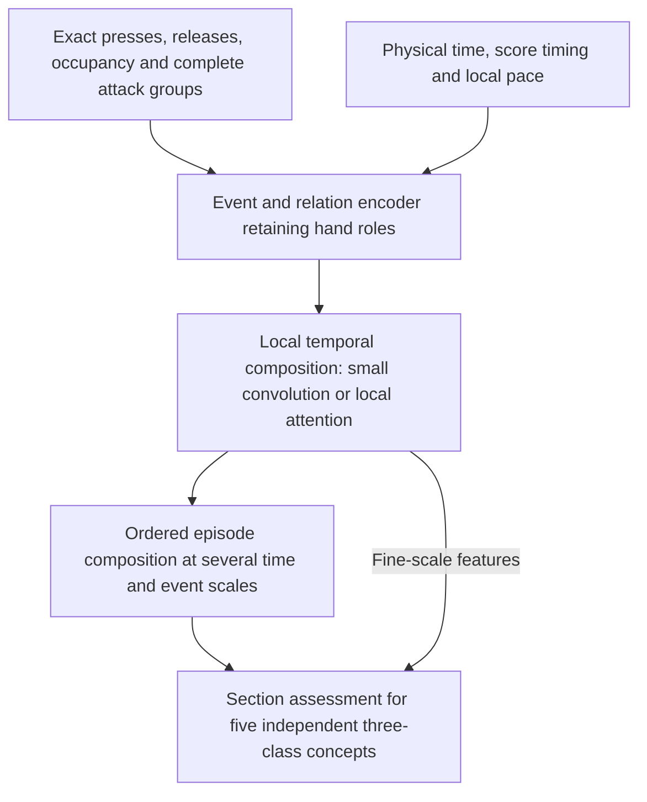

# Scoped style seed 17: results, unresolved mechanisms, and next questions

Evidence reviewed on 2026-09-14. This report covers seed 17 of the paired
`style-only` and `style+evidence` experiment. It records experimental evidence
and architecture proposals; it does not define a Pulsefield V3 architecture or
an accepted next experiment. The [frozen study](scoped_style_witness_generation.md)
and [training implementation guide](scoped_style_training.md) retain their
respective scope.

The evidence arm has slightly lower machine validation NLL and higher human
validation NLL. Both arms miss every human Trill and Tech positive at the declared
presence threshold. Stream and Jack have some predictive signal,
but this experiment does not establish that the model distinguishes their
organizing relationships at matched pace and density. The priority is to locate
the failure between temporal representation, local structure encoding, and
section readout before broadly increasing parameter count.

## Experiment and measurement scope

The classifier assesses five independent concepts: Jack, Stream, Trill, Tech,
and LN coordination. Each assessment has three classes: absent, supporting,
and prominent. Concepts can coexist, including multiple prominent concepts.
Supporting and prominent express strength, not confidence.

Both arms train on machine judgments from the same prepared cohort, with shared
encoder/assessor initialization and paired minibatch draws. Sampling chooses a
concept, then a represented group, then a record uniformly at each level. The
evidence arm adds a teacher-forced selector loss with weight $\beta=0.1$ to the
assessment loss; the other arm uses $\beta=0$. The selector is absent from
assessment inference. There is no class weighting or augmentation in this run.

| Setting | Seed 17 value |
| --- | --- |
| Machine training population | 3,526 resolved assessment cells |
| Machine validation population | 487 cells, 53 groups |
| Human validation population | 79 cells, 26 groups |
| Optimizer | AdamW, learning rate 0.0003, weight decay 0.0001 |
| Batch size; dropout; gradient norm cap | 16; 0.1; 1.0 |
| Hand GRU hidden size per direction | 32, producing 64-dimensional states |
| Relation attention | One block, four heads, feedforward dimension 128 |
| Section GRU hidden size per direction | 32 |
| Training bounds | 30 epochs, patience 5, 4,800 charged seconds per arm |
| Execution | MPS, Python 3.10.20, PyTorch 2.11.0 |

Each arm completed 2,701 updates and 43,096 sampled records: 12 complete epochs
and part of epoch 13. Checkpoints were selected independently by the lowest
machine validation assessment macro NLL: epoch 9 for style-only and epoch 10
for style+evidence. Human and evidence metrics did not select checkpoints.

The pair stopped together under the wall-clock rule. Charged time was 4,821.50
seconds for style-only and 4,614.41 seconds for style+evidence, including shared
preparation charged to each arm. Style-only exceeded its bound by 21.50 seconds.
Final diagnostics cost another 24.50 and 27.88 seconds respectively. Matching
updates does not establish equal convergence. This report evaluates only saved
validation outputs; it adds no model forward passes, training, test evaluation,
or relation ablation. The preset names seeds 17, 29, and 43, but conclusions here
are restricted to seed 17.

Metrics follow [the metric implementation](../../src/pulsefield_model/research/scoped_style_modeling/metrics.py):

- Three-class NLL averages cells within each concept/group, then groups within
  each concept, then the five concepts. Lower is better.
- Presence uses $p_P=p_{\mathrm{supporting}}+p_{\mathrm{prominent}}$ and threshold
  0.5. Balanced accuracy (BA) averages the two class recalls, with records
  averaged within represented groups before groups.
- Positive strength uses $p_{\mathrm{prominent}}/p_P$ on **all reference-positive
  records**, including missed positives. Its NLL and BA retain that population.
- Confusion counts use three-class argmax and raw cell counts. They are distinct
  from the group-weighted binary presence decision.

Macro presence NLL and conditional positive-strength NLL use different
populations and cannot simply be added to reconstruct macro three-class NLL.
Machine and human layers are reported separately. These validation layers have
no exact source/scope/concept matches in the inspected cohort, so their metric
gap is not a paired estimate of annotator disagreement.

## Results and what they support

### Aggregate assessment

| Validation metric | Style-only | Style+evidence |
| --- | ---: | ---: |
| Machine macro NLL | 0.4952 | 0.4832 |
| Machine presence NLL | 0.2978 | 0.2909 |
| Machine positive-strength NLL | 0.5422 | 0.5203 |
| Human macro NLL | 1.0393 | 1.0722 |
| Human presence NLL | 0.7046 | 0.7035 |
| Human positive-strength NLL | 0.7026 | 0.7677 |

The machine macro NLL reduction is about 2.4%; human macro NLL increases about
3.2%. Human presence NLL is almost unchanged while positive-strength NLL
increases about 9.3%.

Define gain as $L_{\mathrm{only}}-L_{\mathrm{evidence}}$, so positive favors
evidence. A paired group bootstrap gives:

| Layer | Macro NLL gain | Conditional 95% interval |
| --- | ---: | ---: |
| Machine | +0.0119 | [-0.0357, +0.0635] |
| Human | -0.0328 | [-0.1101, +0.0453] |

These are percentile intervals from 1,000 resamples using NumPy
`default_rng(170914)`. Each layer resamples groups uniformly with replacement,
keeping paired predictions and all represented concepts with each group's
multiplicity; a draw missing an entire concept is redrawn. Both intervals
include zero. They condition on the chosen checkpoints and exclude training
seed variation and checkpoint-selection uncertainty. Machine validation also
selected the checkpoints, so this is not independent test evidence.

### Concept distinctions

Each arrow below is style-only to style+evidence. BA is expressed as a percentage.

| Concept | Machine cells/groups | Machine NLL | Machine presence BA | Human cells/groups | Human NLL | Human presence BA |
| --- | ---: | ---: | ---: | ---: | ---: | ---: |
| Jack | 101/53 | 0.6614 → 0.6727 | 78.5 → 79.3 | 13/13 | 1.2054 → 1.2027 | 51.7 → 46.7 |
| Stream | 100/53 | 0.6322 → 0.6111 | 78.4 → 83.1 | 12/12 | 0.6794 → 0.7291 | 75.0 → 75.0 |
| Trill | 95/52 | 0.4780 → 0.4672 | 51.7 → 51.1 | 14/14 | 1.1259 → 1.0491 | 50.0 → 50.0 |
| Tech | 96/53 | 0.3459 → 0.3927 | 63.6 → 53.2 | 24/23 | 1.6365 → 1.8423 | 50.0 → 50.0 |
| LN coordination | 95/53 | 0.3584 → 0.2724 | 91.5 → 78.8 | 16/16 | 0.5495 → 0.5376 | 95.0 → 86.7 |

**Stream/Jack remain unproven as structural distinctions.** Their machine
results show predictive signal, and human Stream presence BA is 75%. However,
there is no controlled comparison holding pace, density, and chord composition
approximately fixed while changing repetition, flow, or alternation. Separate
label scores cannot establish this ability, and a mutually exclusive
Stream-versus-Jack task would omit legitimate coexistence.

**Trill and Tech positive detection fail on this human validation slice.**
For both arms, all 14 human Trill cells and all 24 human Tech cells have absent
as their three-class prediction. Presence positive recall is also zero. This
misses four Trill positives (one supporting, three prominent) and ten Tech
positives (four supporting, six prominent). Trill's lower evidence-arm NLL
therefore does not establish recognition. Machine Trill positive recall is
only 3.3% in both arms.

**LN's NLL improvement accompanies worse positive detection.** Machine LN
positive recall drops from 88.5% to 57.7%, and positive-strength BA drops from
76.4% to 65.9%. The raw three-class confusion counts expose the shift:

| Reference | Style-only predictions: absent / supporting / prominent | Style+evidence predictions: absent / supporting / prominent |
| --- | ---: | ---: |
| Absent | 74 / 1 / 1 | 76 / 0 / 0 |
| Supporting | 2 / 8 / 3 | 10 / 1 / 2 |
| Prominent | 0 / 1 / 5 | 0 / 3 / 3 |

The machine LN NLL gain of 0.0861 decomposes into +0.1759 from absent cells,
-0.0676 from supporting cells, and -0.0222 from prominent cells. This decomposition
keeps the original all-cell group denominators, assigning zero contribution to
other classes; it is not a sum of independently normalized class NLLs. The gain
is consequently insufficient evidence that LN coordination was better learned.

### Priors and the auxiliary objective

A constant baseline estimated only from machine training labels, using
group-weighted class frequencies separately for each concept, has macro NLL
0.7613 on machine validation and 1.0679 on human validation. Both models improve
substantially over this baseline on machine validation. On human validation,
style-only is only slightly lower and style+evidence slightly higher. For human
Jack, Trill, and Tech, both models have worse NLL than this concept-specific
prior. A prior comparison establishes neither density independence nor learned
relationships; simple pace, density, recurrence, and LN-amount baselines remain
useful controls.

Training group-weighted absent proportions are 80.2% for Trill, 88.6% for Tech,
and 82.5% for LN. Imbalance, sparse human support, and differences between the
label layers remain plausible contributors. They do not identify a sufficient
cause of failure or displace the temporal representation and readout hypotheses.

The evidence branch adds 83,082 training parameters: 106,423 total parameters
for style-only versus 189,505 for style+evidence, with 106,423 used at inference
in both arms. At 28 logged gradient observations, the median ratio of weighted
evidence-gradient norm to assessment-gradient norm on the shared encoder is
4.3%, ranging from 0.54% to 21.5%. Gradient direction was not measured. These
norms do not establish that increasing $\beta$ would help or that objectives
conflict.

Teacher-forced normalized evidence NLL is 0.2508 on machine validation and
0.3506 on human validation. It conditions on the reference assessment and
reference selection history. Human assessments do not by themselves establish
independently human-authored selections. This metric measures conditional
selection prediction, not free evidence generation, classification improvement,
or the causal importance of selected notes.

## Structures available to the model, and the missing temporal coordinates

The [replay](../../src/pulsefield_model/research/scoped_style_modeling/replay.py)
and [tensor construction](../../src/pulsefield_model/research/scoped_style_modeling/tensors.py)
retain exact source action ordering, complete attack groups, LN head/tail
identity, occupancy before and after actions, and lane-relative timing facts.
The graph supplies the following relationships:

| Relation family | Information available | What availability does not prove |
| --- | --- | --- |
| Event succession and attack succession at distances one and two | Event order, including releases/boundaries, and original attack-row order | Sustained flow, meaningful resets, or fixed A/B episodes |
| Same-lane recurrence | Return to a lane and intervening attack-row count | Adjacent Jack organization versus two-row Trill return |
| Simultaneous and same/other-hand relations | Complete four-column groups, action/occupancy facts, relative hand roles | Recognition of a particular coordinated expression |
| LN identity and occupied-role relations | Original heads/tails and actions around occupied lanes | LN coordination from overlap alone |

These are deterministic input relations, not learned connectivity discovered
by this analysis. No attention attribution or relationship intervention has
established which ones drive the saved predictions.

The [encoder and assessor](../../src/pulsefield_model/research/scoped_style_modeling/model.py)
already contain temporal sequence models. A shared bidirectional GRU processes
each hand across the complete review context before one relation-attention
block. At each section event, an MLP processes both hand orders and averages
them; a concept-conditioned bidirectional section GRU then supplies terminal
states and an event-masked mean, with section duration and an empty-section flag.
The receptive field is therefore not limited to one graph hop, and section
readout is not an orderless mean. Nevertheless, a small recurrent state may
struggle to retain local repetition, duration, interruptions, and transitions.
An event mean also does not directly weight evidence by physical duration.

Current time features are signed `log1p(abs(milliseconds)/1000)` plus
availability where needed. This monotonic transform does not inherently
quantize away fine differences. The specific gap is that source parsing does
not consume `.osu` timing points: no redline beat length, beat distance, or beat
phase reaches the model. Deriving pulse ratios and rhythmic equivalence from
millisecond channels is left to learning.

The annotation method exposes richer temporal observations. Its initial brief
includes active timing and timing changes; articulation inspection provides
LN duration in milliseconds and beats, interior attack rows, release position
relative to attacks, and other continuing holds. The inspected files match the
frozen harness inventory. See the pinned [brief construction](https://github.com/Pulsefield/beatmap-lens/blob/ee71da102a604df4d3673fd19b66263c3f739625/annotation/section_evidence.py),
[inspection implementation](https://github.com/Pulsefield/beatmap-lens/blob/ee71da102a604df4d3673fd19b66263c3f739625/harness/harness_inspection.py),
and [method inventory](https://github.com/Pulsefield/beatmap-lens/blob/ee71da102a604df4d3673fd19b66263c3f739625/annotation/methods/astra-1000-20260912/harness.json).
This establishes an information difference between labeler tooling and model
input. It does not establish how often agents used each view or whether that
difference caused the observed errors.

The frozen [Foundation](https://github.com/Pulsefield/beatmap-lens/blob/647009ab60ed69d98190712a6ab025807cca07b8/annotation/foundations/15fa68913bdb2bf395a189df7ab433f6d5b126fc35c46c1dbc8e607ce2182e97.json)
and [method skill](https://github.com/Pulsefield/beatmap-lens/blob/ee71da102a604df4d3673fd19b66263c3f739625/annotation/methods/astra-1000-20260912/skill/SKILL.md)
require distinctions that should guide the next diagnostics:

- Jack requires repeated-column organization in complete attack groups. A
  fixed disjoint A/B pattern can revisit each lane every two rows while Jack
  remains absent; speed alone does not decide the label.
- Stream involves flow, direction, chord placement, continuity, and resets.
  Continuous activity and fixed alternation alone are insufficient.
- Trill uses repeated alternation of fixed disjoint groups, which can be chords
  and can lie within or across hands. A short A/B fragment is not automatically
  a sustained expression; pace, duration, and entry/exit context matter without
  a universal row-count or millisecond threshold.
- Tech concerns concrete sequence, rhythm, and articulation relationships.
  Density, variation, entropy, model surprise, or failure to fit another label
  are insufficient definitions.
- LN coordination requires at least two simultaneously LN-occupied columns
  under this Foundation, but overlap alone is insufficient. Exact release
  placement and continuing occupancy must remain available.

## Representation and architecture directions

### Preserve physical time, beat coordinates, and local pace

The most direct temporal proposal is to supply three complementary views:

| View | Candidate features | Distinction to preserve |
| --- | --- | --- |
| Physical time | Signed event gaps, LN durations, release-to-attack offsets; exact source grouping | Performed speed and fine before/after relationships |
| Score timing | Integrated beat distance, local beat length, phase relative to the active timing anchor | Placement and duration relative to the chart's timing |
| Local pace | Adjacent attack-gap ratios, gaps relative to several local pulse estimates, ordered changes | Local acceleration, interruption, and pulse organization beyond BPM |

For source time $t$ in milliseconds and active positive uninherited beat length
$L(t)$ in milliseconds per beat, a signed beat distance is

$$
\Delta b_{ij}=\int_{t_i}^{t_j}\frac{dt}{L(t)}.
$$

Compute this across tempo changes. Keep cumulative beat distance separate from
phase reanchored at a timing point; phase alone aliases integer-beat separations.
Inherited negative beat lengths describe scroll-velocity changes and must not
be integrated as tempo. This distinction follows the [osu! timing-point format](https://osu.ppy.sh/wiki/en/Client/File_formats/osu_%28file_format%29).

A 125 ms gap is a quarter beat at 120 BPM and a half beat at 240 BPM. Conversely,
equal beat gaps at different tempos have different physical speeds. Beat features
should therefore supplement physical time. For playback-rate variants, retain
source coordinates for identity and scale performed time by the reciprocal
rate; tempo scales by the rate and beat distance remains unchanged.

Start with continuous beat distance, cyclic phase features, physical-time
features, and local gap ratios. Test fractional-grid compatibility as a soft
feature with residual and unavailable/uncertain cases. A reduced fraction can
belong to several subdivision grids, so its denominator is not a unique rhythm
class. Do not hard-snap notes, merge near-simultaneous events, or alter LN release
order to make a grid fit. Meter and redline anchors are candidate coordinates,
not guaranteed semantic phrase boundaries.

When trustworthy redlines are available at inference, compute these facts
directly before introducing beat prediction. Adding them changes the available
information as well as its representation; a stronger physical-time embedding
is a necessary control. Local gap ratios are derived from existing note times,
so they change representation without adding redline information. If timing
must instead be inferred from audio or notes,
treat that as a separate uncertain estimator with half/double-tempo ambiguity
and an oracle-timing comparison. A masked fractional-beat or pulse objective is
a later option, with all algebraically revealing dependent features masked as
well. Style assessment remains the downstream criterion.

[REMI / Pop Music Transformer](https://arxiv.org/abs/2002.00212) is a close
analogue for exposing metrical structure and local tempo to a music model.
Its piano-generation representation does not validate a quantized mania action
representation. [Time2Vec](https://arxiv.org/abs/1907.05321) supplies a related
family of learnable time representations; it motivates an embedding control,
not a demonstrated solution to these style errors.

### Local structure followed by episode and section composition

The candidate below is untested. Each changed component should be compared
separately before evaluating their interaction.

Temporal features should participate in local encoding and relation bias/value
messages, where actions are combined. A BPM scalar appended only at the final
head would not directly provide these relationships.

The central Trill hypothesis is that fixed A/B alternation may be locally
available but its sustained expression is not successfully read out. Probe
these separately: fixed groups and disjointness, repeated alternation, then
duration, pace, interruptions, and resumption. A model must distinguish one
continuous episode from separated fragments with the same total motif coverage.
Max or mean pooling alone cannot specify that order. Existing recurrent readout
could encode it, so its failure must be tested rather than assumed.

Use both event-count scales and physical/beat spans: the same number of rows
can occupy very different durations. Retain fine-resolution features alongside
longer summaries. Window sizes are computational choices, not semantic Trill
thresholds. [Temporal Convolutional Networks for action segmentation](https://arxiv.org/abs/1608.08242)
provide an analogue for composing temporal structure across scales; transferring
this mechanism to section-level style supervision leaves episode localization
and strength learning unresolved.

Tech motivates ordered composition across several scales, including how local
rhythmic and articulation changes interact with recurring organization. A Tech
head should retain access to those representations instead of being constrained
to a weighted sum of the other four style predictions. Local activation maps
may aid inspection, but section labels and selected evidence do not provide
dense ground-truth style labels.

Hand fusion is another separate hypothesis. The current per-event averaging
over hand order may make later access to hand-specific trajectories harder,
although earlier recurrent states already carry context. Compare preserving
both trajectories until a later globally mirror-invariant readout. Whole-chart
mirroring should remain consistent; arbitrary hand swaps at individual moments
are not an equivalent invariance requirement. No such comparison has been run.

These proposals adapt existing temporal representation and composition families.
Their usefulness and any contribution specific to this task remain unestablished.

## Diagnostics before scaling

The next evaluation must test relationships directly. Assemble human-reviewed
Stream/Jack/Trill contrasts with approximately matched note count, NPS, column
histograms, chord sizes, and timing where feasible, while changing action order
or group recurrence. Include coexistence cases and near misses. Do not assign
style labels mechanically from a motif generator. Use source-disjoint groups
and freeze judgments before examining model differences. Previously selected
illustrative cases are exploratory examples, not an estimate of contrast accuracy.

| Possible bottleneck | Smallest useful diagnostic | Interpretation and main limitation |
| --- | --- | --- |
| Local facts are poorly encoded | Probe frozen event states for exact group relationships, repeat versus return, and release placement | Failure motivates encoder/time changes; probe capacity and source leakage must be controlled. Success on source facts does not establish style recognition. |
| Timing is difficult to use | Compare richer physical-time/local-pace features, then add beat metadata in a separate comparison with similar capacity and fixed readout | Improvement from new timing information differs from improvement from a richer embedding; metadata quality and tempo notation are confounders. |
| Sustained expression is lost at readout | Hold encoder fixed and compare current readout with a small ordered multiscale readout on pace/duration/interruption contrasts | Improvement with decodable local facts favors a readout bottleneck; a larger readout alone is a necessary capacity control. |
| Supervision or sampling dominates | Inspect reviewed positive support and compare against constant and simple chart-feature baselines | This tests shortcut explanations without assuming imbalance is the primary cause; changing data and architecture together obscures attribution. |
| Evidence gradients contribute little useful signal | Measure encoder gradient alignment and assessment changes under a separately controlled auxiliary comparison | Small norms alone cannot distinguish a weak useful signal from an irrelevant or conflicting one. |

A sensible first comparison uses $\beta=0$, fixes the current readout, and tests
an enhanced physical-time/local-pace representation using the existing input
information. A separate comparison adds beat metadata while retaining that
representation and matching trainable capacity as closely as possible.
Introduce the multiscale readout subsequently; if both timing and readout
branches remain plausible, test their interaction. Do not simultaneously change
timing, readout, class balance, and evidence weight and interpret the result as
a causal test of one of them.

Report matched-contrast errors, positive recall, and supporting/prominent
distinctions alongside group-macro NLL. Keep independent held-out human cases
for evaluation after validation has informed architecture choices. Seeds 29
and 43 can test variability of the original paired objective, but cannot by
themselves identify a timing or readout mechanism. Practical improvement
thresholds, regression bounds, compute budget, and the exact seed/slice plan
remain to be agreed before a next experiment is specified.

### Where additional parameters would go

The following are parameter counts from model instantiation, not measured
quality or runtime improvements. Inference excludes the evidence selector.

| Change from the seed 17 baseline | Inference parameters | Increase | Question it could test |
| --- | ---: | ---: | --- |
| Baseline | 106,423 | — | Reference |
| Relation feedforward dimension 128 → 256 | 122,935 | 15.5% | Is within-block feature mixing too narrow? |
| Row dimension 64 → 128 | 139,319 | 30.9% | Is hand-pair projection/readout input too narrow? |
| Section hidden size 32 → 64 | 149,367 | 40.4% | Is section recurrent capacity a bottleneck? |
| Add a second relation block | 154,107 estimated | 44.8% | Does repeated relational composition help? |
| Hand hidden size 32 → 64 | 238,391 | 124.0% | Is early temporal state capacity insufficient? |

A second relation block requires an architecture change; it is not an existing
configuration switch. Increasing hand width affects several dependent layers
and more than doubles inference parameters. Prefer a targeted change after
probing where information becomes inaccessible. Better time coordinates and
local episode composition may matter more than uniform width, but this remains
a hypothesis. Enlarging the selector solely to lower selection NLL has no
demonstrated assessment benefit in seed 17.

## Questions for the next design discussion

1. **What proves Stream/Jack separation?** Which matched families, near misses,
   and coexistence cases are mandatory? Which mistakes would reject a model
   despite a lower aggregate NLL?
2. **Which temporal changes should preserve style?** Equivalent half/double-BPM
   notation can leave performed actions unchanged; genuine time stretching can
   change expression. Decide which transformations are nuisance controls and
   which require a new human judgment. Beat coordinates must not silently
   redefine the labels.
3. **What makes Trill an episode?** How should pace, continuous duration,
   fragmentation, resumption, and section entry/exit affect presence and
   strength? Retain calibrated examples instead of imposing one hard threshold.
4. **Where is the information lost?** Can frozen local states recover fixed A/B
   structure and articulation while section predictions fail? Would a stronger
   current readout explain the gain of a multiscale alternative?
5. **What temporal precision matters?** Which release/attack offsets distinguish
   articulation, and which reflect source noise? A universal jitter tolerance
   is unsafe as a semantic assumption: even a small offset can split an exact
   simultaneous group or change occupancy ordering.
6. **What timing is available at inference?** Are redlines supplied, estimated
   from audio, or inferred from notes? How should missing timing, uncertain
   tempo, and inconsistent meter be represented and evaluated?
7. **What supervision is needed for Tech?** Can section judgments teach the
   relevant interactions across scales, or are more reviewed temporal
   contrasts needed? Avoid equating unpredictability to one model with Tech.
8. **What counts as a worthwhile result?** Specify per-concept positive-recall
   and strength guards, a practical effect size, source-disjoint evaluation,
   seed variability, and a resource limit. Choose these before inspecting the
   next comparison's outputs.

## Evidence identity and reproducibility limits

The local run root is
`artifacts/scoped-style-modeling/overnight-17-29-43-v1/`.
The evidence consists of `run.json`, `config.json`, the saved `source/` tree,
`seed-17/summary.json`, and each arm's `best.pt`, `assessment.pt`,
`machine-validation.json`, `human-validation.json`, and `updates.jsonl`.
Post-hoc calculations and illustrative plots are under
`seed-17/analysis-20260914/`; prepared cells are in
`artifacts/scoped-style-modeling/prepare-v1/assessment-cohort.jsonl`.
These generated assets may be absent in a fresh clone. The tables and methods
above preserve the substantive findings without requiring their visualizations.

| Identity | Recorded value |
| --- | --- |
| Dataset revision | `b22a7a443783e05fee4db4b1d22b8e573ad448ae` of `sed-i/mania-pattern-annotations` |
| Foundation | `f-15fa68913bdb2bf3` |
| Machine method | `method-5ebd91cd0db19242f14bf5d4fc96b328c792b185ec4ab2bc785ca2e13a4d056c` |
| Run-recorded Git revision | `0f1bf9f234f1a09042a1c85566cf2aea5bd45ae4` |
| Later matching tracked-source revision | `867d5a051ddefd2d899bf69e84944692f67e93d8` |
| Saved source aggregate SHA-256 | `e1f4e43712c7f0a3d43f634567fdc8fa7938d3d0673a2c1a39ef79e105362382` |
| Frozen study SHA-256 | `197ae4c5de62d4f7207200c6892562650a47e3dbc0ea80640ac86776e7ea9bdd` |
| Cohort SHA-256 | `252fe593514adc5498011b55dbf62224cba55651025233fc1ed9235078bb95b8` |
| Split SHA-256 | `15175f45e91cf7299a9a30166731bf38ee7361399b346fb692cf68e76de5992a` |
| Style-only `best.pt` SHA-256 | `d16fa2aee5b7e13c3c034eddbe15c80d31693227161f95240005ee1cadae59fa` |
| Style+evidence `best.pt` SHA-256 | `71919de0f05c4f16a46c1271a8ddf57899a4a601d3a9d92a9f33d07ef3c55021` |

The launch revision alone does not reproduce the run: some saved source files
differ from that commit. All 25 saved files match their recorded hashes; 24
match tracked blobs in the later revision above. The remaining file, `uv.lock`,
is preserved in the run snapshot but is not tracked in that revision. A local
analysis manifest's broader claim that all source files match a commit is
therefore insufficient; reproduction also needs the saved lockfile. The
preparation specification hash was not recorded and remains unavailable.

The harness inventory records source commit
`eb233598c6d0fcf5e9931416948d105f23ca8a71`; all eight listed tool-file hashes
match the inspected files. Pinned inspection links above identify
`beatmap-lens` revision `ee71da102a604df4d3673fd19b66263c3f739625`.
This report does not establish a clean accepted experiment execution record.
Its single-seed results and proposed explanations remain exploratory, with
structural contrast evaluation and controlled architecture comparisons pending.
