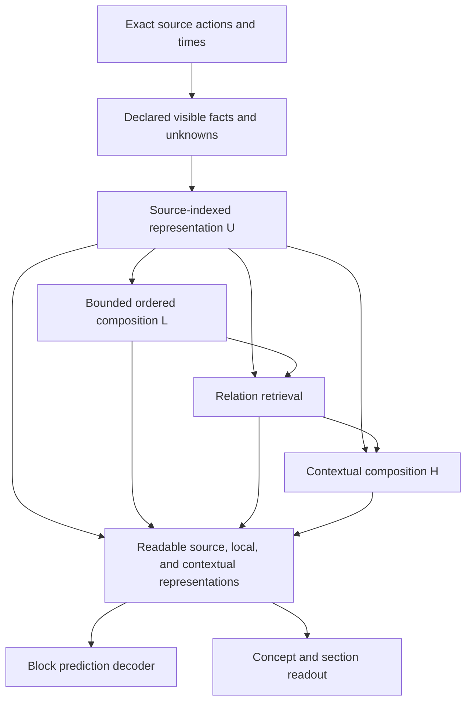

# Source-action representation: architecture directions and research aims

The recommended direction is to learn source-action organization through
conditional prediction of complete action blocks, while preserving access to
source facts, local compositions, and contextual representations. Scoped style
assessment becomes one semantic query over that representation. Its five
concepts remain useful supervision and evaluation, but do not exhaust what the
representation should distinguish.

This is a research proposal. The strongest architectural hypothesis is that
direct access to several levels of representation makes useful relationships
easier to learn and reuse. Multiple residual slots are a possible extension;
their benefit is unestablished. The learning objective and the access paths
need separate evidence even when they form one research direction.

The [source-action block prediction foundation](source_action_stage1.md) owns
the implemented partial-observation contract, reference predictor and bounded
software checks for a common prediction task.

The baseline is the scoped classifier examined in the
[2026-09-14 postmortem](scoped_style_probe_postmortem.md), with implementation
inspection at source revision `32e2c60c8b437884e9c45c634b1d22d6a7bfaef3`.
The [V3 formulation](../formulation/README.md) retains authority over generation
and demand semantics. This proposal defines neither a V3 reference architecture
nor an executable experiment specification.

## Assessment of the direction

The [source-action memory proposal](https://chatgpt.com/share/6aa785c7-8ab8-83e8-9d1e-6a7adae35ce7)
has a sound central motivation: a classifier can satisfy its labels without
preserving distinctions among differently organized sections that share those
labels. Expanding hidden capacity alone does not require it to retain those
distinctions. A prediction task grounded in source actions supplies a broader
reason to learn them. It still reflects corpus selection, mapper conventions,
and the chosen prediction conditions; self-supervision does not remove bias.

Several qualifications determine whether the direction is useful:

| Proposal | Judgment and consequence |
| --- | --- |
| Preserve early, local, and contextual representations for query-dependent reading | Prioritize. It changes which facts and computations remain accessible, without assuming that the existing BiGRU has destroyed information. |
| Avoid style-named hidden streams | Preserve this principle. The current backbone already has concept-independent hand states and relation channels; there are no Jack or Trill streams to remove. |
| Learn structure from masked source-action blocks | Prioritize as a representation-learning objective. Its success must include useful context dependence and reuse, beyond a lower reconstruction loss. |
| Introduce dynamically read and written residual slots | Keep as a hypothesis. Retained intermediate representations and direct paths can be tested before adding dynamic routing and persistent slot expansion. |
| Require orthogonality between streams | Defer. Orthogonal vectors can encode identical information, and shared lane, timing, and occupation facts may be necessary for several computations. |
| Prioritize directional Jacobian diagnostics | Retain, using actual parameter updates and paired output changes. This measures a local update effect; it does not identify the responsible training examples by itself. |

The [current encoder](../../src/pulsefield_model/research/scoped_style_modeling/model.py)
retains two hand vectors at each event position. Lane and row features pass
through a shared hand BiGRU and relation attention before the assessor reads
them. The [multiscale extension](../../src/pulsefield_model/research/scoped_style_modeling/probe_model.py)
composes those already contextualized states. It supplies no direct assessment
path from the earlier lane/row representation. Its added local head also reads
the ordered section summary, so improved loss could reflect added readout
capacity as well as the local summaries.

The postmortem motivates investigation without diagnosing that path as the
cause. All selected B/C models miss the 36 human Trill training positives, with
human training AUROC between 0.308 and 0.499. LN retains validation AUROC of
0.85–0.90 while missing all six positives. CM/CTM correctly classify six of
twelve matched Jack/Stream pairs, all of them coexistence cases. These are
different failures. Better source-action pretraining might help, but it cannot
be credited with fixing them until the corresponding distinctions improve.

## Research object and new aims

Here, *source-action structure* means conditional relationships among complete
four-lane action rows, their order, elapsed times, recurrence, and hold/release
organization over declared ranges. It does not name an unknown set of ideal
latent coordinates. A useful representation should make those relationships
predictively useful across source groups and accessible to more than one query.

The central question is:

> Can a representation with direct access to source facts and several levels of
> composition learn reusable action relationships through block prediction,
> including distinctions that the current style vocabulary does not specify?

| Aim | Evidence sought |
| --- | --- |
| Predict organization at several scales | Better held-out block likelihood using permitted context, reported by target span and actual duration. |
| Use the content of relationships | Added ordered or relational context improves predictions beyond timing, count, and broad corpus-prior information. |
| Make learned structure reusable | A fixed-capacity readout of frozen representations supports human semantic distinctions beyond the same readout on untrained representations. |
| Establish effective learning paths | Actual updates improve discriminative responses, with a checked local approximation showing where the parameter changes act. |

These aims are related but separate. Structural likelihood can improve while
style recognition does not; the target may emphasize different regularities,
or the readout may fail to access relevant ones. Style recognition can improve
without evidence of broader structural reuse. Neither outcome establishes
player-response or demand semantics.

## Architecture: preserve facts, compose relationships, query several levels

Let $X=(\Gamma,A)$ denote exact event times and complete source-action rows.
Relations are derived from these facts under a declared observation policy.
During assessment, the permitted observation is the recorded review context.
During masked prediction, it is a partial observation $V$, constructed before
feature extraction. The two input policies must remain explicit.

The diagram specifies access and retention, not a requirement for a large
parallel backbone. A small stack can implement these paths. Preserve source
identities for alignment and exact retrieval, but do not embed arbitrary source
hashes, line numbers, titles, or annotation provenance as predictive features.
An exact fact store and its learned embedding have different roles: retaining
the former does not imply that the latter is lossless.

### Operators describe computation

| Operator | Computation and retained information |
| --- | --- |
| Local ordered composition | Compose full attack groups and intervening releases in order, retaining outer/inner roles, timing, and permitted entering occupation. Counts and histograms alone do not preserve the arrangement. |
| Relation retrieval | Gather along permitted recurrence, simultaneous-action, and LN relationships. Relation type specifies a source relationship, without assigning a style interpretation. |
| Interval and contextual composition | Combine shorter organizations into longer ones and relate their continuation, repetition, interruption, and change. The BiGRU remains a candidate contextual mixer. |

Operators must be able to compose sequentially. Retrieving recurrence after
forming complete group representations can expose different information from
composing a sequence of recurrence results. A bank of parallel projections
followed by pooling does not by itself test this ordered composition. Keep the
initial composition order explicit instead of searching over arbitrary operator
graphs.

The representation bank can be written as

$$
\mathcal Z_\theta(V,\Gamma)
=\{U,\ L^{(s)},\ H^{(\ell)}\},
\qquad
p_\psi(y_c\mid X,S)
=\operatorname{softmax}D_\psi\bigl(
\operatorname{Read}(e_c,S;\mathcal Z_\theta(X))\bigr).
$$

Here $s$ indexes support scale and $\ell$ composition depth. The concept and
section condition the readout; ground-truth assessments never enter it. Several
concepts may use the same representations, and one concept may read several
levels. Assessment retains independent absent/supporting/prominent
distributions, including simultaneous prominent concepts. A complete-input
assessment does not invoke the reconstruction decoder.

### Locality includes the provenance of features

A pre-BiGRU path is not automatically a strictly local path. The existing
[lane facts](../../src/pulsefield_model/research/scoped_style_modeling/replay.py)
include next-attack intervals and LN ages, remaining times, and endpoints;
[relations](../../src/pulsefield_model/research/scoped_style_modeling/relations.py)
can connect distant events. Their support may extend beyond a convolution's
nominal event window. Local pace statistics can have the same issue.

For a claimed local representation, count every feature, edge, normalization
statistic, and supplied boundary fact among its dependencies:

$$
\operatorname{Supp}(z)
=\bigcup_{u\in\operatorname{Parents}(z)}\operatorname{Supp}(u).
$$

Form local states using facts available within their declared support, with any
entering state named as an additional condition. Retain these states before
global mixing. Representations that subsequently read global context may be
useful, but their support is global. This is an access bound, not attribution.

Keep original event times and phases. Describe scale with both action-group
span and actual duration; release-only rows and synthetic boundary markers are
not extra attacks. Exact attack-group indexing inside a hidden block is itself
target information unless declared as a condition. The first access-path
comparison should preserve the timeline and total available facts in both
models; changing timing features or indexing at the same time obscures the
source of a gain.

### Residual slots are optional storage, without assigned semantics

If retained paths need more persistent read/write capacity, let each aligned
node have $K$ latent slots $R_k^{(\ell)}$. One possible interface is

$$
\begin{aligned}
v_o^{(\ell)}
&=\sum_k a_{o,k}^{(\ell)}\odot\operatorname{Norm}(R_k^{(\ell)}),\\
\Delta_o^{(\ell)}
&=\mathcal O_o^{(\ell)}(v_o^{(\ell)};U,E_V,\Gamma),\\
R_k^{(\ell+1)}
&=R_k^{(\ell)}+\sum_o b_{o,k}^{(\ell)}\odot\Delta_o^{(\ell)}.
\end{aligned}
$$

The coefficients control reading and writing; their inputs obey the operator's
support policy. Slots have no permanent style or operator assignment. Operators
at one depth in this expression read the same preceding state; sequential
composition requires another depth or an explicit dependency. Cross-scale
reading also needs defined alignment, rather than addition of unrelated nodes.

[Hyper-Connections](https://arxiv.org/html/2409.19606v2) is the closest analogue
for separating integration across depth from exchange among streams. Its
language and vision results do not establish that the small scoped classifier
needs several slots. The expression above is an adapted interface, not the full
HC parameterization. Identity skips do not guarantee invertibility, preservation
of facts, stable update scales, or useful slot diversity.

Start by retaining source and intermediate states with ordinary residual
composition. Expand slots only if a comparison with the same prediction task
and similar capacity supports additional reuse. Preserve hand-exchange
equivariance in operators, routing, and the action decoder; style readouts for
the current concepts remain invariant. The existing
[model tests](../../tests/research/scoped_style_modeling/test_model.py) provide
reference checks for mirror behavior, padding, and target isolation.

Orthogonality is not an appropriate semantic requirement: $(x,0)$ and $(0,x)$
are orthogonal while carrying the same information. Decorrelation also does
not establish independence. [VICReg](https://arxiv.org/abs/2105.04906) addresses
collapse and redundancy with variance and covariance regularization; it does
not identify independent gameplay mechanisms. Judge complementary computation
through predictive use before imposing a diversity penalty.

## Learning objective: conditional action-block prediction

Mask a nonempty contiguous block of action rows $A_I$, retaining the declared
event-time skeleton $\Gamma$ and permitted context $V$. Let $q_I$ describe the
target positions and any explicitly supplied task metadata; visibility is
encoded in $V$. A tractable joint distribution is

$$
p_{\theta,\phi}(A_I\mid V,\Gamma,q_I)
=\prod_{j\in I}
p_{\theta,\phi}\bigl(
a_j\mid A_{I,<j},\mathcal Z_\theta(V,\Gamma),q_I,j
\bigr),
$$

with a starting objective

$$
\mathcal L_{\mathrm{structure}}
=\mathbb E_{X,I,V}\left[
-\frac{1}{|I|}\log p_{\theta,\phi}(A_I\mid V,\Gamma,q_I)
\right].
$$

The expectation includes the source-group, block-scale, and observation
sampling policy. Averaging per block after normalizing by its row count gives
different weights from pooling every target row; choose and record that risk
explicitly. Report results by scale so plentiful short or easy blocks cannot
conceal failure on longer organization.

Each $a_j$ is a joint four-lane action row, including taps, LN heads, and closes.
A joint categorical output or a conditional within-row factorization can
preserve dependencies; four independent lane classifiers would not express
the same distribution. Source close/head coincidences must remain explicit,
as in [source replay](scoped_style_witness_generation.md#5-source-objects-event-rows-and-selection-decisions),
rather than being retimed into invented V3-compatible rows. Legality masks may
use declared conditions and the decoded prefix, never undisclosed target state.

A compact autoregressive decoder permits likelihood evaluation, but teacher
forcing can make later rows easy to predict from the true target prefix. A
small decoder alone does not prove that the encoder learned reusable structure.
Compare its context benefit with identical target prefixes, and inspect the
first row and later positions separately. Targets supplied to the decoder must
not enter the encoder or its relation graph. Generated blocks can additionally
be inspected for legal and coherent continuation, without treating one sampled
completion as the only acceptable answer.

### The time skeleton defines a conditional task

Providing $\Gamma$ reveals the event positions and count, including the union
of attack and release times. This is a deliberate condition, even if the
attack/release type at each position is hidden. The task learns action
arrangement and articulation *given those positions*. It does not learn when
to place the next event, whether an event should exist, or a full joint timing
and action generator.

Keep hidden row types, lane membership, and exact attack ranks out of skeleton
metadata. Mask shapes, scale labels, and block-selection rules can also reveal
target properties. State any such conditioning and do not count its deterministic
consequences as recovered information. Sampling blocks by attack-group span
does not justify exposing every hidden group's membership or location as a
feature.

### Construct partial observations before deriving features

The complete-chart classifier's feature builders cannot simply be reused after
zeroing masked embeddings. A masked observation is not a chart with deleted
notes. Unknown actions, known silence, and unavailable context are distinct.

| Potential answer path | Required treatment |
| --- | --- |
| Previous/next attacks, recurrence edges, endpoint group descriptors, pace estimates | Recompute from permitted observations. Distinguish a next *observed* attack from a known immediate successor across an unknown interval. |
| LN duration, remaining time, identity edges, and occupation | Hide every disallowed descendant of the target fact, including fields attached to visible rows outside the block. |
| Boundary occupation | Supply only explicitly declared state. A known entering held lane need not reveal its future close. Occupation after hidden actions may be unknown. |
| Row phases, graph topology, padding lengths, target-query metadata | Allow only information implied by the stated skeleton and observation policy. Hidden action type must not be encoded indirectly by node or edge selection. |
| Decoder history and legal-action masks | Derive from visible conditions and the preceding supplied/generated target rows, without access to the current or future hidden row. |

In particular, a visible LN head with its full duration can disclose a masked
release. Either expand the observation mask to hide that endpoint information,
or declare the endpoint as a condition and exclude the already known fact from
claims of prediction. Do not silently clip the source object. Preserve original
objects in the evidence owner while representing partial knowledge separately.

A necessary input check is to vary hidden action facts while holding the
declared conditions fixed: every encoder input must remain unchanged. Apply it
to derived values and topology, including LN facts outside the target interval.
Mirror checks must transform the observation mask and joint action distribution
along with the chart. No style label is transferred to an altered or masked chart.

[MusicBERT](https://aclanthology.org/2021.findings-acl.70/) is a closer sequence
analogue than image masking alone: it groups masking by musical attributes and
bars to limit easy reconstruction from correlated neighboring tokens. Its MIDI
representation and masking units differ from exact four-lane source actions
and LN replay. [MAE](https://arxiv.org/abs/2111.06377) motivates separating a
visible-input encoder from a reconstruction decoder;
[I-JEPA](https://arxiv.org/abs/2301.08243) motivates attention to target scale and
context selection, but predicts representations rather than an action
likelihood. None establishes the effectiveness of this objective for Pulsefield.

## Evidence of structure and semantic reuse

For the same target block, compare a near-context observation $C_n$ with one
that additionally exposes farther context $C_f$:

$$
G_s=\mathbb E\left[
\frac{\log p(A_I\mid C_n,C_f,\Gamma,q_I)
-\log p(A_I\mid C_n,\Gamma,q_I)}{|I|}
\;\middle|\;\operatorname{scale}(I)=s
\right].
$$

Train with both observation conditions and keep the target, decoder prefix,
model parameters, and scoring rule paired. This measures model prediction gain
in nats per target row. It is not an estimate of true conditional mutual information.
A positive gain can arise from a broad mapper or chart prior; by itself it does
not establish use of precise distant organization.

The first additional diagnostic should therefore compare detailed context with
a declared coarse-context view, retaining the same timing and available
count/occupation summaries. Expose both views during training. A benefit from
ordered and relational content beyond that view is stronger evidence of useful
structure. These are observation changes for the same prediction target, not
synthetic charts to which semantic labels are assigned. Keep this comparison
small; its purpose is to reject a shortcut explanation.

Train a small concept readout on frozen pretrained representations using the
existing eligible human targets. Match its capacity and accessible levels
against the same readout on an untrained encoder. If the probe can also read
raw source memory, retain that access in the comparator: a powerful readout
learning directly from raw facts is not evidence that pretraining helped.
Fit probes using complete declared chart inputs, and record the difference
between those inputs and the pretraining observation distribution. A fitted
readout held fixed across a short update window can also serve as a diagnostic;
an arbitrary untrained tag head cannot.

Semantic evaluation retains the
[postmortem's definitions and support limits](scoped_style_probe_postmortem.md#data-measurement-and-execution):

- Trill: human training fit and held-out positive/negative ranking, probabilities,
  and false positives; a uniform prior increase is insufficient.
- Jack/Stream: matched source, scope, context, and playback rate, separating
  Jack-only, Stream-only, both, and neither. Missing judgments stay unreviewed.
- LN: presence probability fitting and conditional strength as well as ranking.
- Tech: eligible High-confidence human judgments, with independent source and
  positive counts. Repeated sampling does not increase independent support.

Keep group-macro human three-class NLL as a shared semantic measure. Preserve
the operating threshold and distinguish development validation from an
independent test. Exclude held-out source/song groups and related variants from
unlabeled pretraining as well as supervised fitting. More unlabeled sections
of an evaluated song do not constitute an independent training population.

## One priority update diagnostic

Use the actual parameter displacement
$\Delta\theta=\theta_{t+1}-\theta_t$ and a fixed scalar response $f_r$:

$$
\Delta f_r
=f_r(\theta_{t+1})-f_r(\theta_t)
\approx\sum_m
\left\langle\nabla_{\theta_m}f_r(\theta_t),\Delta\theta_m\right\rangle.
$$

Useful responses are normalized target-block log likelihood and the difference
between mean positive and negative presence margins on fixed human training
examples. For a concept, the presence margin is

$$
u_c=\operatorname{logsumexp}(z_{\mathrm{supporting}},z_{\mathrm{prominent}})
-z_{\mathrm{absent}}.
$$

Observe individual scores as well as this contrast, and check both concept
outputs on selective Jack/Stream examples.

Evaluate $f_r$ at both endpoints with identical inputs, fixed non-parameter
state, and deterministic evaluation behavior. Compare the first-order sum with
the actual change and record the residual. Decompose parameters into disjoint
ownership groups, counting shared parameters once. Slot-level or loss-source
attribution does not follow from this module decomposition.

For scalar responses, a gradient-vector dot product avoids constructing a full
Jacobian. [PyTorch's JVP interface](https://docs.pytorch.org/docs/2.11/generated/torch.func.jvp.html)
provides the directional operation, although operator support must be checked;
ordinary reverse-mode gradients suffice for the scalar form. Actual displacement
includes AdamW history, weight decay, and clipping. It does not separate their
causes, or show which human/machine loss component produced the displacement.

Record this only at a few declared updates and on a small fixed training
diagnostic set, then observe whether any improvement survives subsequent
updates. Validation is not used to choose gradient routes. A small response may
reflect the readout, saturation, cancellation, or step scale, rather than absent
information. A large linearization residual limits module-level interpretation.

The [probe checkpoint writer](../../src/pulsefield_model/research/scoped_style_modeling/probes.py)
stores weights and update metadata without optimizer moments. Old checkpoints
cannot reconstruct the historical next AdamW step by themselves. Capture actual
before/after weights during a new diagnostic run; preserve optimizer, RNG,
sampler, and any scheduler state when replay is required. Expand into loss
decomposition or optimizer interventions only when this diagnostic identifies
a specific unresolved mechanism.

## Focused development direction

The first decision concerns **direct representation access under a common
source-action objective**. Build the masked-observation contract and compact
decoder once, then compare a reference contextual encoder with the smallest
operator composition that retains early and local states. Both receive the
same source facts, target blocks, decoder capacity, and training risk. The
reference must receive the new prediction objective too; otherwise an apparent
architecture gain could come entirely from pretraining.

Two explanations remain live. If the reference acquires the same context gains
and semantic reuse, the broader objective may be sufficient and added paths
have not earned their cost. If retained paths improve those properties beyond
a capacity control, access and composition receive bounded support. If neither
does, inspect observation shortcuts, target ambiguity, and decoder dependence
before expanding the backbone. This is one comparison with different possible
decisions, rather than a mandatory architecture/optimizer grid.

Match total trainable capacity as closely as practical and report the remaining
difference, compute, and activation memory. Retaining every node at every depth
and scale can dominate memory even with few parameters. Preserve only the
levels needed by the declared queries. If adding a residual prediction adapter
to a common checkpoint, zero-initializing its final projection can preserve
initial logits; it also initially blocks gradients to earlier adapter layers,
which matters when interpreting the first directional diagnostic.

Use common update horizons, loss normalization, exposure records, and evaluation
cadence. Fix the output selection rule and runtime bound before execution.
Choose one held-out structural metric as primary, a practical gain threshold,
and semantic regression bounds; report group counts and paired uncertainty.
Seed 17 can support exploration, with 29/43 reserved for confirmation of a
fixed comparison. The postmortem's short pilot endpoints are neither a
convergence target nor a suitable default budget for this different objective.

Broader slot routing, information-diversity penalties, loss routing, optimizer
search, timing generation, and audio conditioning remain subsequent questions.
They need not block an initial test of the structural objective and direct
access. A bounded fit check can detect broken wiring, but fitting a small set
does not establish either reusable structure or generalization.

Within the inspected literature, this is provisionally an adaptation and
combination of masked sequence prediction, retained representations, and
operator-based computation. A new general learning principle or an effective
Pulsefield architecture has not been established. The immediate research
recommendation is to refine this direction into one bounded comparison with
the observation contract and decision criteria fixed.

The eventual generation question remains separate: this task models corpus
action organization conditional on supplied times and potentially bidirectional
chart context. A generator reads committed chart history and its provisional
continuation under the [V3 information contract](../formulation/notation.md).
Transfer of weights requires a separately trained or validated causal access
policy. Calling the resulting latent state *demand* additionally requires the
[declared continuation-response semantics](../formulation/gameplay-state.md#target-response-and-frontier);
neither reconstruction nor style accuracy supplies them.
